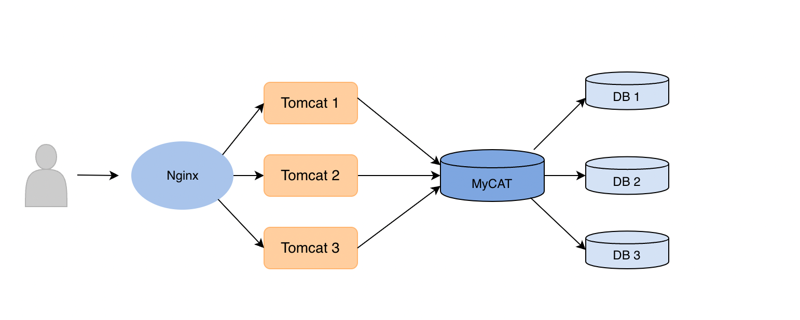
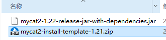
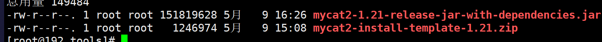
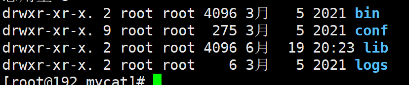
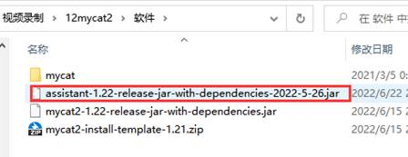

    
        <b>MyCAT</b>
    

# 简介

​		随着互联网的发展，系统数据的量级也是呈指数的增长，从GB到TB到PB，操作数据也是愈加困难，传统的关系性数据库已经无法满足快速查询与插入数据的需求。虽然NoSQL数据操作效率很高，但NoSQL也有着数据安全性低的缺点，所以很多业务场景还是需要使用关系型数据库。为了解决关系型数据库的海量数据存储问题，就需要搭建数据库集群来提升性能，而**[MyCAT](http://www.mycat.org.cn/)**就是一个用来帮助我们管理数据库集群的中间件。

​		**MyCAT**其实就是一个数据库集群的**代理**，也可以说是一个**抽象**，当我们的应用需要进行数据存储时可以直接与**MyCAT**进行对接，而不用直接去操作集群，MyCAT核心作用就是帮我们隔离掉数据库集群操作的复杂性。

​		MyCAT支持的数据库有很多，例如MySQL、ORACLE、SQL Server、MongoDB等。

​		**MyCAT工作原理**的核心是采用了**拦截**的理念，它会拦截用户发来的SQL语句，首先对SQL语句进行一些分析和操作，如分片分析、路由分析、读写分离分析、缓存分析等，然后将此SQL通过JDBC等协议发往后面的真实数据库，并将返回的结果做适当处理，最终返回给用户。

# MyCAT的安装

​		这里是Linux环境下的安装，由于MyCAT是基于JDK1.8开发的，所以记得先准备好JDK环境。

1. 下载压缩包和jar包

   * 安装程序包：http://dl.mycat.org.cn/2.0/install-template/mycat2-install-template-1.21.zip

   * jar包：http://dl.mycat.org.cn/2.0/1.21-release/mycat2-1.21-release-jar-with-dependencies.jar
   * wget：http://dl.mycat.org.cn/2.0/install-template/mycat2-install-template-1.21.zip

   * wget：http://dl.mycat.org.cn/2.0/1.21-release/mycat2-1.21-release-jar-with-dependencies.jar

   

2. 安装MyCAT

   * 创建/data/tools后进入这个目录

     > mkdir -p /data/tools  
     >
     > cd /data/tools

   * 下载或上传资源

     > （如果没有wget，就执行yum -y install wget）
     >
     > wget http://dl.mycat.org.cn/2.0/install-template/mycat2-install-template-1.21.zip
     >
     > wget http://dl.mycat.org.cn/2.0/1.21-release/mycat2-1.21-release-jar-with-dependencies.jar
     >
     > 

   * 解压并移动到data目录下

     > yum -y install unzip
     >
     > unzip mycat2-install-template-1.21.zip
     >
     > mv mycat ../

   * 修改权限

     > 把bin目录的文件加执行权限：
     >
     > cd /data/mycat/bin
     >
     > chmod +x *  

   * 把所需的jar复制到mycat/lib目录

       > cd /data/mycat/lib/  
       > 
       > cp  /data/tools/mycat2-1.21-release-jar-with-dependencies.jar ./  

3. MyCAT的目录结构
   >

   >其中：
   >+ bin 执行命令的目录 
   >+ conf 配置文件
   >+ lib  依赖包
   >+ logs 日志包

4. 启动一个3306的MySQL

   因为mycat代理连接启动时需要有一个默认的数据源，所以我们在启动的时候先为其准备一个数据源，接下来我们使用docker启动：

     > docker run --name mysql  -p 3306:3306 -e MYSQL_ROOT_PASSWORD=123456 -d mysql:5.7  --lower_case_table_names=1  

5. 给MyCAT配置数据库地址

    > 启动MyCAT前需要指定数据库地址，不然会报错；
    >
    > 配置文件位置：mycat/conf/datasources/prototypeDs.datasource.json
    >
    > ~~~json
    > {
    > 	"dbType":"mysql",
    > 	"idleTimeout":60000,
    > 	"initSqls":[],
    > 	"initSqlsGetConnection":true,
    > 	"instanceType":"READ_WRITE",
    > 	"maxCon":1000,
    > 	"maxConnectTimeout":3000,
    > 	"maxRetryCount":5,
    > 	"minCon":1,
    > 	"name":"prototypeDs",
    > 	"password":"123456",
    > 	"type":"JDBC",
    > 	"url":"jdbc:mysql://localhost:3306?useUnicode=true&serverTimezone=Asia/Shanghai&characterEncoding=UTF-8",
    > 	"user":"root",
    > 	"weight":0
    > }
    > ~~~

6. 启动MyCAT

   * MyCAT操作命令

     > cd /data/mycat/bin
     >
     > **./mycat start 启动**
     >
     > **./mycat stop 停止**
     >
     > ./mycat console 前台运行
     >
     > ./mycat install 添加到系统自动启动
     >
     > ./mycat remove 取消随系统自动启动
     >
     > ./mycat restart 重启
     >
     > **./mycat pause 暂停**
     >
     > **./mycat status 查看启动状态**

   * 查看logs/wrapper.log文档报错
   
       > cat /data/mycat/logs/wrapper.log 如果出现下面的信息就说明启动成功了。
       >
       > 

7. 连接MyCAT

      我们从外面看MyCAT其实就可以当作一个MySQL，具体连接MyCAT方式有：

   * Navicat for MySQL 对MyCAT支持查询

   * SQLyog 操作MyCAT更友好

     > 
     >
     > 输入IP地址、用户名，和端口号**（注意端口号为8066）。**
     >
     > 
     >
     >  
     >
     > 
     >
     > **如果出现上面的弹出框，说明MyCAT安装成功。**

# MyCAT配置文件

## 用户（user）

​		配置文件位置mycat/conf/user/{用户名}.user.json。这个配置文件主要是用来配置MyCAT的登录用户的，也就是我们连接8066这个端口的用户信息。

~~~json
{
	"dialect":"mysql",
	"ip":null,
	"password":"123456",
	"transactionType":"proxy",
	"username":"root",
    "isolation":3 
}
~~~

​		配置说明：

> 1. **dialect**：数据库(方言)类型
>
> 2. **ip**：配置白名单使用，一般写null，如果要限制指定用户才写明
>
> 3. **password**：配置MyCAT用户的密码（明文）
>
> 4. **isolation**：设置初始化的事务隔离级别
>
>    * READ_UNCOMMITTED：1
>
>    * READ_COMMITTED：2
>
>    * REPEATED_READ：3【**默认**】
>
>    * SERIALIZABLE：4
>
> 5. **transactionType**
>
>    * 默认值：proxy（本地事务，在涉及大于1个数据库的事务，commit阶段失败会导致不一致，但是兼容性最好）
>
>    * 可选值：xa（事务，需要确认存储节点集群类型是否支持XA）

## 数据源（datasource）

​		作用：配置MyCAT连接后面的实际数据库

​		配置文件位置：mycat/conf/datasources/{数据源名字}.datasource.json

~~~json
{
	"dbType": "mysql",
	"idleTimeout": 60000,
	"initSqls": [],
	"initSqlsGetConnection": true,
	"instanceType": "READ_WRITE",
	"maxCon": 1000,
	"maxConnectTimeout": 3000,
	"maxRetryCount": 5,
	"minCon": 1,
	"name": "prototype",
	"password": "123456",
	"type": "JDBC",
	"url": "jdbc:mysql://127.0.0.1:3306/mysql?useUnicode=true&serverTimezone=UTC",
	"user": "root",
	"weight": 0,
    "queryTimeout":30 //mills
}
~~~

​		配置说明：

> 1. **dbType**：数据源类型
> 2. **name**：数据源名字
> 3. **password**：后端MySQL的密码
> 4. **url**：后端MySQL的JDBC连接地址 
> 5. **user**：后端MySQL的用户名
> 6. **weight**：配置数据源负载均衡的使用权重

## 逻辑库与逻辑表（logicaltable）

> **逻辑库**：数据库代理**MyCAT**中的数据库，包含多个逻辑表
>
> **逻辑表**：MyCAT中的表，映射表示被代理数据源中实际数据库的表（物理表）

​		作用：配置MyCAT中和MySQL对应的逻辑表

​		配置文件位置：mycat/conf/schemas/{库名}.schema.json

~~~json
{
	"customTables": {},
	"globalTables": {},
	"normalTables": {},
	"schemaName": "test",
	"shardingTables": {},
	"targetName": "prototype"
}
~~~

​		配置说明：

> 1. **customTables：**自定义表
> 2. **globalTables：**全局表
> 3. **normalTables：**默认表
> 4. **schemaName：**库名
> 5. **shardingTables：**分片表
> 6. **targetName：**数据源名，也可以是集群名

## 序列号（sequence）

​		作用：使用序列号的分片表所对应的自增主键要在建表SQL中体现。

​		配置文件位置：mycat/conf/sequences/{数据库名字}_{表名字}.sequence.json（后面细说）。

## 服务器（server）

​		这个是针对MyCAT的服务器的配置，一般默认即可。

# MyCAT配置动态更新（注释配置）

​		在MyCAT执行的SQL文件中使用**SQL注释结合特定格式的方式**进行声明,可以用于动态更新**MyCAT配置**并且把配置持久化。

1. 重置配置：

   ~~~json
   /*+ mycat:resetConfig{} */
   ~~~

2. 用户相关：

   * 创建用户

   ~~~json
   /*+ mycat:createUser{
     "username":"user",
     "password":"",
     "ip":"127.0.0.1",
     "transactionType":"xa"
   } */
   ~~~
   * 删除用户

     ~~~json
     /*+ mycat:dropUser{
       "username":"user"} */
     ~~~

   * 显示用户

     ~~~json
     /*+ mycat:showUsers */
     ~~~

3. 数据源相关

   * 创建数据源

     ~~~json
     /*+ mycat:createDataSource{
       "dbType":"mysql",
       "idleTimeout":60000,
       "initSqls":[],
       "initSqlsGetConnection":true,
       "instanceType":"READ_WRITE",
       "maxCon":1000,
       "maxConnectTimeout":3000,
       "maxRetryCount":5,
       "minCon":1,
       "name":"dc1",
       "password":"123456",
       "type":"JDBC",
       "url":"jdbc:mysql://127.0.0.1:3306?useUnicode=true&serverTimezone=UTC&characterEncoding=UTF-8",
       "user":"root",
       "weight":0
     } */;
     ~~~

   * 删除数据源

     ~~~json
     /*+ mycat:dropDataSource{
       "dbType":"mysql",
       "idleTimeout":60000,
       "initSqls":[],
       "initSqlsGetConnection":true,
       "instanceType":"READ_WRITE",
       "maxCon":1000,
       "maxConnectTimeout":3000,
       "maxRetryCount":5,
       "minCon":1,
       "name":"dc1",
       "type":"JDBC",
       "weight":0
     } */
     ~~~

   * 显示数据源

     ~~~json
     /*+ mycat:showDataSources{} */
     ~~~

4. 集群相关：

   * 创建集群

     ~~~json
     /*! mycat:createCluster{
       "clusterType":"MASTER_SLAVE",
       "heartbeat":{
         "heartbeatTimeout":1000,
         "maxRetry":3,
         "minSwitchTimeInterval":300,
         "slaveThreshold":0
       },
       "masters":[
         "dc1" //主节点
       ],
       "maxCon":2000,
       "name":"c0",
       "readBalanceType":"BALANCE_ALL",
       "replicas":[
         "dc2" //从节点
       ],
       "switchType":"SWITCH"
     } */
     ~~~

   * 删除集群

     ~~~json
     /*! mycat:dropCluster{
       "name":"c0"
     } */
     ~~~

   * 显示集群

     ~~~json
     /*+ mycat:showClusters{} */
     ~~~

# MySQL集群和MyCAT操作集群

​		因为MyCAT只负责SQL语句的路由和分发，而数据库集群中的数据存储和同步问题还是要利用MySQL的主从集群来解决。

## MySQL主从概念

​		MySQL主从又叫Replication、AB复制。简单讲就是A与B两台机器做主从后，在A上写数据，另外一台B也会跟着写数据，实现数据实时同步。有这样几个关键点：

> 1. MySQL主从是基于binlog，主上需开启binlog才能进行主从；
> 2. 主从过程大概有3个步骤；
>    * 主将更改操作记录到binlog里；
>    * 从将主的binlog事件（SQL语句） 同步本机上并记录在relaylog里；
>    * 从根据relaylog里面的SQL语句按顺序执行。

​		主从作用有：实时灾备，用于故障切换；读写分离，提供查询服务；备份，避免影响业务。

​		主从形式有：

## 主从复制原理

​		主库将所有的写操作记录在binlog日志中，并生成log dump线程，将binlog日志传给从库的I/O线程；

​		从库生成两个线程，一个是I/O线程，另一个是SQL线程，I/O线程去请求主库的binlog日志，并将binlog日志中的文件写入relay log（中继日志）中，SQL线程会读取relay log中的内容，并解析成具体的操作，来实现主从的操作一致，达到最终数据一致的目的。

## 一主一从MySQL集群

​		搭建一主一从的要点有：

> 1. 确保从数据库与主数据库里的数据一致；
> 2. 在主数据库里创建一个同步账户授权给从数据库使用；
> 3. 配置主数据库（修改配置文件）；
> 4. 配置从数据库（修改配置文件）；
> 5. 需求；
> 6. 搭建两台MySQL服务器，一台作为主服务器，一台作为从服务器，主服务器进行写操作，从服务器进行读操作

### 1.环境准备（使用Docker启动MySQL容器）

| 名称 | Ip              | Port |
| ---- | --------------- | ---- |
| M1   | 192.168.106.133 | 3307 |
| M1S1 | 192.168.106.133 | 3308 |

> 
>
> 
>
> * docker run --name M1  -p 3307:3306 -e MYSQL_ROOT_PASSWORD=123456 -d mysql:5.7  --lower_case_table_names=1  
> * docker run --name  M1S1 -p 3308:3306 -e MYSQL_ROOT_PASSWORD=123456 -d mysql:5.7  --lower_case_table_names=1  

### 2.修改配置文件

> ​       将容器里面的配置文件复制出来，主要修改服务器的配置；在root目录下创建一个mysqlms的目录存放从Docker容器里面复制过来的配置文件。进入目录：cd /mysqlms
>
> 
>
> * docker cp  M1:/etc/mysql/conf.d/docker.cnf m1.cnf  
>
> * docker cp  M1S1:/etc/mysql/conf.d/docker.cnf m1s1.cnf  
>
> 
>
1. 主机配置m1.cnf

   > 主机需要记录SQL语句，然后从机再将该SQL复制过去
   >
   > 

2. 从机配置m1s1.cnf

   >

3. 配置文件修改后再复制到容器内去
   > * docker cp m1.cnf  M1:/etc/mysql/conf.d/docker.cnf  
   > * docker cp m1s1.cnf  M1S1:/etc/mysql/conf.d/docker.cnf  
   >
   > 
   >
   > 1. 重启MySQL（m1,m1s1）
   >
   >    > 
   >
   > 2. 测试连接
   >
   >      > 

### 3.搭建主从关系

1. 进入主机执行相关配置

   > * docker exec -it M1  bash  
   >
   > * mysql -uroot -p123456  
   >
   > 
   >
   > 1. 创建用户：
   >
   >    >   create user 'rep'@'%'  identified by '123456';  
   >    >
   >    > 
   >
   > 2. 给该用户授予权限
   >
   >    >   grant replication  slave on *.* to 'rep'@'%';  
   >    >
   >    > 
   >
   > 3. 刷新权限
   >
   >    >   flush privileges;  
   >    >
   >    > 
   >
   > 至此，M1 里面已经创建了一个用户：rep 123456 拥有所有库，所有表replication slave；接下来，我们尝试使用M1 里面的rep 用户登录：
   >
   > 
   >
   > 

2. 进入从机执行相关配置

   > * docker exec -it M1S1  bash 
   >
   > * mysql -u root  -p123456  
   >
   > 
   >
   > * change master to master_host="**192.168.106.133**",master_port=**3307**,master_user="**rep**",master_password="**123456**",master_log_file="**master.000001**",master_log_pos=**745;**  
   >
   >   > 其中master_log_file：该文件具体叫什么名称，需要从主机里面去看看。进入M1 里面使用root 用户登录M1，执行下面的SQL：**show master status;**
   >   >
   >   > 
   >   >
   >
   > 1. 修改上面的SQL执行：
   >    
   >
   > 2. 启动主从（在M1S1中执行）：start slave;
   >
   >    
   >
   > 3. 查询主从的状态（M1S1）：show slave status \G;
   >
   > 4. 成功的标注：
   >
   >    

### 4.搭建失败的原因

​		从机上使用**show slave status \G;**查看主从信息时的参数不对时：

1. **Slave_IO_Running**为connecting

   > 原因是从机使用你配置的**主机信息**没有成功登录到主机中，在从机中修改：
   >
   > * stop slave;  
   > * change master to  master_host="192.168.106.133",master_port=3307,master_user="rep",master_password="123456",master_log_file="master.000001",master_log_pos=745;  
   > * start slave;  

2. **Slave_SQL_Running**为no

   > 原因是主机和从机里的数据不一致。
   >
   > 从机会复制主机里面的SQL语句来自己执行！实验时先把从机里面的db3 删除—>再把主机里面的db3 删除->从机里面复制该删除的命令->从机执行删除的命令（db3），事务无法提交，将一直阻塞！
   >
   > 现在从机里面要删除db3 ，但是没有db3，导致一直阻塞，以后的主从复制不会进行了。解决：在从机新建一个db3，然后停止主从，启动主从：
   >
   > 

3. **Slave_IO_Running**为no

   > 原因是你的server-id没有配置成功，需要重新修改配置文件

### 5.MySQL主从的操作规范

1. 只能在主机里面执行DML 语句，不能在从机里面执行DML语句（会破坏主从）；
2. 在从机里面可以执行查询语句；
3. 主机只有一台，但是从机可以有多台。

### 6.测试

​		在主机M1中创建数据库，看从机M1S1有没有复制过去：

## MyCAT操作一主一从集群

​		使用MyCAT的注释配置语法动态修改MyCAT的数据源、集群等配置，连接和管理一主一从的MySQL集群。

### 1.创建数据源

~~~sql
添加读写的数据源
/*+ mycat:createDataSource{
  "dbType":"mysql",
  "idleTimeout":60000,
  "initSqls":[],
  "initSqlsGetConnection":true,
  "instanceType":"READ_WRITE",
  "maxCon":1000,
  "maxConnectTimeout":3000,
  "maxRetryCount":5,
  "minCon":1,
  "name":"m1",
  "password":"123456",
  "type":"JDBC",
  "url":"jdbc:mysql://127.0.0.1:3307/db1?useUnicode=true&serverTimezone=UTC&characterEncoding=UTF-8",
  "user":"root",
  "weight":0
} */;

添加读的数据源
/*+ mycat:createDataSource{
  "dbType":"mysql",
  "idleTimeout":60000,
  "initSqls":[],
  "initSqlsGetConnection":true,
  "instanceType":"READ",
  "maxCon":1000,
  "maxConnectTimeout":3000,
  "maxRetryCount":5,
  "minCon":1,
  "name":"m1s1",
  "password":"123456",
  "type":"JDBC",
  "url":"jdbc:mysql://127.0.0.1:3308/db1?useUnicode=true&serverTimezone=UTC&characterEncoding=UTF-8",
  "user":"root",
  "weight":0
} */;
~~~

### 2.查询数据源

~~~sql
/*+ mycat:showDataSources{} */
~~~

### 3.创建集群

~~~sql
/*! mycat:createCluster{
  "clusterType":"MASTER_SLAVE",
  "heartbeat":{
    "heartbeatTimeout":1000,
    "maxRetry":3,
    "minSwitchTimeInterval":300,
    "slaveThreshold":0
  },
  "masters":[
    "m1"
  ],
  "maxCon":2000,
  "name":"prototype",
  "readBalanceType":"BALANCE_ALL",
  "replicas":[
    "m1s1"
  ],
  "switchType":"SWITCH"
} */;
~~~

### 4.查询集群

~~~sql
/*+ mycat:showClusters{} */
~~~

### 5.创建逻辑库

~~~sql
CREATE DATABASE db1 DEFAULT CHARACTER SET utf8mb4 COLLATE utf8mb4_general_ci;
~~~

### 6.修改逻辑库的数据源

~~~sql
修改conf/schemas/db1.schema.json
vim /data/mycat/conf/schemas/db1.schema.json
在里面添加  
"targetName":"prototype"
~~~

### 7.查看集群的配置文件

​		我们查看集群配置的结果，发现文件里面自动帮我们添加了。

### 8.在MyCAT中测试读写分离是否成功

​		重启MyCAT：**mycat restart**

1. 在MyCAT中创建一个sys_user表

   ~~~sql
   CREATE TABLE SYS_USER(
       ID BIGINT PRIMARY KEY,
       USERNAME VARCHAR(200) NOT NULL,
       ADDRESS  VARCHAR(500)
   )
   ~~~

2. 通过**注释配置**生成物理库和物理表

   如果物理表不存在，在 MyCAT2 能正常启动的情况下，根据当前配置自动创建分片表，全局表和物理表：

   ~~~sql
   /*+ mycat:repairPhysicalTable{} */;
   ~~~

3. 查看后端物理库：发现物理库和物理表都生成了

4. 在MyCAT里面向sys_user表添加一条数据

   ~~~sql
   INSERT INTO SYS_USER(ID,USERNAME,ADDRESS) VALUES(1,"XIAOMING","WUHAN");
   ~~~

5. 修改MySQL主和从的数据，让主从数据不一致

   >
   >
   >

6. 在MyCAT里面查询数据，会发现每次查询的结果不一样

   

## 双主双从MySQL集群

​		搭建思路：

### 1.环境准备

1. Docker启动5个MySQL容器

   | 名称 | Ip              | Port |
   | ---- | --------------- | ---- |
   | M1   | 192.168.106.133 | 3307 |
   | M1S1 | 192.168.106.133 | 3308 |
   | M1S2 | 192.168.106.133 | 3309 |
   | M2   | 192.168.106.133 | 3310 |
   | M2S1 | 192.168.106.133 | 3311 |

   前面一主一从一启动两个，所以再新启三个就行：

   > * docker  run --name M1 -p 3307:3306 -e MYSQL_ROOT_PASSWORD=123456 -d mysql:5.7  --lower_case_table_names=1 
   > * docker  run --name M1S1 -p 3308:3306 -e MYSQL_ROOT_PASSWORD=123456 -d mysql:5.7  --lower_case_table_names=1 
   > * **docker run --name  M1S2 -p 3309:3306 -e MYSQL_ROOT_PASSWORD=123456 -d mysql:5.7 --lower_case_table_names=1**
   > * **docker run --name M2  -p 3310:3306 -e MYSQL_ROOT_PASSWORD=123456   -d mysql:5.7 --lower_case_table_names=1**
   > * **docker run --name  M2S1 -p 3311:3306 -e MYSQL_ROOT_PASSWORD=123456 -d mysql:5.7 --lower_case_table_names=1**
   >
   > 
   
2. 配置文件的修改

   先准备5个配置文件：

   

   分别修改：

   * 因为在上面的主从里面已有两个配置文件，所以只用创建三个就够了：m1s2.cnf、m2.cnf、m2s1.cnf
   * M2 需要添加一个配置项(具体配置看下面截图)
   * M2 会从M1 复制数据，但是M2 从M1复制的数据，不会记录下来，则M2S1 里面没有数据！
   * 我们需要打开M2的级联复制功能，让M2 也能记录从M1 里面复制的数据。

   最后结果如下：

   

   配置文件修改好以后复制到容器中，然后重启容器：

   > *  #docker cp m1.cnf  M1:/etc/mysql/conf.d/docker.cnf  
   > * #docker cp m1s1.cnf M1S1:/etc/mysql/conf.d/docker.cnf  
   > * docker cp m1s2.cnf  M1S2:/etc/mysql/conf.d/docker.cnf  
   > * docker cp m2.cnf  M2:/etc/mysql/conf.d/docker.cnf  
   > * docker cp m2s1.cnf  M2S1:/etc/mysql/conf.d/docker.cnf  

3. 重启新建的三个容器：**docker restart M1S2  M2 M2S1**

   

### 2.搭建主从关系

​		搭建双主双从集群前，先清空所有MySQL容器中的数据。

1. M1和M1S1已经搭建好主从关系，无需修改

2. M1S2修改（从机）

   * 指定主机

     > docker exec -it M1S2  bash  
     >
     > mysql -uroot -p123456  
     >
     > 
     >
     > 关联主机：
     >
     > ~~~sql
     > change master to master_host="192.168.106.133",master_port=3307,master_user="rep",master_password="123456",master_log_file="master.000001",master_log_pos=3574;
     > ~~~
     
   * 启动主从：start slave;

   * 查看状态：show slave status \G;

     > 

3. M2修改

   进入M2使用root登录：

   > docker exec -it M2 bash
   >
   > mysql -uroot -p123456

   * **新建用户：**create user 'rep1'@'%' identified by '123456';

   * **给用户授权：**grant replication slave on *.* to 'rep1'@'%';

   * **刷新权限：**flush privileges;

   * **使用新的用户尝试登录：**

     > 
     >
     > 
   
   M2作为M1的从机需要执行的SQL（使用root登录M2）：
   
   ~~~sql
   change master to master_host="192.168.106.133",master_port=3307,master_user="rep",master_password="123456",master_log_file="master.000001",master_log_pos=3574;
   
   start slave ;
   show slave status \G;
   ~~~
   
   

4. M2S1修改

   * 查看主机M2的信息：show master status;

     > 

   * 在M2S1里面执行下面的命令：

     ~~~sql
     change master to master_host="192.168.106.133",master_port=3310,master_user="rep1",master_password="123456",master_log_file="master.000001",master_log_pos=747;
     ~~~

   * 启动主从：

     > start slave;
     >
     > show slave status \G;
     >
     > 

### 3.验证集群是否搭建成功

​		使用工具连接所有的MySQL容器

1. 往M1 写数据，看 M2S1

2. 在M1 新建数据库

3. 观察M2S1

4. 往M1 写数据，看M1S1

   

## MyCAT操作双主双从

​		利用MyCAT的**注释配置**动态更新MyCAT的配置，实现MyCAT管理双主双从MySQL集群。

### 1.角色说明

> M1 主机
>
> M1S1 是M1的从机
>
> M1S2 是M1的从机
>
> M2 主机
>
> M2S1 是M2的从机

### 2.添加数据源

~~~sql
添加M1S2读的数据源
/*+ mycat:createDataSource{
  "dbType":"mysql",
  "idleTimeout":60000,
  "initSqls":[],
  "initSqlsGetConnection":true,
  "instanceType":"READ",
  "maxCon":1000,
  "maxConnectTimeout":3000,
  "maxRetryCount":5,
  "minCon":1,
  "name":"m1s2",
  "password":"123456",
  "type":"JDBC",
  "url":"jdbc:mysql://127.0.0.1:3309?useUnicode=true&serverTimezone=UTC&characterEncoding=UTF-8",
  "user":"root",
  "weight":0
} */;

添加M2的数据源
/*+ mycat:createDataSource{
  "dbType":"mysql",
  "idleTimeout":60000,
  "initSqls":[],
  "initSqlsGetConnection":true,
  "instanceType":"READ_WRITE",
  "maxCon":1000,
  "maxConnectTimeout":3000,
  "maxRetryCount":5,
  "minCon":1,
  "name":"m2",
  "password":"123456",
  "type":"JDBC",
  "url":"jdbc:mysql://127.0.0.1:3310?useUnicode=true&serverTimezone=UTC&characterEncoding=UTF-8",
  "user":"root",
  "weight":0
} */;

添加M2S1的数据源
/*+ mycat:createDataSource{
  "dbType":"mysql",
  "idleTimeout":60000,
  "initSqls":[],
  "initSqlsGetConnection":true,
  "instanceType":"READ",
  "maxCon":1000,
  "maxConnectTimeout":3000,
  "maxRetryCount":5,
  "minCon":1,
  "name":"m2s1",
  "password":"123456",
  "type":"JDBC",
  "url":"jdbc:mysql://127.0.0.1:3311?useUnicode=true&serverTimezone=UTC&characterEncoding=UTF-8",
  "user":"root",
  "weight":0
} */;
~~~

### 3.修改集群配置

​		因为我们现在后端的MySQL集群结构发生了变化，现在修改集群的配置**【只是修改】**。

~~~json
{
	"clusterType":"MASTER_SLAVE",
	"heartbeat":{
		"heartbeatTimeout":1000,
		"maxRetryCount":0,
		"minSwitchTimeInterval":300,
		"showLog":true,
		"slaveThreshold":0.0
	},
	"masters":[
		"m1","m2"
	],
	"maxCon":2000,
	"name":"prototype",
	"readBalanceType":"BALANCE_ALL",
	"replicas":[
		"m1s1","m1s2","m2s1"
	],
	"switchType":"SWITCH"
}
~~~

### 4.重启MyCAT测试

1. 重启MyCAT

   > cd  /data/mycat/bin  
   >
   > ./mycat restart  
   >
   > 

2. 在MyCAT创建db1库

   ~~~sql
   CREATE DATABASE db1 DEFAULT CHARACTER SET utf8mb4 COLLATE utf8mb4_general_ci;
   ~~~

3. 在MyCAT创建表

   ~~~sql
   create table sys_user(
       id bigint primary key,
       username varchar(200) not null,
       address  varchar(500)
   )
   ~~~

4. 刷新逻辑表到物理库

   ~~~sql
   /*+ mycat:repairPhysicalTable{} */;
   ~~~

5. 在MyCAT里添加数据

   ~~~sql
   insert INTO sys_user(id,username,address) values(1,"xiaofang","wuhan");
   ~~~

6. 在MyCAT中查询测试

   ​		修改上面五个MySQL数据库中db1库中sys_user表里面的数据，让它不一样，再通过MyCAT进行查询。

   ~~~sql
   select * from sys_user;
   ~~~

# 分库分表

## 简介

​		分库分表是指按照一定规则将单个数据库中的表拆分后分开保存，减少单库或单表的数据量，提升数据存取性能，常见的拆分方式有**垂直拆分**和**水平拆分**。

1. 垂直拆分（分库）

​		**垂直拆分**是指按业务将表进行分类，分布到不同的数据库上面，也就是将单个数据库的压力分担到多个数据库上去。

> **注**：关联关系精密的表应该在同一个库中，相互没有关联关系的表可以拆分到不同的库中。

2. 水平拆分（分表）

​		**水平拆分**是指单纯基于数据进行拆分，将一张大数据量的表拆分为多个结构相同的子表（子表可存储在同一个库也可在不同的库中），子表各自存一部分数据，减少单表的数据量。

## 水平拆分实现

​		假设现在有一张订单表的数据过大，以拆分这个订单表为例来演示：：

~~~sql
订单表  600W数据
CREATE TABLE orders(
   ID BIGINT AUTO_INCREMENT,
   ORDER_TYPE INT,
   CUSTOMER_ID INT,
   AMOUNT DECIMAL(10,2),
   PRIMARY KEY(ID)
);

订单详情表  800W数据
CREATE TABLE orders_detail(
  ID BIGINT AUTO_INCREMENT,
  detail VARCHAR(2000),
  order_id BIGINT,
  PRIMARY KEY(ID)
)
~~~

​		首先我们先准备两个一主一从的MySQL集群，搭建方式这里就不重复描述了：

| 名称           | ip              | port |
| -------------- | --------------- | ---- |
| dw0 （master） | 192.168.106.133 | 3312 |
| dr0  （slave） | 192.168.106.133 | 3313 |
| dw1（master）  | 192.168.106.133 | 3314 |
| dr1  （slave） | 192.168.106.133 | 3315 |

### 1.选择分表字段

选择一个合适的字段来作为我们水平分表的依据：

| 分表字段             | 效果                                                         |
| -------------------- | ------------------------------------------------------------ |
| id(主键、或创建时间) | 查询订单注重时效。历史订单被查询的次数少，如此分片会造成一个节点访问多，一个访问少，不平均 |
| customer_id(客户id)  | 根据客户id去分，两个节点访问平均，一个客户所有的订单都在同一个节点，这样查询就快 |

### 2.配置MyCAT数据源

​		基于准备好的两组主从集群进行MyCAT的配置：

~~~sql
添加dw0数据源
/*+ mycat:createDataSource{
  "name":"dw0",
  "password":"123456",  "url":"jdbc:mysql://127.0.0.1:3312?useUnicode=true&serverTimezone=UTC&characterEncoding=UTF-8",
  "user":"root",} */;

添加dr0数据源
/*+ mycat:createDataSource{
  "name":"dr0",
  "password":"123456",  "url":"jdbc:mysql://127.0.0.1:3313?useUnicode=true&serverTimezone=UTC&characterEncoding=UTF-8",
  "user":"root",} */;

添加dw1数据源
/*+ mycat:createDataSource{
  "name":"dw1",
  "password":"123456",  "url":"jdbc:mysql://127.0.0.1:3314?useUnicode=true&serverTimezone=UTC&characterEncoding=UTF-8",
  "user":"root",} */;

添加dr1数据源
/*+ mycat:createDataSource{
  "name":"dr1",
  "password":"123456",  "url":"jdbc:mysql://127.0.0.1:3315?useUnicode=true&serverTimezone=UTC&characterEncoding=UTF-8",
  "user":"root",} */;
~~~

​		执行后我们在MyCAT里面可以看到如下数据源的配置文件：

### 3.配置MyCAT集群

​		注：MyCAT自动分片默认要求集群名称以字母**c**为前缀，**数字**为后缀：

1. c0就是分片表第一个节点；

2. c1就是第二个节点。

   一般情况我们使用MyCAT默认的自动分片即可：

   ~~~sql
   /*! mycat:createCluster{
     "name":"c0",
     "masters":[
       "dw0"
     ],
     "replicas":[
       "dr0"
     ]
   } */;
   
   /*! mycat:createCluster{
     "name":"c1",
     "masters":[
       "dw1"
     ],
     "replicas":[
       "dr1"
     ]
   } */;
   ~~~

   创建完后查看MyCAT集群配置文件内容如下（文件位置：mycat/conf/clusters）：

   ~~~json
   {
   	"clusterType":"MASTER_SLAVE",
   	"heartbeat":{
   		"heartbeatTimeout":1000,
   		"maxRetryCount":3,
   		"minSwitchTimeInterval":300,
   		"showLog":false,
   		"slaveThreshold":0.0
   	},
   	"masters":[
   		"dw0"
   	],
   	"maxCon":2000,
   	"name":"c0",
   	"readBalanceType":"BALANCE_ALL",
   	"replicas":[
   		"dr0"
   	],
   	"switchType":"SWITCH"
   }
   ~~~

### 4.全局表（广播表）配置

​		**全局表（广播表）**：每个分片节点上都有这张表的全部数据，多份写入，多处读取。

​		**应用场景**：比如说数据库有一张表总体变动很小，而其它的查询操作经常需要关联此表，那么这个表就适合做成mycat全局表。

​		这里订单表中的订单类型需要关联的字典表就很适合配置为**全局表**。

1. 创建数据库

   ~~~sql
   CREATE DATABASE db1 DEFAULT CHARACTER SET utf8mb4 COLLATE utf8mb4_general_ci;
   ~~~

2. 创建sys_dict表

   ~~~sql
   use db1;
   CREATE TABLE `sys_dict` (
     `id` bigint NOT NULL AUTO_INCREMENT,
     `dict_type` int  ,
     `dict_name` varchar(100) DEFAULT NULL,
     `dict_value` int ,
     PRIMARY KEY (`id`)
   ) ENGINE=InnoDB  DEFAULT CHARSET=utf8mb4 BROADCAST;
   ~~~

   上面的SQL中有一个**BROADCAST** 这个就是全局表的标识。

3. 查看结果

   MyCAT的配置文件中：

   

   后端数据库中发现所有的数据库节点中都出现了这张表：

   

4. 在MyCAT中向sys_dict表插入数据：

   ~~~sql
   INSERT INTO sys_dict(dict_type,dict_name,dict_value) VALUES(1,"男",1);
   INSERT INTO sys_dict(dict_type,dict_name,dict_value) VALUES(1,"女",0);
   ~~~

   执行后查看所有数据库节点中的sys_dict表都有添加了这些数据。

5. 在MyCAT在查询sys_dict表

   

   可以看到查询出的数据并没有出现重复。

### 5.分片表配置

1. 创建表并指定分片策略

   ~~~sql
   CREATE TABLE orders(
      ID BIGINT NOT NULL AUTO_INCREMENT,
      ORDER_TYPE INT,
      CUSTOMER_ID INT,
      AMOUNT DECIMAL(10,2),
      PRIMARY KEY(ID)
   ) ENGINE=INNODB  DEFAULT CHARSET=utf8mb4
   dbpartition BY mod_hash(CUSTOMER_ID) tbpartition By mod_hash(CUSTOMER_ID) 
   tbpartitions 1 dbpartitions 2
   ~~~

   * **dbpartition BY mod_hash(CUSTOMER_ID)：** 指定数据库的分片算法及使用哪一条数据进行分片HASH

   * **tbpartition BY mod_hash(CUSTOMER_ID) ：**指定表的分片算法及使用哪一条数据进行分片HASH

   * **tbpartitions 1** 表的分片数量

   * **dbpartitions 2** 数据库的分片数量

   以上的运行成功必须是c0、c1的数据源配置没有问题才行。

2. 查看MyCAT生成的配置

   

3. 添加数据

   ~~~sql
   INSERT INTO ORDERS(ID,ORDER_TYPE,CUSTOMER_ID,AMOUNT) VALUES(1,101,100,100101);
   INSERT INTO ORDERS(ID,ORDER_TYPE,CUSTOMER_ID,AMOUNT) VALUES(2,101,100,100101);
   INSERT INTO ORDERS(ID,ORDER_TYPE,CUSTOMER_ID,AMOUNT) VALUES(3,101,100,100101);
   INSERT INTO ORDERS(ID,ORDER_TYPE,CUSTOMER_ID,AMOUNT) VALUES(4,102,101,101102);
   INSERT INTO ORDERS(ID,ORDER_TYPE,CUSTOMER_ID,AMOUNT) VALUES(5,102,101,101102);
   INSERT INTO ORDERS(ID,ORDER_TYPE,CUSTOMER_ID,AMOUNT) VALUES(6,102,101,101102);
   ~~~

4. 查看后台物理库

   

   从图中我们可以看到数据库生成了。打开数据库后，里面的表也生成了，里面的数据也分开了，并不在一个表里。

5. MyCAT中查询

   

   从上图中，我们发现查询到结果也帮我们合并了。

### 6.ER表配置

​		说明：在1.6的版本中，我们ER表的配置有关系的数据必须存放在相同的库中，但是在2.0中不用了，MyCAT2自动帮我们优化了。上面我们创建了一张订单表，接下来我们创建一张订单详情表。

1. 创建表

   ~~~sql
   CREATE TABLE orders_detail(
     ID BIGINT AUTO_INCREMENT,
     detail VARCHAR(2000),
     order_id BIGINT,
     PRIMARY KEY(ID)
   ) ENGINE=INNODB  DEFAULT CHARSET=utf8mb4
   dbpartition BY mod_hash(order_id) tbpartition By mod_hash(order_id) 
   tbpartitions 1 dbpartitions 2
   ~~~

   * **dbpartition BY mod_hash(order_id) ：**指定数据库的分片算法及使用哪一条数据进行分片HASH
   * **tbpartition BY mod_hash(order_id) ：**指定表的分片算法及使用哪一条数据进行分片HASH
   * **tbpartitions 1 表的分片数量**
   * **dbpartitions 2 数据库的分片数量**

2. 查看MyCAT生成的配置

   

3. 添加数据

   ~~~sql
   INSERT INTO orders_detail VALUES(1,"详情1",1);
   INSERT INTO orders_detail VALUES(2,"详情2",2);
   INSERT INTO orders_detail VALUES(3,"详情3",3);
   INSERT INTO orders_detail VALUES(4,"详情4",4);
   INSERT INTO orders_detail VALUES(5,"详情5",5);
   INSERT INTO orders_detail VALUES(6,"详情6",6);
   ~~~

4. 查询后台物理库

   * dw0中存了三条数据

   

   * dw1中也存了三条数据

   

5. MyCAT中进行关联查询

   ~~~sql
   select * from orders o inner join orders_detail od on(o.id=od.order_id);
   ~~~

   

6. 查看所有表的ER关系

   ~~~sql
   /*+ mycat:showErGroup{}*/
   ~~~

   

   group_id表示相同的组，该组中的表具有相同的存储分布。

## 分片算法简介

1. 取模哈希分片 MOD_HASH

   * 如果分片值是字符串则先对字符串进行Hash转换为数值类型
   * 分库键和分表键是同键
     * 分表下标=分片值%(分库数量*分表数量)
     * 分库下标=分表下标/分表数量
   * 分库键和分表键是不同键
     * 分表下标= 分片值%分表数量
     * 分库下标= 分片值%分库数量

   ~~~sql
   create table travelrecord (
    ....
   ) ENGINE=InnoDB DEFAULT CHARSET=utf8 
   dbpartition by MOD_HASH (id) dbpartitions 6
   tbpartition by MOD_HASH (id) tbpartitions 6;
   ~~~

2. 范围哈希分片 RANGE_HASH

   * RANGE_HASH(字段1, 字段2, 截取开始下标)
   * 仅支持数值类型，字符串类型
   * 当为字符串类型时候，第三个参数生效
   * 计算时候优先选择第一个字段,找不到选择第二个字段
   * 如果是字符串则根据下标截取其后部分字符串，然后该字符串hash成数值
   * 根据数值按分片数取余
   * 要求截取下标不能少于实际值的长度
   * 两个字段的数值类型要求一致

   ~~~sql
   create table travelrecord(
   ...
   )ENGINE=InnoDB DEFAULT CHARSET=utf8 
   dbpartition by RANGE_HASH(id,user_id,3) dbpartitions 3
   tbpartition by RANGE_HASH(id,user_id,3) tbpartitions 3;
   ~~~

3. 字符串哈希分片 UNI_HASH

   * 如果分片值是字符串则先对字符串进行hash转换为数值类型

   * 分库键和分表键是同键
     * 分库下标=分片值%分库数量

     * 分表下标=(分片值%分库数量)*分表数量+(分片值/分库数量)%分表数量

   * 分库键和分表键是不同键
     * 分表下标= 分片值%分表数量

     * 分库下标=分片值%分库数量

   ~~~sql
   create table travelrecord (
    ....
   ) ENGINE=InnoDB DEFAULT CHARSET=utf8 
   dbpartition by UNI_HASH (id) dbpartitions 6
   tbpartition by UNI_HASH (id) tbpartitions 6;
   ~~~

4. 日期哈希分片 YYYYDD

   * 仅用于分库

   * DD是一年之中的天数

   * (YYYY*366+DD)%分库数
   
   ~~~sql
   create table travelrecord (
    ....
   ) ENGINE=InnoDB DEFAULT CHARSET=utf8 
   dbpartition by YYYYDD(xxx) dbpartitions 8
   tbpartition by xxx(xxx) tbpartitions 12;
   ~~~

# MyCAT生成全局ID

## 全局ID概述

​		在复杂的分布式系统中，需要对大量的数据和消息进行唯一标识。如在阿里，淘宝，支付，等系统中，数据日渐增长，对数据分库分表后需要有一个唯一ID来标识一条数据或消息；还有如美团和饿了吗的骑手ID 商家ID  优惠券ID等，从以上可以得出，一个能够生成全局唯一ID的系统是非常必要的。

​		在MyCAT2中，自动默认使用雪花片法生成全局序列号。

​		如果不需要MyCAT默认全局序列，可以通过配置关闭自动加全局序列或者通过建表语句方式关闭全局序列。

​		如果不需要使用MyCAT的自增序列，而使用MySQL本身的自增主键的功能。需要在配置中更改对应的建表SQL。不设置auto_increment关键字，这样 MyCAT就不认为这个表有自增主键的功能。就不会使用MyCAT全局序列号，对应的插入SQL在MySQL中处理时，由MySQL的自增主键功能来实现ID的自增。

​		**雪花算法**：引入了时间戳的ID保持自增的分布式ID生成算法。

## 雪花算法（Snowflake）

1. 概述

   Twitter开源的分布式生成ID算法。

   * 优点：基本解决了所有问题

   * 缺点：每个节点时间可能不同，生成ID是整体趋势递增的

   Snowflake的结构如下(每部分用-分开):

   

   图中的信息如下：

   * 第一位未使用，因为二进制中最高位是符号位同，1表示负数，0表示正数。ID不可能为负数。

   * 时间戳：41位，最后为2的41次方，大概69.73年，10==2+8 

   * 然后是5位datacenterId和5位workerId(10位的长度最多支持部署1024个节点） 也可以是3位**datacenterId**和7位**workerId**

   * 最后12位是毫秒内的计数（12位的计数顺序号支持每个节点每毫秒产生4096个ID序号）每秒生成409.6万个【可怕】

   一共加起来刚好64位，为一个Long型。(转换成字符串长度为18)

   我们可以使用https://tool.oschina.net/hexconvert/ 进制转化工具测试。

   **优点**：

   1）毫秒数在高位，自增序列在低位，整个ID都是趋势递增的。

   2）不依赖数据库等第三方系统，以服务的方式部署，稳定性更高，生成ID的性能也是非常高的。

   3）可以根据自身业务特性分配bit位，非常灵活。

   **缺点**：强依赖机器时钟，如果机器上时钟回拨，会导致发号重复或者服务会处于不可用状态。

   **结论**：适用于大规模分布式架构。

2. 验证MyCAT的雪花算法

   先去掉order表主键ID的**ID自增配置**（**AUTO_INCREMENT关键字**）

   ~~~sql
   CREATE TABLE orders(
      ID BIGINT,
      ORDER_TYPE INT,
      CUSTOMER_ID INT,
      AMOUNT DECIMAL(10,2),
      PRIMARY KEY(ID)
   );
   ~~~

   再新增数据

   ~~~sql
   INSERT INTO ORDERS(ORDER_TYPE,CUSTOMER_ID,AMOUNT) VALUES(103,102,102102);
   ~~~

   查看结果：

   

# MyCAT工具（了解）

​		一个用来连接MyCAT和修改MyCAT配置的工具。

1. 下载

   http://dl.mycat.org.cn/2.0/ui/

   

2. 运行
   前提：安装的电脑必须安装JDK1.8及以上的版本

   

   

3. 创建连接并操作

   **文件-新连接：**

   

   连接成功之后我们可以看到我们之前配置的所有MyCAT的配置：

   