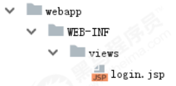

    
    	<b>Spring Security OAuth2.0认证授权</b>
    

# 一、基本概念

## 1、认证

​		**认证**就是判断一个用户的身份是否合法的过程，用户去访问系统资源时系统要求验证用户的身份信息，身份合法方可继续访问，不合法则拒绝访问。常见的用户身份认证方式有：用户名密码登录，二维码登录，手机短信登录，指纹认证等方式。

## 2、会话

​		用户认证通过后，为了避免用户的每次操作都进行认证可将用户的信息保证在**会话**中。会话就是系统为了保持当前用户的登录状态所提供的机制，常见的有基于session方式、基于token方式等。 

1. 基于session的认证方式如下图： 

   ​		它的交互流程是，用户认证成功后，在服务端生成用户相关的数据保存在session(当前会话)中，发给客户端的 sesssion_id 存放到 cookie 中，这样用户客户端请求时带上 session_id 就可以验证服务器端是否存在 session 数 据，以此完成用户的合法校验，当用户退出系统或session过期销毁时,客户端的session_id也就无效了。

2. 基于token方式如下图： 

   ​		它的交互流程是，用户认证成功后，服务端生成一个token发给客户端，客户端可以放到 cookie 或 localStorage 等存储中，每次请求时带上 token，服务端收到token通过验证后即可确认用户身份。

​		基于session的认证方式由Servlet规范定制，服务端要存储session信息需要占用内存资源，客户端需要支持 cookie；基于token的方式则一般不需要服务端存储token，并且不限制客户端的存储方式。如今移动互联网时代 更多类型的客户端需要接入系统，系统多是采用前后端分离的架构进行实现，所以基于token的方式更适合。

## 3、授权

**授权**是用户认证通过根据用户的权限来控制用户访问资源的过程，拥有资源的访问权限则正常访问，没有权限则拒绝访问。

## 4、RBAC（权限控制方案）

1. **基于角色的访问控制**

   ​		RBAC基于角色的访问控制（Role-Based Access Control）是按特定角色进行授权，比如：主体（用户）的角色为总经理可以查询企业运营报表，查询员工工资信息等，访问控制流程如下：

   

   根据上图的判断逻辑，授权代码可表示如下：

   ~~~java
   if(主体.hasRole("总经理角色id")){
   	查询工资
   }
   ~~~

   如果上图中查询工资所需要的角色变化为总经理和部门经理，此时就需要修改判断逻辑为“判断用户的角色是否是“总经理或部门经理”，修改代码如下：

   ~~~java
   if(主体.hasRole("总经理角色id") || 主体.hasRole("部门经理角色id")){
   	查询工资
   }
   ~~~

   根据上边的例子发现，当需要修改角色的权限时就需要修改授权的相关代码，系统可扩展性差。

2. **基于资源的访问控制**

   ​		RBAC基于资源的访问控制（Resource-Based Access Control）是按资源（或权限）进行授权，比如：用户必须具有查询工资权限才可以查询员工工资信息等，访问控制流程如下：

   

   根据上图中的判断，授权代码可以表示为：

   ~~~java
   if(主体.hasPermission("查询工资权限标识")){
   	查询工资
   }
   ~~~

   优点：系统设计时定义好查询工资的权限标识，即使查询工资所需要的角色变化为总经理和部门经理也不需要修改授权代码，系统可扩展性强。

# 二、演示基于Session的认证方式

基于Session的认证机制由Servlet规范定制，Servlet容器已实现，用户通过HttpSession的操作方法即可实现，如下是HttpSession相关的操作API。

|   方法   |   含义   |
| ---- | ---- |
|   HttpSession getSession(Boolean create)   |  获取当前HttpSession对象   |
|     void setAttribute(String name,Object value)  |  向session中存放对象    |
|   object getAttribute(String name)   |  从session中获取对象    |
|void removeAttribute(String name) |移除session中对象|
|void invalidate() |使HttpSession失效 |
|略...||

## 1、创建工程

​		本案例工程使用maven进行构建，使用SpringMVC、Servlet3.0实现。

1. **创建maven工程**

   创建maven工程 security-springmvc，工程结构如下：

   

   引入如下依赖如下

   > 注意： 
   >
   > 1、由于是web工程，packaging设置为war 
   >
   > 2、使用tomcat7-maven-plugin插件来运行工程

   ~~~xml
   <?xml version="1.0" encoding="UTF‐8"?>
   <project xmlns="http://maven.apache.org/POM/4.0.0"
            xmlns:xsi="http://www.w3.org/2001/XMLSchema‐instance"
            xsi:schemaLocation="http://maven.apache.org/POM/4.0.0
   http://maven.apache.org/xsd/maven‐4.0.0.xsd">
       <modelVersion>4.0.0</modelVersion>
       <groupId>com.itheima.security</groupId>
       <artifactId>security‐springmvc</artifactId>
       <version>1.0‐SNAPSHOT</version>
       <packaging>war</packaging>
       <properties>
           <project.build.sourceEncoding>UTF‐8</project.build.sourceEncoding>
           <maven.compiler.source>1.8</maven.compiler.source>
           <maven.compiler.target>1.8</maven.compiler.target>
       </properties>
       <dependencies>
           <dependency>
               <groupId>org.springframework</groupId>
               <artifactId>spring‐webmvc</artifactId>
               <version>5.1.5.RELEASE</version>
           </dependency>
           <dependency>
               <groupId>javax.servlet</groupId>
               <artifactId>javax.servlet‐api</artifactId>
               <version>3.0.1</version>
               <scope>provided</scope>
           </dependency>
           <dependency>
               <groupId>org.projectlombok</groupId>
               <artifactId>lombok</artifactId>
               <version>1.18.8</version>
           </dependency>
       </dependencies>
       <build>
           <finalName>security‐springmvc</finalName>
           <pluginManagement>
               <plugins>
                   <plugin>
                       <groupId>org.apache.tomcat.maven</groupId>
                       <artifactId>tomcat7‐maven‐plugin</artifactId>
                       <version>2.2</version>
                   </plugin>
                   <plugin>
                       <groupId>org.apache.maven.plugins</groupId>
                       <artifactId>maven‐compiler‐plugin</artifactId>
                       <configuration>
                           <source>1.8</source>
                           <target>1.8</target>
                       </configuration>
                   </plugin>
                   <plugin>
                       <artifactId>maven‐resources‐plugin</artifactId>
                       <configuration>
                           <encoding>utf‐8</encoding>
                           <useDefaultDelimiters>true</useDefaultDelimiters>
                           <resources>
                               <resource>
                                   <directory>src/main/resources</directory>
                                   <filtering>true</filtering>
                                   <includes>
                                       <include>**/*</include>
                                   </includes>
                               </resource>
                               <resource>
                                   <directory>src/main/java</directory>
                                   <includes>
                                       <include>**/*.xml</include>
                                   </includes>
                               </resource>
                           </resources>
                       </configuration>
                   </plugin>
               </plugins>
           </pluginManagement>
       </build>
   </project>
   ~~~

2. **Spring容器配置**

   在config包下定义ApplicationConfig.java，它对应web.xml中ContextLoaderListener的配置

   ~~~java
   @Configuration
   @ComponentScan(basePackages = "com.itheima.security.springmvc"
   ,excludeFilters = {@ComponentScan.Filter(type = FilterType.ANNOTATION,value =
   Controller.class)})
   public class ApplicationConfig {
   	//在此配置除了Controller的其它bean，比如：数据库链接池、事务管理器、业务bean等。
   }
   ~~~

3. **servletContext配置**

   本案例采用Servlet3.0无web.xml方式，的config包下定义WebConfig.java，它对应DispatcherServlet配置。

   ~~~java
   @Configuration
   @EnableWebMvc
   @ComponentScan(basePackages = "com.itheima.security.springmvc"
   ,includeFilters = {@ComponentScan.Filter(type = FilterType.ANNOTATION,value =
   Controller.class)})
   public class WebConfig implements WebMvcConfigurer {
       //视频解析器
       @Bean
       public InternalResourceViewResolver viewResolver(){
           InternalResourceViewResolver viewResolver = new InternalResourceViewResolver();
           viewResolver.setPrefix("/WEB‐INF/views/");
           viewResolver.setSuffix(".jsp");
           return viewResolver;
       }
   }
   ~~~

4.  **加载 Spring容器**

   ​		在init包下定义Spring容器初始化类SpringApplicationInitializer，此类实现WebApplicationInitializer接口， Spring容器启动时加载WebApplicationInitializer接口的所有实现类。

   ~~~java
   public class SpringApplicationInitializer extends AbstractAnnotationConfigDispatcherServletInitializer {
       @Override
       protected Class<?>[] getRootConfigClasses() {
       	return new Class<?>[] { ApplicationConfig.class };//指定rootContext的配置类
       }
       
       @Override
       protected Class<?>[] getServletConfigClasses() {
       	return new Class<?>[] { WebConfig.class }; //指定servletContext的配置类
       }
       
       @Override
       protected String[] getServletMappings() {
       	return new String [] {"/"};
       }
   }
   ~~~
   
   ​		SpringApplicationInitializer相当于web.xml，使用了servlet3.0开发则不需要再定义web.xml， ApplicationConfig.class对应以下配置的application-context.xml，WebConfig.class对应以下配置的springmvc.xml，web.xml的内容参考：
   
   ~~~xml
   <web‐app>
       <listener>
       	<listener‐class>org.springframework.web.context.ContextLoaderListener</listener‐class>
       </listener>
       
       <context‐param>
           <param‐name>contextConfigLocation</param‐name>
           <param‐value>/WEB‐INF/application‐context.xml</param‐value>
       </context‐param>
       
       <servlet>
           <servlet‐name>springmvc</servlet‐name>
           <servlet‐class>org.springframework.web.servlet.DispatcherServlet</servlet‐class>
           <init‐param>
           <param‐name>contextConfigLocation</param‐name>
           <param‐value>/WEB‐INF/spring‐mvc.xml</param‐value>
           </init‐param>
           <load‐on‐startup>1</load‐on‐startup>
       </servlet>
       <servlet‐mapping>
           <servlet‐name>springmvc</servlet‐name>
           <url‐pattern>/</url‐pattern>
       </servlet‐mapping>
   </web‐app>
   ~~~

## 2、实现认证功能

1. **认证页面**

   ​		在webapp/WEB-INF/views下定义认证页面login.jsp，本案例只是测试认证流程，页面没有添加css样式，页面实现可填入用户名，密码，触发登录将提交表单信息至/login，内容如下：

   ~~~jsp
   <%@ page contentType="text/html;charset=UTF‐8" pageEncoding="utf‐8" %>
   <html>
   <head>
   	<title>用户登录</title>
   </head>
   <body>
       <form action="login" method="post">
           用户名：<input type="text" name="username"> 
           密&nbsp;&nbsp;&nbsp;码:
           <input type="password" name="password"> 
           <input type="submit" value="登录">
       </form>
   </body>
   </html>
   ~~~

   在WebConfig中新增如下配置，将/直接导向login.jsp页面：

   ~~~java
   @Override
   public void addViewControllers(ViewControllerRegistry registry) {
   	registry.addViewController("/").setViewName("login");
   }
   ~~~

   启动项目，访问/路径地址，进行测试

   

2. **认证接口**

   用户进入认证页面，输入账号和密码，点击登录，请求/login进行身份认证。

   * **定义认证接口**

     此接口用于对传来的用户名、密码校验，若成功则返回该用户的详细信息，否则抛出错误异常：

     ~~~java
     /**
     * 认证服务
     */
     public interface AuthenticationService {
         /**
         * 用户认证
         * @param authenticationRequest 用户认证请求
         * @return 认证成功的用户信息
         */
         UserDto authentication(AuthenticationRequest authenticationRequest);
     }
     ~~~

     认证请求结构：

     ~~~java
     @Data
     public class AuthenticationRequest {
         /**
         * 用户名
         */
         private String username;
         
         /**
         * 密码
         */
         private String password;
     }
     ~~~

     认证成功后返回的用户详细信息，也就是当前登录用户的信息：

     ~~~java
     /**
     * 当前登录用户信息
     */
     @Data
     @AllArgsConstructor
     public class UserDto {
         private String id;
         private String username;
         private String password;
         private String fullname;
         private String mobile;
     }
     ~~~

   * **认证实现类**

     根据用户名查找用户信息，并校验密码，这里模拟了两个用户：

     ~~~java
     @Service
     public class AuthenticationServiceImpl implements AuthenticationService{
         @Override
         public UserDto authentication(AuthenticationRequest authenticationRequest) {
             if(authenticationRequest == null
             		|| StringUtils.isEmpty(authenticationRequest.getUsername())
             		|| StringUtils.isEmpty(authenticationRequest.getPassword())){
             	throw new RuntimeException("账号或密码为空");
             }
             UserDto userDto = getUserDto(authenticationRequest.getUsername());
             if(userDto == null){
             	throw new RuntimeException("查询不到该用户");
             }
             if(!authenticationRequest.getPassword().equals(userDto.getPassword())){
             	throw new RuntimeException("账号或密码错误");
             }
             return userDto;
         }
         
         //模拟用户查询
         public UserDto getUserDto(String username){
         	return userMap.get(username);
         }
         
         //用户信息
         private Map<String,UserDto> userMap = new HashMap<>();
         {
         	userMap.put("zhangsan",new UserDto("1010","zhangsan","123","张三","133443"));
         	userMap.put("lisi",new UserDto("1011","lisi","456","李四","144553"));
         }
     }
     ~~~

     

   * **登录Controller**

     对/login请求处理，它调用AuthenticationService完成认证并返回登录结果提示信息：

     ~~~java
     @RestController
     public class LoginController {
         @Autowired
         private AuthenticationService authenticationService;
         
         /**
         * 用户登录
         * @param authenticationRequest 登录请求
         * @return
         */
         @PostMapping(value = "/login",produces = {"text/plain;charset=UTF‐8"})
         public String login(AuthenticationRequest authenticationRequest){
         	UserDetails userDetails = authenticationService.authentication(authenticationRequest);
         	return userDetails.getFullname() + " 登录成功";
         }
     }
     ~~~

   * **测试**

     启动项目，访问/路径地址，进行测试

     

     填入错误的用户信息，页面返回错误信息：

     

     填入正确的用户信息，页面提示登录成功：

     

     ​		以上的测试全部符合预期，到目前为止最基础的认证功能已经完成，它仅仅实现了对用户身份凭证的校验，若某用户认证成功，只能说明他是该系统的一个合法用户，仅此而已。

## 3、实现会话功能

​		会话是指用户登入系统后，系统会记住该用户的登录状态，他可以在系统连续操作直到退出系统的过程。 

​		认证的目的是对系统资源的保护，每次对资源的访问，系统必须得知道是谁在访问资源，才能对该请求进行合法性 拦截。因此，在认证成功后，一般会把认证成功的用户信息放入Session中，在后续的请求中，系统能够从Session 中获取到当前用户，用这样的方式来实现会话机制。

1. **增加会话控制**

   首先在UserDto中定义一个SESSION_USER_KEY，作为Session中存放登录用户信息的key。

   ~~~java
   public static final String SESSION_USER_KEY = "_user";
   ~~~

   然后修改LoginController，认证成功后，将用户信息放入当前会话。并增加用户登出方法，登出时将session置为失效。

   ~~~java
   /**
   * 用户登录
   * @param authenticationRequest 登录请求
   * @param session http会话
   * @return
   */
   @PostMapping(value = "/login",produces = "text/plain;charset=utf‐8")
   public String login(AuthenticationRequest authenticationRequest, HttpSession session){
       UserDto userDto = authenticationService.authentication(authenticationRequest);
       //用户信息存入session
       session.setAttribute(UserDto.SESSION_USER_KEY,userDto);
       return userDto.getUsername() + "登录成功";
   }
   
   @GetMapping(value = "logout",produces = "text/plain;charset=utf‐8")
   public String logout(HttpSession session){
       session.invalidate();
       return "退出成功";
   }
   ~~~

2. **增加测试资源**

   修改LoginController，增加测试资源1，它从当前会话session中获取当前登录用户，并返回提示信息给前台。

   ~~~java
   /**
   * 测试资源1
   * @param session
   * @return
   */
   @GetMapping(value = "/r/r1",produces = {"text/plain;charset=UTF‐8"})
   public String r1(HttpSession session){
       String fullname = null;
       Object userObj = session.getAttribute(UserDto.SESSION_USER_KEY);
       if(userObj != null){
       	fullname = ((UserDto)userObj).getFullname();
       }else{
       	fullname = "匿名";
       }
       return fullname + " 访问资源1";
   }
   ~~~

3. **测试**

   未登录情况下直接访问测试资源/r/r1：

   

   成功登录的情况下访问测试资源/r/r1：

   

   测试结果说明，在用户登录成功时，该用户信息已被成功放入session，并且后续请求可以正常从session中获取当 前登录用户信息，符合预期结果。

## 4、实现授权功能

​		现在我们已经完成了用户身份凭证的校验以及登录的状态保持，并且我们也知道了如何获取当前登录用户(从 Session中获取)的信息，接下来，用户访问系统需要经过授权，即需要完成如下功能： 

* 匿名用户（未登录用户）访问拦截：禁止匿名用户访问某些资源。 
* 登录用户访问拦截：根据用户的权限决定是否能访问某些资源。 

1. **增加权限数据** 

   为了实现这样的功能，我们需要在UserDto里增加权限属性，用于表示该登录用户所拥有的权限，同时修改 UserDto的构造方法。

   ~~~java
   @Data
   @AllArgsConstructor
   public class UserDto {
       public static final String SESSION_USER_KEY = "_user";
       private String id;
       private String username;
       private String password;
       private String fullname;
       private String mobile;
       /**
       * 用户权限
       */
       private Set<String> authorities;
   }
   ~~~

   并在AuthenticationServiceImpl中为模拟用户初始化权限，其中张三给了p1权限，李四给了p2权限。

   ~~~java
   //用户信息
   private Map<String,UserDto> userMap = new HashMap<>();
   
   {
       Set<String> authorities1 = new HashSet<>();
       authorities1.add("p1");
       Set<String> authorities2 = new HashSet<>();
       authorities2.add("p2");
       userMap.put("zhangsan",new UserDto("1010","zhangsan","123","张三","133443",authorities1));
       userMap.put("lisi",new UserDto("1011","lisi","456","李四","144553",authorities2));
   }
                                          
   private UserDetails getUserDetails(String username) {
   	return userDetailsMap.get(username);
   }
   ~~~

2. **增加测试资源**

   我们想实现针对不同的用户能访问不同的资源，前提是得有多个资源，因此在LoginController中增加测试资源2。

   ~~~java
   /**
   * 测试资源2
   * @param session
   * @return
   */
   @GetMapping(value = "/r/r2",produces = {"text/plain;charset=UTF‐8"})
   public String r2(HttpSession session){
       String fullname = null;
       Object userObj = session.getAttribute(UserDto.SESSION_USER_KEY);
       if(userObj != null){
       	fullname = ((UserDto)userObj).getFullname();
       }else{
       	fullname = "匿名";
       }
       return fullname + " 访问资源2";
   }
   ~~~

3. **实现授权拦截器**

   在interceptor包下定义SimpleAuthenticationInterceptor拦截器，实现授权拦截：

   * 校验用户是否登录
   * 校验用户是否拥有操作权限

   ~~~java
   @Component
   public class SimpleAuthenticationInterceptor implements HandlerInterceptor {
       //请求拦截方法
       @Override
       public boolean preHandle(HttpServletRequest request, HttpServletResponse response, Object handler) throws Exception {
           //读取会话信息
           Object object = request.getSession().getAttribute(UserDto.SESSION_USER_KEY);
           if(object == null){
               writeContent(response,"请登录");
           }
           UserDto user = (UserDto) object;
           //请求的url
           String requestURI = request.getRequestURI();
           if(user.getAuthorities().contains("p1") && requestURI.contains("/r1")){
           	return true;
       	}
           if(user.getAuthorities().contains("p2") && requestURI.contains("/r2")){
           	return true;
           }
           writeContent(response,"权限不足，拒绝访问");
           return false;
       }
       
       //响应输出
       private void writeContent(HttpServletResponse response, String msg) throws IOException {
           response.setContentType("text/html;charset=utf‐8");
           PrintWriter writer = response.getWriter();
           writer.print(msg);
           writer.close();
           response.resetBuffer();
       }
   }
   ~~~

   在WebConfig中配置拦截器，匹配/r/**的资源为受保护的系统资源，访问该资源的请求进入 SimpleAuthenticationInterceptor拦截器。

   ~~~java
   @Autowired
   private SimpleAuthenticationInterceptor simpleAuthenticationInterceptor;
   
   @Override
   public void addInterceptors(InterceptorRegistry registry) {
   	registry.addInterceptor(simpleAuthenticationInterceptor).addPathPatterns("/r/**");
   }
   ~~~

4. **测试**

   未登录情况下，/r/r1与/r/r2均提示 “请先登录”。 

   张三登录情况下，由于张三有p1权限，因此可以访问/r/r1，张三没有p2权限，访问/r/r2时提示 “权限不足 “。 

   李四登录情况下，由于李四有p2权限，因此可以访问/r/r2，李四没有p1权限，访问/r/r1时提示 “权限不足 “。 

   测试结果全部符合预期结果。

## 5、小结

​		基于Session的认证方式是一种常见的认证方式，至今还有非常多的系统在使用。我们在此小节使用Spring mvc技 术对它进行简单实现，旨在让大家更清晰实在的了解用户认证、授权以及会话的功能意义及实现套路，也就是它们分别干了哪些事儿？大概需要怎么做？ 

​		而在正式生产项目中，我们往往会考虑使用第三方安全框架（如 spring security，shiro等安全框架）来实现认证 授权功能，因为这样做能一定程度提高生产力，提高软件标准化程度，另外往往这些框架的可扩展性考虑的非常全 面。但是缺点也非常明显，这些通用化组件为了提高支持范围会增加很多可能我们不需要的功能，结构上也会比较 抽象，如果我们不够了解它，一旦出现问题，将会很难定位。

# 三、Spring Security应用详解

​		Spring Security是一个能够为基于Spring的企业应用系统提供声明式的安全访问控制解决方案的安全框架。由于它是Spring生态系统中的一员，因此它伴随着整个Spring生态系统不断修正、升级，在spring boot项目中加入spring security更是十分简单，使用Spring Security 减少了为企业系统安全控制编写大量重复代码的工作。

## 1、Spring Security快速上手

### 1.1 **创建maven工程**

创建maven工程 security-spring-boot，工程结构如下：

引入以下依赖：

~~~xml
<?xml version="1.0" encoding="UTF‐8"?>
<project xmlns="http://maven.apache.org/POM/4.0.0"
         xmlns:xsi="http://www.w3.org/2001/XMLSchema‐instance"
         xsi:schemaLocation="http://maven.apache.org/POM/4.0.0 http://maven.apache.org/xsd/maven‐
4.0.0.xsd">
    <modelVersion>4.0.0</modelVersion>
    <groupId>com.itheima.security</groupId>
    <artifactId>security‐springboot</artifactId>
    <version>1.0‐SNAPSHOT</version>
    <parent>
        <groupId>org.springframework.boot</groupId>
        <artifactId>spring‐boot‐starter‐parent</artifactId>
        <version>2.1.3.RELEASE</version>
    </parent>
    <properties>
        <project.build.sourceEncoding>UTF‐8</project.build.sourceEncoding>
        <maven.compiler.source>1.8</maven.compiler.source>
        <maven.compiler.target>1.8</maven.compiler.target>
    </properties>
    <dependencies>
        <!‐‐ 以下是>spring boot依赖‐‐>
        <dependency>
            <groupId>org.springframework.boot</groupId>
            <artifactId>spring‐boot‐starter‐web</artifactId>
        </dependency>
        <!‐‐ 以下是>spring security依赖‐‐>
        <dependency>
            <groupId>org.springframework.boot</groupId>
            <artifactId>spring‐boot‐starter‐security</artifactId>
        </dependency>
        <!‐‐ 以下是jsp依赖‐‐>
        <dependency>
            <groupId>javax.servlet</groupId>
            <artifactId>javax.servlet‐api</artifactId>
            <scope>provided</scope>
        </dependency>
        <!‐‐jsp页面使用jstl标签 ‐‐>
        <dependency>
            <groupId>javax.servlet</groupId>
            <artifactId>jstl</artifactId>
        </dependency>
        <dependency>
            <groupId>org.springframework.boot</groupId>
            <artifactId>spring‐boot‐starter‐tomcat</artifactId>
            <scope>provided</scope>
        </dependency>
        <!‐‐用于编译jsp ‐‐>
        <dependency>
            <groupId>org.apache.tomcat.embed</groupId>
            <artifactId>tomcat‐embed‐jasper</artifactId>
            <scope>provided</scope>
        </dependency>
        <dependency>
            <groupId>org.projectlombok</groupId>
            <artifactId>lombok</artifactId>
            <version>1.18.0</version>
        </dependency>
    </dependencies>
    <build>
        <finalName>security‐springboot</finalName>
        <pluginManagement>
            <plugins>
                <plugin>
                    <groupId>org.apache.tomcat.maven</groupId><artifactId>tomcat7‐maven‐plugin</artifactId>
                    <version>2.2</version>
                </plugin>
                <plugin>
                    <groupId>org.apache.maven.plugins</groupId>
                    <artifactId>maven‐compiler‐plugin</artifactId>
                    <configuration>
                        <source>1.8</source>
                        <target>1.8</target>
                    </configuration>
                </plugin>
                <plugin>
                    <artifactId>maven‐resources‐plugin</artifactId>
                    <configuration>
                        <encoding>utf‐8</encoding>
                        <useDefaultDelimiters>true</useDefaultDelimiters>
                        <resources>
                            <resource>
                                <directory>src/main/resources</directory>
                                <filtering>true</filtering>
                                <includes>
                                    <include>**/*</include>
                                </includes>
                            </resource>
                            <resource>
                                <directory>src/main/java</directory>
                                <includes>
                                    <include>**/*.xml</include>
                                </includes>
                            </resource>
                        </resources>
                    </configuration>
                </plugin>
            </plugins>
        </pluginManagement>
    </build>
</project>
~~~

### 1.2 **spring容器配置**

SpringBoot工程启动会自动扫描启动类所在包下的所有Bean，加载到spring容器。 

* *Spring Boot配置文件* 

  在resources下添加application.properties，内容如下：

  ~~~properties
  server.port=8080
  server.servlet.context‐path=/security‐springboot
  spring.application.name = security‐springboot
  ~~~

* *Spring Boot 启动类*

  ~~~java
  @SpringBootApplication
  public class SecuritySpringBootApp {
      public static void main(String[] args) {
      	SpringApplication.run(SecuritySpringBootApp.class, args);
      }
  }
  ~~~

* LoginController

  ~~~java
  @RestController
  public class LoginController {
  }
  ~~~

### 1.3 MVC配置

springSecurity默认提供认证页面，不需要额外开发。

默认根路径请求

~~~java
@Configuration
public class WebConfig implements WebMvcConfigurer {
	//默认Url根路径跳转到/login，此url为spring security提供
    @Override
    public void addViewControllers(ViewControllerRegistry registry) {
    	registry.addViewController("/").setViewName("redirect:/login");
    }
}
~~~

视频解析器配置在application.properties中

~~~properties
spring.mvc.view.prefix=/WEB‐INF/views/
spring.mvc.view.suffix=.jsp
~~~

### 1.4 **安全配置**

spring security提供了用户名密码登录、退出、会话管理等认证功能，只需要配置即可使用。

~~~java
@Configuration
public class WebSecurityConfig extends WebSecurityConfigurerAdapter {
	//配置用户信息服务
    @Bean
    public UserDetailsService userDetailsService() {
        InMemoryUserDetailsManager manager = new InMemoryUserDetailsManager();
        manager.createUser(User.withUsername("zhangsan").password("123").authorities("p1").build());
        manager.createUser(User.withUsername("lisi").password("456").authorities("p2").build());
        return manager;
    }
    
    @Bean
    public PasswordEncoder passwordEncoder() {
    	return NoOpPasswordEncoder.getInstance();
    }
    
    //配置安全拦截机制
    @Override
    protected void configure(HttpSecurity http) throws Exception {
        http.authorizeRequests()
            .antMatchers("/r/**").authenticated() 				（1）
            .anyRequest().permitAll() 							（2）
            .and()
            .formLogin().successForwardUrl("/login‐success"); 	（3）
    }
}
~~~

在**userDetailsService()**方法中，我们返回了一个UserDetailsService给spring容器，Spring Security会使用它来获取用户信息。我们暂时使用InMemoryUserDetailsManager实现类，并在其中分别创建了zhangsan、lisi两个用户，并设置密码和权限。

而在**configure()**中，我们通过HttpSecurity设置了安全拦截规则，其中包含了以下内容： 

（1）url匹配/r/**的资源，经过认证后才能访问。 

（2）其他url完全开放。 

（3）支持form表单认证，认证成功后转向/login-success。 

关于HttpSecurity的配置清单请参考**附录 HttpSecurity**。

### 1.5 **认证成功页面**

在安全配置中，认证成功将跳转到/login-success，代码如下：

~~~java
//配置安全拦截机制
@Override
protected void configure(HttpSecurity http) throws Exception {
    http.authorizeRequests()
        .antMatchers("/r/**").authenticated()
        .anyRequest().permitAll()
        .and()
        .formLogin().successForwardUrl("/login‐success");
}
~~~

spring security支持form表单认证，认证成功后转向/login-success。 

在LoginController中定义/login-success:

~~~java
@RestController
public class LoginController {
    @RequestMapping(value = "/login‐success",produces = {"text/plain;charset=UTF‐8"})
    public String loginSuccess(){
        return " 登录成功";
    }
}
~~~

### 1.6 **授权**

实现授权需要对用户的访问进行拦截校验，校验用户的权限是否可以操作指定的资源，Spring Security默认提供授权实现方法。

在LoginController添加/r/r1和/r/r2

~~~java
@RestController
public class LoginController {
    /**
    * 测试资源1
    * @return
    */
    @GetMapping(value = "/r/r1",produces = {"text/plain;charset=UTF‐8"})
    public String r1(){
        return " 访问资源1";
    }

    /**
    * 测试资源2
    * @return
    */
    @GetMapping(value = "/r/r2",produces = {"text/plain;charset=UTF‐8"})
    public String r2(){
        return " 访问资源2";
    }
    
    @RequestMapping(value = "/login‐success",produces = {"text/plain;charset=UTF‐8"})
    public String loginSuccess(){
        return " 登录成功";
    }
}
~~~

在安全配置类WebSecurityConfig.java中配置授权规则：

~~~java
@Override
protected void configure(HttpSecurity http) throws Exception {
	http.authorizeRequests()
        .antMatchers("/r/r1").hasAuthority("p1") //访问 /r/r1 资源的 url需要拥有p1权限
        .antMatchers("/r/r2").hasAuthority("p2") //访问 /r/r2 资源的 url需要拥有p2权限
        .antMatchers("/r/**").authenticated()
        .anyRequest().permitAll()
        .and()
        .formLogin().successForwardUrl("/login‐success");
}
~~~

### 1.7 **测试**

* *启动项目*

访问http://localhost:8080/security-springboot/路径地址

页面会根据WebConfig中addViewControllers配置规则，跳转至/login，/login是pring Security提供的登录页面。

* *登录*

  * 输入错误的用户名、密码

  

  * 输入正确的用户名、密码，登录成功

    

  * 登录成功后访问对应资源测试

    

* *退出*

  * 请求/logout退出

    

  * 退出后再访问资源自动跳转到登录页面

### 1.8 **小结**

​		通过快速上手，咱们使用Spring Security实现了认证和授权，Spring Security提供了基于账号和密码的认证方式， 通过安全配置即可实现请求拦截，授权功能，Spring Security能完成的不仅仅是这些。

## 2、工作原理

### 2.1 **结构总览**

​		Spring Security所解决的问题就是安全访问控制，而安全访问控制功能其实就是对所有进入系统的请求进行拦截，校验每个请求是否能够访问它所期望的资源。根据前边知识的学习，可以通过Filter或AOP等技术来实现，Spring Security对Web资源的保护是靠Filter实现的，所以从这个Filter来入手，逐步深入Spring Security原理。 

​		当初始化Spring Security时，会创建一个名为 SpringSecurityFilterChain 的Servlet过滤器，类型为 org.springframework.security.web.FilterChainProxy，它实现了javax.servlet.Filter，因此外部的请求会经过此类，下图是Spring Security过虑器链结构图：

​		FilterChainProxy是一个代理，真正起作用的是FilterChainProxy中SecurityFilterChain所包含的各个Filter，同时这些Filter作为Bean被Spring管理，它们是Spring Security核心，各有各的职责，但他们并不直接处理用户的认证，也不直接处理用户的授权，而是把它们交给了认证管理器（AuthenticationManager）和决策管理器 （AccessDecisionManager）进行处理，下图是FilterChainProxy相关类的UML图示。

spring Security功能的实现主要是由一系列过滤器链相互配合完成。

下面介绍过滤器链中主要的几个过滤器及其作用：

* **SecurityContextPersistenceFilter** 

  ​		这个Filter是整个拦截过程的入口和出口（也就是第一个和最后一个拦截器），会在请求开始时从配置好的 SecurityContextRepository 中获取 SecurityContext，然后把它设置给SecurityContextHolder。在请求完成后将 SecurityContextHolder 持有的 SecurityContext 再保存到配置好的SecurityContextRepository，同时清除 securityContextHolder 所持有的 SecurityContext； 

* **UsernamePasswordAuthenticationFilter** 

  ​		用于处理来自表单提交的认证。该表单必须提供对应的用户名和密 码，其内部还有登录成功或失败后进行处理的 AuthenticationSuccessHandler 和 AuthenticationFailureHandler，这些都可以根据需求做相关改变； 

* **FilterSecurityInterceptor** 

  ​		是用于保护web资源的，使用AccessDecisionManager对当前用户进行授权访问，前面已经详细介绍过了； 

* **ExceptionTranslationFilter** 

  ​		能够捕获来自 FilterChain 所有的异常，并进行处理。但是它只会处理两类异常：AuthenticationException 和 AccessDeniedException，其它的异常它会继续抛出。

### 2.2 **认证流程**

#### 2.2.1 认证流程

让我们仔细分析认证过程： 

* 用户提交用户名、密码被SecurityFilterChain中的 UsernamePasswordAuthenticationFilter 过滤器获取到，封装为请求Authentication，通常情况下是UsernamePasswordAuthenticationToken这个实现类。 

* 然后过滤器将Authentication提交至认证管理器（AuthenticationManager）进行认证 

* 认证成功后， AuthenticationManager 身份管理器返回一个被填充满了信息的（包括上面提到的权限信息， 身份信息，细节信息，但密码通常会被移除） Authentication 实例。 

* SecurityContextHolder 安全上下文容器将第3步填充了信息的 Authentication ，通过 SecurityContextHolder.getContext().setAuthentication(…)方法，设置到其中。 可以看出AuthenticationManager接口（认证管理器）是认证相关的核心接口，也是发起认证的出发点，它 的实现类为ProviderManager。而Spring Security支持多种认证方式，因此ProviderManager维护着一个 List 列表，存放多种认证方式，最终实际的认证工作是由 AuthenticationProvider完成的。咱们知道web表单的对应的AuthenticationProvider实现类为 DaoAuthenticationProvider，它的内部又维护着一个UserDetailsService负责UserDetails的获取。最终 AuthenticationProvider将UserDetails填充至Authentication。 认证核心组件的大体关系如下：

  

#### 2.2.2 AuthenticationProvider

​		通过前面的Spring Security认证流程我们得知，认证管理器（AuthenticationManager）委托 AuthenticationProvider完成认证工作。 AuthenticationProvider是一个接口，定义如下：

~~~java
public interface AuthenticationProvider {
	Authentication authenticate(Authentication authentication) throws AuthenticationException;
	boolean supports(Class<?> var1);
}
~~~

​		authenticate()方法定义了认证的实现过程，它的参数是一个Authentication，里面包含了登录用户所提交的用 户、密码等。而返回值也是一个Authentication，这个Authentication则是在认证成功后，将用户的权限及其他信 息重新组装后生成。 

​		Spring Security中维护着一个 `List<AuthenticationProvider>`列表，存放多种认证方式，不同的认证方式使用不 同的AuthenticationProvider。如使用用户名密码登录时，使用AuthenticationProvider1，短信登录时使用 AuthenticationProvider2等等这样的例子很多。 

​		每个AuthenticationProvider需要实现supports（）方法来表明自己支持的认证方式，如我们使用表单方式认证， 在提交请求时Spring Security会生成UsernamePasswordAuthenticationToken，它是一个Authentication，里面 封装着用户提交的用户名、密码信息。而对应的，哪个AuthenticationProvider来处理它？ 

​		我们在DaoAuthenticationProvider的基类AbstractUserDetailsAuthenticationProvider发现以下代码：

~~~java
public boolean supports(Class<?> authentication) {
	return UsernamePasswordAuthenticationToken.class.isAssignableFrom(authentication);
}
~~~

也就是说当web表单提交用户名密码时，Spring Security由DaoAuthenticationProvider处理。

最后，我们来看一下Authentication(认证信息)的结构，它是一个接口，我们之前提到的UsernamePasswordAuthenticationToken就是它的实现之一：

~~~java
public interface Authentication extends Principal, Serializable { 			（1）
    
    Collection<? extends GrantedAuthority> getAuthorities(); 				（2） 
    
    Object getCredentials(); 												（3）
    
    Object getDetails(); 													（4） 
    
    Object getPrincipal(); 													（5）  
    
    boolean isAuthenticated();                                                             
    void setAuthenticated(boolean var1) throws IllegalArgumentException;
}
~~~

（1）Authentication是spring security包中的接口，直接继承自Principal类，而Principal是位于 java.security 包中的。它是表示着一个抽象主体身份，任何主体都有一个名称，因此包含一个getName()方法。 

（2）getAuthorities()，权限信息列表，默认是GrantedAuthority接口的一些实现类，通常是代表权限信息的一系 列字符串。 

（3）getCredentials()，凭证信息，用户输入的密码字符串，在认证过后通常会被移除，用于保障安全。 

（4）getDetails()，细节信息，web应用中的实现接口通常为 WebAuthenticationDetails，它记录了访问者的ip地 址和sessionId的值。 

（5）getPrincipal()，身份信息，大部分情况下返回的是UserDetails接口的实现类，UserDetails代表用户的详细 信息，那从Authentication中取出来的UserDetails就是当前登录用户信息，它也是框架中的常用接口之一。

#### 2.2.3 UserDetailsService

1. **认识UserDetailsService**

   ​		现在咱们现在知道DaoAuthenticationProvider处理了web表单的认证逻辑，认证成功后既得到一个 Authentication(UsernamePasswordAuthenticationToken实现)，里面包含了身份信息（Principal）。这个身份 信息就是一个 Object ，大多数情况下它可以被强转为UserDetails对象。

   ​		DaoAuthenticationProvider中包含了一个UserDetailsService实例，它负责根据用户名提取用户信息 UserDetails(包含密码)，而后DaoAuthenticationProvider会去对比UserDetailsService提取的用户密码与用户提交 的密码是否匹配作为认证成功的关键依据，因此可以通过将自定义的 UserDetailsService 公开为spring bean来定 义自定义身份验证。

   ~~~java
   public interface UserDetailsService {
   	UserDetails loadUserByUsername(String username) throws UsernameNotFoundException;
   }
   ~~~

   ​		很多人把DaoAuthenticationProvider和UserDetailsService的职责搞混淆，其实UserDetailsService只负责从特定 的地方（通常是数据库）加载用户信息，仅此而已。而DaoAuthenticationProvider的职责更大，它完成完整的认 证流程，同时会把UserDetails填充至Authentication。 上面一直提到UserDetails是用户信息，咱们看一下它的真面目：

   ~~~java
   public interface UserDetails extends Serializable {
       Collection<? extends GrantedAuthority> getAuthorities();
       String getPassword();
       String getUsername();
       boolean isAccountNonExpired();
       boolean isAccountNonLocked();
       boolean isCredentialsNonExpired();
       boolean isEnabled();
   }
   ~~~

   ​		它和Authentication接口很类似，比如它们都拥有username，authorities。Authentication的getCredentials()与 UserDetails中的getPassword()需要被区分对待，前者是用户提交的密码凭证，后者是用户实际存储的密码，认证 其实就是对这两者的比对。Authentication中的getAuthorities()实际是由UserDetails的getAuthorities()传递而形成的。还记得Authentication接口中的getDetails()方法吗？其中的UserDetails用户详细信息便是经过了 AuthenticationProvider认证之后被填充的。 

   ​		通过实现UserDetailsService和UserDetails，我们可以完成对用户信息获取方式以及用户信息字段的扩展。 

   ​		Spring Security提供的InMemoryUserDetailsManager(内存认证)，JdbcUserDetailsManager(jdbc认证)就是 UserDetailsService的实现类，主要区别无非就是从内存还是从数据库加载用户。

2. **测试**

   自定义UserDetailsService

   ~~~java
   @Service
   public class SpringDataUserDetailsService implements UserDetailsService {
       @Override
       public UserDetails loadUserByUsername(String username) throws UsernameNotFoundException {
           //登录账号
           System.out.println("username="+username);
           //根据账号去数据库查询...
           //这里暂时使用静态数据
           UserDetails userDetails =
           User.withUsername(username).password("123").authorities("p1").build();
           return userDetails;
       }
   }
   ~~~

   屏蔽安全配置类中UserDetailsService的定义

   ~~~java
   /* 
   @Bean
   public UserDetailsService userDetailsService() {
       InMemoryUserDetailsManager manager = new InMemoryUserDetailsManager();
       manager.createUser(User.withUsername("zhangsan").password("123").authorities("p1").build());
       manager.createUser(User.withUsername("lisi").password("456").authorities("p2").build());
       return manager;
   }
   */
   ~~~

   重启工程，请求认证，SpringDataUserDetailsService的loadUserByUsername方法被调用 ，查询用户信息。

#### 2.2.4 PasswordEncoder

1. **认识PasswordEncoder**

   ​		DaoAuthenticationProvider认证处理器通过UserDetailsService获取到UserDetails后，它是如何与请求 Authentication中的密码做对比呢？ 在这里Spring Security为了适应多种多样的加密类型，又做了抽象，DaoAuthenticationProvider通过 PasswordEncoder接口的matches方法进行密码的对比，而具体的密码对比细节取决于实现：

   ~~~java
   public interface PasswordEncoder {
       String encode(CharSequence var1);
       
       boolean matches(CharSequence var1, String var2);
       
       default boolean upgradeEncoding(String encodedPassword) {
       	return false;
       }
   }
   ~~~

   ​		而Spring Security提供很多内置的PasswordEncoder，能够开箱即用，使用某种PasswordEncoder只需要进行如 下声明即可，如下：

   ~~~java
   @Bean
   public PasswordEncoder passwordEncoder() {
   	return NoOpPasswordEncoder.getInstance();
   }
   ~~~

   NoOpPasswordEncoder采用字符串匹配方法，不对密码进行加密比较处理，密码比较流程如下：

   * 用户输入密码（明文 ） 
   * DaoAuthenticationProvider获取UserDetails（其中存储了用户的正确密码） 
   * DaoAuthenticationProvider使用PasswordEncoder对输入的密码和正确的密码进行校验，密码一致则校验通 过，否则校验失败。

   NoOpPasswordEncoder的校验规则拿 输入的密码和UserDetails中的正确密码进行字符串比较，字符串内容一致 则校验通过，否则校验失败。

   实际项目中推荐使用BCryptPasswordEncoder, Pbkdf2PasswordEncoder, SCryptPasswordEncoder等，感兴趣 的大家可以看看这些PasswordEncoder的具体实现。

2. **使用BCryptPasswordEncoder**

   * *配置BCryptPasswordEncoder*

     在安全配置类中定义：

     ~~~java
     @Bean
     public PasswordEncoder passwordEncoder() {
     	return new BCryptPasswordEncoder();
     }
     ~~~

     测试发现认证失败，提示：Encoded password does not look like BCrypt。 

     原因： 由于UserDetails中存储的是原始密码（比如：123），它不是BCrypt格式。 

     跟踪 DaoAuthenticationProvider第33行代码查看 userDetails中的内容 ，跟踪第38行代码查看 PasswordEncoder的类型。

   * *测试BCrypt*

     通过下边的代码测试BCrypt加密及校验的方法 

     添加依赖：

     ~~~xml
     <dependency>
         <groupId>org.springframework.boot</groupId>
         <artifactId>spring‐boot‐starter‐test</artifactId>
         <scope>test</scope>
     </dependency>
     ~~~

     编写测试方法：

     ~~~java
     @RunWith(SpringRunner.class)
     public class TestBCrypt {
         @Test
         public void test1(){
             //对原始密码加密
             String hashpw = BCrypt.hashpw("123",BCrypt.gensalt());
             System.out.println(hashpw);
             //校验原始密码和BCrypt密码是否一致
             boolean checkpw = BCrypt.checkpw("123","$2a$10$NlBC84MVb7F95EXYTXwLneXgCca6/GipyWR5NHm8K0203bSQMLpvm");
             System.out.println(checkpw);
         }
     }
     ~~~

   * *修改安全配置类*

     将UserDetails中的原始密码修改为BCrypt格式 

     ~~~java
     manager.createUser(User.withUsername("zhangsan").password("$2a$10$1b5mIkehqv5c4KRrX9bUj.A4Y2hug3I GCnMCL5i4RpQrYV12xNKye").authorities("p1").build()); 
     ~~~

     实际项目中存储在数据库中的密码并不是原始密码，都是经过加密处理的密码。

### 2.3 授权流程

1. **授权流程**

   ​		通过快速上手我们知道，Spring Security可以通过 http.authorizeRequests() 对web请求进行授权保护。Spring Security使用标准Filter建立了对web请求的拦截，最终实现对资源的授权访问。 Spring Security的授权流程如下：

   

   分析授权流程：

   * *拦截请求*

     已认证用户访问受保护的web资源将被SecurityFilterChain中的 FilterSecurityInterceptor 的子类拦截。 

   * *获取资源访问策略*

     ​		FilterSecurityInterceptor会从 SecurityMetadataSource 的子类 DefaultFilterInvocationSecurityMetadataSource 获取要访问当前资源所需要的权限 `Collection<ConfigAttribute>` 。 

     SecurityMetadataSource其实就是读取访问策略的抽象，而读取的内容，其实就是我们配置的访问规则， 读 取访问策略如：

     ~~~java
     http.authorizeRequests()
         .antMatchers("/r/r1").hasAuthority("p1")
         .antMatchers("/r/r2").hasAuthority("p2")
         ...
     ~~~

   * 最后，FilterSecurityInterceptor会调用 AccessDecisionManager 进行授权决策，若决策通过，则允许访问资源，否则将禁止访问。

     AccessDecisionManager（访问决策管理器）的核心接口如下:

     ~~~java
     public interface AccessDecisionManager {
         /**
         * 通过传递的参数来决定用户是否有访问对应受保护资源的权限
         */
         void decide(Authentication authentication , Object object, Collection<ConfigAttribute> configAttributes ) 
             throws AccessDeniedException, InsufficientAuthenticationException;
         
         //略..
     }
     ~~~

     这里着重说明一下decide的参数： 

     * authentication：要访问资源的访问者的身份 
     * object：要访问的受保护资源，web请求对应FilterInvocation 
     * configAttributes：是受保护资源的访问策略，通过SecurityMetadataSource获取。

     decide接口就是用来鉴定当前用户是否有访问对应受保护资源的权限。

2. **授权决策**

   AccessDecisionManager采用投票的方式来确定是否能够访问受保护资源。

   

   通过上图可以看出，AccessDecisionManager中包含的一系列AccessDecisionVoter将会被用来对Authentication 是否有权访问受保护对象进行投票，AccessDecisionManager根据投票结果，做出最终决策。

   AccessDecisionVoter是一个接口，其中定义有三个方法，具体结构如下所示。

   ~~~java
   public interface AccessDecisionVoter<S> {
       int ACCESS_GRANTED = 1;
       int ACCESS_ABSTAIN = 0;
       int ACCESS_DENIED = ‐1;
       
       boolean supports(ConfigAttribute var1);
       
       boolean supports(Class<?> var1);
       
       int vote(Authentication var1, S var2, Collection<ConfigAttribute> var3);
   }
   ~~~

   ​		vote()方法的返回结果会是AccessDecisionVoter中定义的三个常量之一。ACCESS_GRANTED表示同意， ACCESS_DENIED表示拒绝，ACCESS_ABSTAIN表示弃权。如果一个AccessDecisionVoter不能判定当前 Authentication是否拥有访问对应受保护对象的权限，则其vote()方法的返回值应当为弃权ACCESS_ABSTAIN。 

   ​		Spring Security内置了三个基于投票的AccessDecisionManager实现类如下，它们分别是 **AffirmativeBased、ConsensusBased和UnanimousBased**。 

   * **AffirmativeBased**的逻辑是：(Spring security默认使用的是AffirmativeBased) 

     > （1）只要有AccessDecisionVoter的投票为ACCESS_GRANTED则同意用户进行访问； 
     >
     > （2）如果全部弃权也表示通过； 
     >
     > （3）如果没有一个人投赞成票，但是有人投反对票，则将抛出AccessDeniedException。 

   * **ConsensusBased**的逻辑是： 

     > （1）如果赞成票多于反对票则表示通过。 
     >
     > （2）反过来，如果反对票多于赞成票则将抛出AccessDeniedException。 
     >
     > （3）如果赞成票与反对票相同且不等于0，并且属性allowIfEqualGrantedDeniedDecisions的值为true，则表 示通过，否则将抛出异常AccessDeniedException。参数allowIfEqualGrantedDeniedDecisions的值默认为true。 
     >
     > （4）如果所有的AccessDecisionVoter都弃权了，则将视参数allowIfAllAbstainDecisions的值而定，如果该值 为true则表示通过，否则将抛出异常AccessDeniedException。参数allowIfAllAbstainDecisions的值默认为false。

   *  **UnanimousBased**的逻辑与另外两种实现有点不一样，另外两种会一次性把受保护对象的配置属性全部传递 给AccessDecisionVoter进行投票，而UnanimousBased会一次只传递一个ConfigAttribute给 AccessDecisionVoter进行投票。这也就意味着如果我们的AccessDecisionVoter的逻辑是只要传递进来的 ConfigAttribute中有一个能够匹配则投赞成票，但是放到UnanimousBased中其投票结果就不一定是赞成了。 UnanimousBased的逻辑具体来说是这样的： 

     > （1）如果受保护对象配置的某一个ConfigAttribute被任意的AccessDecisionVoter反对了，则将抛出 AccessDeniedException。 
     >
     > （2）如果没有反对票，但是有赞成票，则表示通过。 
     >
     > （3）如果全部弃权了，则将视参数allowIfAllAbstainDecisions的值而定，true则通过，false则抛出 AccessDeniedException。 

   Spring Security也内置一些投票者实现类如RoleVoter、AuthenticatedVoter和WebExpressionVoter等，可以 自行查阅资料进行学习。

## 3、自定义认证

### 3.1 自定义登录页面

​		Spring Security会根据启用的功能自动生成一个登录 页面URL，并使用默认URL处理登录的提交内容，登录后跳转的到默认URL等等。尽管自动生成的登录页面很方便快速启动和运行，但大多数应用程序都希望定义自己的登录页面。

1. **认证页面**

   将security-springmvc工程的login.jsp拷贝到security-springboot下，目录保持一致。

   

2. **配置认证页面**

   在WebConfig.java中配置认证页面地址：

   ~~~java
   //默认Url根路径跳转到/login，此url为spring security提供
   @Override
   public void addViewControllers(ViewControllerRegistry registry) {
       registry.addViewController("/").setViewName("redirect:/login‐view");
       registry.addViewController("/login‐view").setViewName("login");
   }
   ~~~

3. **安全配置**

   在WebSecurityConfig中配置表章登录信息：

   ~~~java
   //配置安全拦截机制
   @Override
   protected void configure(HttpSecurity http) throws Exception {
       http.authorizeRequests()
           .antMatchers("/r/**").authenticated()
           .anyRequest().permitAll()
           .and()
           .formLogin() 							(1)
           .loginPage("/login‐view")				(2)
           .loginProcessingUrl("/login")		 	(3)
           .successForwardUrl("/login‐success") 	(4)
           .permitAll();							(5)
   }
   ~~~

   > （1）允许表单登录 
   >
   > （2）指定我们自己的登录页,spring security以重定向方式跳转到/login-view 
   >
   > （3）指定登录处理的URL，也就是用户名、密码表单提交的目的路径 
   >
   > （4）指定登录成功后的跳转URL 
   >
   > （5）我们必须允许所有用户访问我们的登录页（例如为验证的用户），这个 formLogin().permitAll() 方法允许任意用户访问基于表单登录的所有的URL

4. **测试**

   当用户没有认证时访问系统的资源会重定向到login-view页面

   

   输入账号和密码，点击登录,报错：

   

   问题解决：spring security为防止CSRF（Cross-site request forgery跨站请求伪造）的发生，限制了除了get以外的大多数方法。

   * 解决方法1： 屏蔽CSRF控制，即spring security不再限制CSRF。 

     配置WebSecurityConfig

     ~~~java
     @Override
     protected void configure(HttpSecurity http) throws Exception {
         http.csrf().disable() //屏蔽CSRF控制，即spring security不再限制CSRF
         ...
     }
     ~~~

     本案例采用方法1

   * 解决方法2： 在login.jsp页面添加一个token，spring security会验证token，如果token合法则可以继续请求。 

     修改login.jsp

     ~~~jsp
     <form action="login" method="post">
         <input type="hidden" name="${_csrf.parameterName}" value="${_csrf.token}"/>
         ...
     </form>
     ~~~

### 3.2 连接数据库认证

​		前边的例子我们是将用户信息存储在内存中，实际项目中用户信息存储在数据库中，本节实现从数据库读取用户信息。根据前边对认证流程研究，只需要重新定义UserDetailService即可实现根据用户账号查询数据库。

1. **创建数据库**

   创建user_db数据库

   ~~~sql
    CREATE DATABASE `user_db` CHARACTER SET 'utf8' COLLATE 'utf8_general_ci'; 
   ~~~

   创建t_user表

   ~~~sql
   CREATE TABLE `t_user` (
       `id` bigint(20) NOT NULL COMMENT '用户id', 
       `username` varchar(64) NOT NULL, 
       `password` varchar(64) NOT NULL, 
       `fullname` varchar(255) NOT NULL COMMENT '用户姓名', 
       `mobile` varchar(11) DEFAULT NULL COMMENT '手机号', 
       PRIMARY KEY (`id`) USING BTREE 
   ) ENGINE=InnoDB DEFAULT CHARSET=utf8 ROW_FORMAT=DYNAMIC
   ~~~

2. **代码实现**

   * *定义dataSource*

     在application.properties配置

     ~~~properties
     spring.datasource.url=jdbc:mysql://localhost:3306/user_db
     spring.datasource.username=root
     spring.datasource.password=mysql
     spring.datasource.driver‐class‐name=com.mysql.jdbc.Driver
     ~~~

   * *添加依赖*

     ~~~xml
     <dependency>
         <groupId>org.springframework.boot</groupId>
         <artifactId>spring‐boot‐starter‐test</artifactId>
         <scope>test</scope>
     </dependency>
     
     <dependency>
         <groupId>org.springframework.boot</groupId>
         <artifactId>spring‐boot‐starter‐jdbc</artifactId>
     </dependency>
     
     <dependency>
         <groupId>mysql</groupId>
         <artifactId>mysql‐connector‐java</artifactId>
         <version>5.1.47</version>
     </dependency>
     ~~~

   * *定义Dao*

     定义模型类型，在model包定义UserDto：

     ~~~java
     @Data
     public class UserDto {
         private String id;
         private String username;
         private String password;
         private String fullname;
         private String mobile;
     }
     ~~~

     在Dao包定义UserDao：

     ~~~java
     @Repository
     public class UserDao {
         @Autowired
         JdbcTemplate jdbcTemplate;
         
         public UserDto getUserByUsername(String username){
             String sql ="select id,username,password,fullname from t_user where username = ?";
             List<UserDto> list = jdbcTemplate.query(sql, new Object[]{username}, new
             BeanPropertyRowMapper<>(UserDto.class));
             if(list == null && list.size() <= 0){
             	return null;
             }
             return list.get(0);
         }
     }
     ~~~

3. **定义UserDetailService**

   在service包下定义SpringDataUserDetailsService：

   ~~~java
   @Service
   public class SpringDataUserDetailsService implements UserDetailsService {
       @Autowired
       UserDao userDao;
       
       @Override
       public UserDetails loadUserByUsername(String username) throws UsernameNotFoundException {
           //登录账号
           System.out.println("username="+username);
           //根据账号去数据库查询...
           UserDto user = userDao.getUserByUsername(username);
           if(user == null){
           	return null;
           }
               //这里暂时使用静态数据
           UserDetails userDetails = User.withUsername(user.getFullname())
               .password(user.getPassword()).authorities("p1").build();
           return userDetails;
       }
   }
   ~~~

4. **测试**

   输入账号和密码请求认证，跟踪代码。

5. **使用BCryptPasswordEncoder**

   按照我们前边讲的PasswordEncoder的使用方法，使用BCryptPasswordEncoder需要完成如下工作：

   * 在安全配置类中定义BCryptPasswordEncoder

     ~~~java
     @Bean
     public PasswordEncoder passwordEncoder() {
     	return new BCryptPasswordEncoder();
     }
     ~~~

   * UserDetails中的密码存储BCrypt格式

     前边实现了从数据库查询用户信息，所以数据库中的密码应该存储BCrypt格式

     

## 4、会话

​		用户认证通过后，为了避免用户的每次操作都进行认证可将用户的信息保存在会话中。spring security提供会话管理，认证通过后将身份信息放入SecurityContextHolder上下文，SecurityContext与当前线程进行绑定，方便获取用户身份。

1. **获取用户身份**

   ​		编写LoginController，实现/r/r1、/r/r2的测试资源，并修改loginSuccess方法，注意getUsername方法，Spring Security获取当前登录用户信息的方法为SecurityContextHolder.getContext().getAuthentication()

   ~~~java
   @RestController
   public class LoginController {
       /**
       * 用户登录成功
       * @return
       */
       @RequestMapping(value = "/login‐success",produces = {"text/plain;charset=UTF‐8"})
       public String loginSuccess(){
           String username = getUsername();
           return username + " 登录成功";
       }
       
       /**
       * 获取当前登录用户名
       * @return
       */
       private String getUsername(){
           Authentication authentication = SecurityContextHolder.getContext().getAuthentication();
           if(!authentication.isAuthenticated()){
           	return null;
           }
           Object principal = authentication.getPrincipal();
           String username = null;
           if (principal instanceof org.springframework.security.core.userdetails.UserDetails) {
           	username = ((org.springframework.security.core.userdetails.UserDetails)principal).getUsername();
           } else {
           	username = principal.toString();
           }
           return username;
       }
       
       /**
       * 测试资源1
       * @return
       */
       @GetMapping(value = "/r/r1",produces = {"text/plain;charset=UTF‐8"})
       public String r1(){
           String username = getUsername();
           return username + " 访问资源1";
       }
       
       /**
       * 测试资源2
       * @return
       */
       @GetMapping(value = "/r/r2",produces = {"text/plain;charset=UTF‐8"})
       public String r2(){
           String username = getUsername();
           return username + " 访问资源2";
       }
   }
   ~~~

   测试 

   登录前访问资源 - 被重定向至登录页面。 

   登录后访问资源 - 成功访问资源，如下：

   

2. **会话控制**

   我们可以通过以下选项准确控制会话何时创建以及Spring Security如何与之交互：

   | 机制 | 描述 |
   | ---- | ---- |
   |always| 如果没有session存在就创建一个|
   |ifRequired |如果需要就创建一个Session（默认）登录时|
   |never |SpringSecurity 将不会创建Session，但是如果应用中其他地方创建了Session，那么Spring Security将会使用它。|
   |stateless| SpringSecurity将绝对不会创建Session，也不使用Session|

   通过以下配置方式对该选项进行配置：

   ~~~java
   @Override
   protected void configure(HttpSecurity http) throws Exception {
       http.sessionManagement()
       .sessionCreationPolicy(SessionCreationPolicy.IF_REQUIRED)
   }
   ~~~

   默认情况下，Spring Security会为每个登录成功的用户会新建一个Session，就是**ifRequired** 。 

   若选用**never**，则指示Spring Security对登录成功的用户不创建Session了，但若你的应用程序在某地方新建了 session，那么Spring Security会用它的。 

   若使用**stateless**，则说明Spring Security对登录成功的用户不会创建Session了，你的应用程序也不会允许新建 session。并且它会暗示不使用cookie，所以每个请求都需要重新进行身份验证。这种无状态架构适用于REST API 及其无状态认证机制。

   * *会话超时*

     可以再sevlet容器中设置Session的超时时间，如下设置Session有效期为3600s； 

     spring boot 配置文件：

     ~~~properties
     server.servlet.session.timeout=3600s
     ~~~

     session超时之后，可以通过Spring Security 设置跳转的路径。

     ~~~java
     http.sessionManagement()
         .expiredUrl("/login‐view?error=EXPIRED_SESSION")
         .invalidSessionUrl("/login‐view?error=INVALID_SESSION");
     ~~~

     expired指session过期，invalidSession指传入的sessionid无效。

   * *安全会话cookie*

     我们可以使用httpOnly和secure标签来保护我们的会话cookie： 

     * httpOnly：如果为true，那么浏览器脚本将无法访问cookie 
     * secure：如果为true，则cookie将仅通过HTTPS连接发送 

     spring boot 配置文件：

     ~~~properties
     server.servlet.session.cookie.http‐only=true
     server.servlet.session.cookie.secure=true
     ~~~

## 5、退出

Spring security默认实现了logout退出，访问/logout，果然不出所料，退出功能Spring也替我们做好了。

点击“Log Out”退出成功。退出后访问其它url判断是否成功退出。 

这里也可以自定义退出成功的页面，在WebSecurityConfig的`protected void configure(HttpSecurity http)`中配置：

~~~java
.and()
.logout()
.logoutUrl("/logout")
.logoutSuccessUrl("/login‐view?logout");
~~~

当退出操作出发时，将发生： 

* 使HTTP Session 无效 
* 清除 SecurityContextHolder 
* 跳转到 /login-view?logout 

但是，类似于配置登录功能，咱们可以进一步自定义退出功能：

~~~java
@Override
protected void configure(HttpSecurity http) throws Exception {
    http.authorizeRequests()
        //...
        .and()
        .logout() 										(1)
        .logoutUrl("/logout") 							(2)
        .logoutSuccessUrl("/login‐view?logout") 		(3)
        .logoutSuccessHandler(logoutSuccessHandler) 	(4)
        .addLogoutHandler(logoutHandler) 				(5)
        .invalidateHttpSession(true); 					(6)
}
~~~

>（1）提供系统退出支持，使用 WebSecurityConfigurerAdapter 会自动被应用 
>
>（2）设置触发退出操作的URL (默认是 /logout ). 
>
>（3）退出之后跳转的URL。默认是 /login?logout 。 
>
>（4）定制的 LogoutSuccessHandler ，用于实现用户退出成功时的处理。如果指定了这个选项那么 logoutSuccessUrl() 的设置会被忽略。 
>
>（5）添加一个 LogoutHandler ，用于实现用户退出时的清理工作.默认 SecurityContextLogoutHandler 会被添加 为最后一个 LogoutHandler 。 
>
>（6）指定是否在退出时让 HttpSession 无效。 默认设置为 true。

**注意**：如果让logout在GET请求下生效，必须关闭防止CSRF攻击csrf().disable()。如果开启了CSRF，必须使用 post方式请求/logout

**logoutHandler**： 

一般来说， LogoutHandler 的实现类被用来执行必要的清理，因而他们不应该抛出异常。 

下面是Spring Security提供的一些实现： 

* PersistentTokenBasedRememberMeServices 基于持久化token的RememberMe功能的相关清理 
* TokenBasedRememberMeService 基于token的RememberMe功能的相关清理 
* CookieClearingLogoutHandler 退出时Cookie的相关清理 
* CsrfLogoutHandler 负责在退出时移除csrfToken 
* SecurityContextLogoutHandler 退出时SecurityContext的相关清理 

链式API提供了调用相应的 LogoutHandler 实现的快捷方式，比如deleteCookies()。

## 6、授权

​		授权的方式包括 web授权和方法授权，web授权是通过 url拦截进行授权，方法授权是通过方法拦截进行授权。他们都会调用accessDecisionManager进行授权决策，若为web授权则拦截器为FilterSecurityInterceptor；若为方法授权则拦截器为MethodSecurityInterceptor。如果同时通过web授权和方法授权则先执行web授权，再执行方法授权，最后决策通过，则允许访问资源，否则将禁止访问。 类关系如下：

### 6.1 准备环境

1. **数据库环境**

   在t_user数据库创建如下表：

   * 角色表：

     ~~~sql
     CREATE TABLE `t_role` (
         `id` varchar(32) NOT NULL,
         `role_name` varchar(255) DEFAULT NULL,
         `description` varchar(255) DEFAULT NULL,
         `create_time` datetime DEFAULT NULL,
         `update_time` datetime DEFAULT NULL,
         `status` char(1) NOT NULL,
         PRIMARY KEY (`id`),
         UNIQUE KEY `unique_role_name` (`role_name`)
     ) ENGINE=InnoDB DEFAULT CHARSET=utf8
     
     insert into `t_role`(`id`,`role_name`,`description`,`create_time`,`update_time`,`status`) values ('1','管理员',NULL,NULL,NULL,'');
     ~~~

   * 用户角色关系表：

     ~~~sql
     CREATE TABLE `t_user_role` (
         `user_id` varchar(32) NOT NULL,
         `role_id` varchar(32) NOT NULL,
         `create_time` datetime DEFAULT NULL,
         `creator` varchar(255) DEFAULT NULL,
         PRIMARY KEY (`user_id`,`role_id`)
     ) ENGINE=InnoDB DEFAULT CHARSET=utf8
     
     insert into `t_user_role`(`user_id`,`role_id`,`create_time`,`creator`) values
     ('1','1',NULL,NULL);
     ~~~

   * 权限表：

     ~~~sql
     CREATE TABLE `t_permission` (
         `id` varchar(32) NOT NULL,
         `code` varchar(32) NOT NULL COMMENT '权限标识符',
         `description` varchar(64) DEFAULT NULL COMMENT '描述',
         `url` varchar(128) DEFAULT NULL COMMENT '请求地址',
         PRIMARY KEY (`id`)
     ) ENGINE=InnoDB DEFAULT CHARSET=utf8
     
     insert into `t_permission`(`id`,`code`,`description`,`url`) values ('1','p1','测试资源1','/r/r1'),('2','p3','测试资源2','/r/r2');
     ~~~

   * 角色权限关系表：

     ~~~sql
     CREATE TABLE `t_role_permission` (
         `role_id` varchar(32) NOT NULL,
         `permission_id` varchar(32) NOT NULL,
         PRIMARY KEY (`role_id`,`permission_id`)
     ) ENGINE=InnoDB DEFAULT CHARSET=utf8
     
     insert into `t_role_permission`(`role_id`,`permission_id`) values ('1','1'),('1','2');
     ~~~

2.  **修改UserDetailService**

   * 修改dao接口 

     在UserDao中添加：

     ~~~java
     //根据用户id查询用户权限
     public List<String> findPermissionsByUserId(String userId){
         String sql="SELECT * FROM t_permission WHERE id IN(\n" +
                 "SELECT permission_id FROM t_role_permission WHERE role_id IN(\n" +
                 "\tSELECT role_id FROM t_user_role WHERE user_id = ? \n" +
                 ")\n" +
                 ")";
         List<PermissionDto> list = jdbcTemplate.query(sql, new Object[]{userId}, new
         BeanPropertyRowMapper<>(PermissionDto.class));
         List<String> permissions = new ArrayList<>();
         list.iterator().forEachRemaining(c‐>permissions.add(c.getCode()));
         return permissions;
     }
     ~~~

   * 修改UserDetailService 

     实现从数据库读取权限

     ~~~java
     @Override
         public UserDetails loadUserByUsername(String username) throws UsernameNotFoundException {
         //登录账号
         System.out.println("username="+username);
         //根据账号去数据库查询...
         UserDto user = userDao.getUserByUsername(username);
         if(user == null){
         	return null;
         }
         //查询用户权限
         List<String> permissions = userDao.findPermissionsByUserId(user.getId());
         String[] perarray = new String[permissions.size()];
         permissions.toArray(perarray);
         //创建userDetails
         UserDetails userDetails =
         		User.withUsername(user.getFullname()).password(user.getPassword()).authorities(perarray).build();
         return userDetails;
     }
     ~~~

### 6.2 web授权

​		在上面例子中我们完成了认证拦截，并对/r/**下的某些资源进行简单的授权保护，但是我们想进行灵活的授权控制该怎么做呢？通过给 http.authorizeRequests() 添加多个子节点来定制需求到我们的URL，如下代码：

~~~java
@Override
protected void configure(HttpSecurity http) throws Exception {
	http.authorizeRequests() 															(1)
        .antMatchers("/r/r1").hasAuthority("p1") 										(2)
        .antMatchers("/r/r2").hasAuthority("p2") 										(3)
        .antMatchers("/r/r3").access("hasAuthority('p1') and hasAuthority('p2')") 		(4)
        .antMatchers("/r/**").authenticated() 											(5)
        .anyRequest().permitAll() 														(6)
        .and()
        .formLogin()
        // ...
}
~~~

> （1） http.authorizeRequests() 方法有多个子节点，每个macher按照他们的声明顺序执行。 
>
> （2）指定"/r/r1"URL，拥有p1权限能够访问 
>
> （3）指定"/r/r2"URL，拥有p2权限能够访问
>
> （4）指定了"/r/r3"URL，同时拥有p1和p2权限才能够访问 
>
> （5）指定了除了r1、r2、r3之外"/r/**"资源，同时通过身份认证就能够访问，这里使用SpEL（Spring Expression Language）表达式
>
> （6）剩余的尚未匹配的资源，不做保护

**注意**： 规则的顺序是重要的,更具体的规则应该先写.现在以/ admin开始的所有内容都需要具有ADMIN角色的身份验证用 户,即使是/ admin / login路径(因为/ admin / login已经被/ admin / **规则匹配,因此第二个规则被忽略).

~~~java
.antMatchers("/admin/**").hasRole("ADMIN")
.antMatchers("/admin/login").permitAll()
~~~

因此,登录页面的规则应该在/ admin / **规则之前.例如.

~~~java
.antMatchers("/admin/login").permitAll()
.antMatchers("/admin/**").hasRole("ADMIN")
~~~

保护URL常用的方法有： 

* authenticated() 保护URL，需要用户登录 
* permitAll() 指定URL无需保护，一般应用与静态资源文件 
* hasRole(String role) 限制单个角色访问，角色将被增加 “ROLE_” .所以”ADMIN” 将和 “ROLE_ADMIN”进行比较. 
* hasAuthority(String authority) 限制单个权限访问 
* hasAnyRole(String… roles)允许多个角色访问. 
* hasAnyAuthority(String… authorities) 允许多个权限访问. 
* access(String attribute) 该方法使用 SpEL表达式, 所以可以创建复杂的限制. 
* hasIpAddress(String ipaddressExpression) 限制IP地址或子网

### 6.3 方法授权

​		现在我们已经掌握了使用如何使用 http.authorizeRequests() 对web资源进行授权保护，从Spring Security2.0版 本开始，它支持服务层方法的安全性的支持。本节学习@PreAuthorize,@PostAuthorize, @Secured三类注解。 

​		我们可以在任何 @Configuration 实例上使用 @EnableGlobalMethodSecurity 注释来启用基于注解的安全性。 以下内容将启用Spring Security的 @Secured 注释。

~~~java
@EnableGlobalMethodSecurity(securedEnabled = true)
public class MethodSecurityConfig {// ...}
~~~

然后向方法（在类或接口上）添加注解就会限制对该方法的访问。 Spring Security的原生注释支持为该方法定义了 一组属性。 这些将被传递给AccessDecisionManager以供它作出实际的决定：

~~~java
public interface BankService {
    @Secured("IS_AUTHENTICATED_ANONYMOUSLY")
    public Account readAccount(Long id);

    @Secured("IS_AUTHENTICATED_ANONYMOUSLY")
    public Account[] findAccounts();

    @Secured("ROLE_TELLER")
    public Account post(Account account, double amount);
}
~~~

以上配置标明readAccount、findAccounts方法可匿名访问，底层使用WebExpressionVoter投票器，可从 AffirmativeBased第23行代码跟踪。

post方法需要有TELLER角色才能访问，底层使用RoleVoter投票器。 

使用如下代码可启用prePost注解的支持

~~~java
@EnableGlobalMethodSecurity(prePostEnabled = true)
public class MethodSecurityConfig {
    // ...
}
~~~

相应java代码如下：

~~~java
public interface BankService {
    @PreAuthorize("isAnonymous()")
    public Account readAccount(Long id);
    
    @PreAuthorize("isAnonymous()")
    public Account[] findAccounts();
    
    @PreAuthorize("hasAuthority('p_transfer') and hasAuthority('p_read_account')")
    public Account post(Account account, double amount);
}
~~~

以上配置标明readAccount、findAccounts方法可匿名访问，post方法需要同时拥有p_transfer和p_read_account 权限才能访问，底层使用WebExpressionVoter投票器，可从AffirmativeBased第23行代码跟踪。

# 四、分布式系统认证方案

## 1、什么是分布式系统

​		随着软件环境和需求的变化 ，软件的架构由单体结构演变为分布式架构，具有分布式架构的系统叫分布式系统，分布式系统的运行通常依赖网络，它将单体结构的系统分为若干服务，服务之间通过网络交互来完成用户的业务处 理，当前流行的微服务架构就是分布式系统架构，如下图： 

分布式系统具体如下基本特点： 

* 分布性：每个部分都可以独立部署，服务之间交互通过网络进行通信，比如：订单服务、商品服务。 
* 伸缩性：每个部分都可以集群方式部署，并可针对部分结点进行硬件及软件扩容，具有一定的伸缩能力。 
* 共享性：每个部分都可以作为共享资源对外提供服务，多个部分可能有操作共享资源的情况。 
* 开放性：每个部分根据需求都可以对外发布共享资源的访问接口，并可允许第三方系统访问。 

## 2、分布式认证需求 

​		分布式系统的每个服务都会有认证、授权的需求，如果每个服务都实现一套认证授权逻辑会非常冗余，考虑分布式 系统共享性的特点，需要由独立的认证服务处理系统认证授权的请求；考虑分布式系统开放性的特点，不仅对系统 内部服务提供认证，对第三方系统也要提供认证。分布式认证的需求总结如下： 

1. **统一认证授权** 

   提供独立的认证服务，统一处理认证授权。 

   无论是不同类型的用户，还是不同种类的客户端(web端，H5、APP)，均采用一致的认证、权限、会话机制，实现 统一认证授权。 

   要实现统一则认证方式必须可扩展，支持各种认证需求，比如：用户名密码认证、短信验证码、二维码、人脸识别 等认证方式，并可以非常灵活的切换。

2. **应用接入认证** 

   ​		应提供扩展和开放能力，提供安全的系统对接机制，并可开放部分API给接入第三方使用，一方应用（内部 系统服 务）和三方应用（第三方应用）均采用统一机制接入。 

## 3、分布式认证方案 

1. **选型分析** 

   * *基于session的认证方式*

     ​		在分布式的环境下，基于session的认证会出现一个问题，每个应用服务都需在session中存储用户身份信息，通过负载均衡将本地的请求分配到另一个应用服务需要将session信息带过去，否则会重新认证。

     

     

     这个时候，通常的做法有下面几种： 

     * **Session复制**：多台应用服务器之间同步session，使session保持一致，对外透明。 
     * **Session黏贴**：当用户访问集群中某台服务器后，强制指定后续所有请求均落到此机器上。 
     * **Session集中存储**：将Session存入分布式缓存中，所有服务器应用实例统一从分布式缓存中存取Session。 

     总体来讲，基于session认证的认证方式，可以更好的在服务端对会话进行控制，且安全性较高。但是，session机 制方式基于cookie，在复杂多样的移动客户端上不能有效的使用，并且无法跨域，另外随着系统的扩展需提高 session的复制、黏贴及存储的容错性。 

   * *基于token的认证方式* 

     ​		基于token的认证方式，服务端不用存储认证数据，易维护扩展性强， 客户端可以把token 存在任意地方，并且可 以实现web和app统一认证机制。其缺点也很明显，token由于自包含信息，因此一般数据量较大，而且每次请求都需要传递，因此比较占带宽。另外，token的签名验签操作也会给cpu带来额外的处理负担。

     

2. **技术方案** 

   根据选型的分析，决定采用基于token的认证方式，它的优点是： 

   * 适合统一认证的机制，客户端、一方应用、三方应用都遵循一致的认证机制。 
   * token认证方式对第三方应用接入更适合，因为它更开放，可使用当前有流行的开放协议Oauth2.0、JWT等。 
   * 一般情况服务端无需存储会话信息，减轻了服务端的压力。 

   分布式系统认证技术方案见下图： 

   

   流程描述： 

   > （1）用户通过接入方（应用）登录，接入方采取OAuth2.0方式在统一认证服务(UAA)中认证。 
   >
   > （2）认证服务(UAA)调用验证该用户的身份是否合法，并获取用户权限信息。 
   >
   > （3）认证服务(UAA)获取接入方权限信息，并验证接入方是否合法。 
   >
   > （4）若登录用户以及接入方都合法，认证服务生成jwt令牌返回给接入方，其中jwt中包含了用户权限及接入方权 限。 
   >
   > （5）后续，接入方携带jwt令牌对API网关内的微服务资源进行访问。 
   >
   > （6）API网关对令牌解析、并验证接入方的权限是否能够访问本次请求的微服务。 
   >
   > （7）如果接入方的权限没问题，API网关将原请求header中附加解析后的明文Token，并将请求转发至微服务。 
   >
   > （8）微服务收到请求，明文token中包含登录用户的身份和权限信息。因此后续微服务自己可以干两件事：1，用 户授权拦截（看当前用户是否有权访问该资源）2，将用户信息存储进当前线程上下文（有利于后续业务逻辑随时 获取当前用户信息）

    流程所涉及到UAA服务、API网关这三个组件职责如下：

   * **统一认证服务(UAA)** 

     它承载了OAuth2.0接入方认证、登入用户的认证、授权以及生成令牌的职责，完成实际的用户认证、授权功能。 

   * **API网关** 

     作为系统的唯一入口，API网关为接入方提供定制的API集合，它可能还具有其它职责，如身份验证、监控、负载均 衡、缓存等。API网关方式的核心要点是，所有的接入方和消费端都通过统一的网关接入微服务，在网关层处理所 有的非业务功能。

 # 五、OAuth2.0

 ## 1、OAuth2.0介绍 

​		OAuth（开放授权）是一个开放标准，允许用户授权第三方应用访问他们存储在另外的服务提供者上的信息，而不需要将用户名和密码提供给第三方应用或分享他们数据的所有内容。OAuth2.0是OAuth协议的延续版本，但不向 后兼容OAuth 1.0即完全废止了OAuth1.0。很多大公司如Google，Yahoo，Microsoft等都提供了OAUTH认证服务，这些都足以说明OAUTH标准逐渐成为开放资源授权的标准。 

Oauth协议目前发展到2.0版本，1.0版本过于复杂，2.0版本已得到广泛应用。 

参考：https://baike.baidu.com/item/oAuth/7153134?fr=aladdin 

Oauth协议：https://tools.ietf.org/html/rfc6749 

​		下边分析一个Oauth2认证的例子，通过例子去理解OAuth2.0协议的认证流程，本例子是黑马程序员网站使用微信 认证的过程，这个过程的简要描述如下：

​		用户借助微信认证登录黑马程序员网站，用户就不用单独在黑马程序员注册用户，怎么样算认证成功吗？黑马程序员网站需要成功从微信获取用户的身份信息则认为用户认证成功，那如何从微信获取用户的身份信息？用户信息的拥有者是用户本人，微信需要经过用户的同意方可为黑马程序员网站生成令牌，黑马程序员网站拿此令牌方可从微信获取用户的信息。 

1. **客户端请求第三方授权** 

   用户进入黑马程序的登录页面，点击微信的图标以微信账号登录系统，用户是自己在微信里信息的资源拥有者。 

   

   点击“微信”出现一个二维码，此时用户扫描二维码，开始给黑马程序员授权。

   

2. **资源拥有者同意给客户端授权** 

   ​		资源拥有者扫描二维码表示资源拥有者同意给客户端授权，微信会对资源拥有者的身份进行验证， 验证通过后，微信会询问用户是否给授权黑马程序员访问自己的微信数据，用户点击“确认登录”表示同意授权，微信认证服务器会颁发一个授权码，并重定向到黑马程序员的网站。 

   

3. **客户端获取到授权码，请求认证服务器申请令牌** 

   此过程用户看不到，客户端应用程序请求认证服务器，请求携带授权码。 

4. **认证服务器向客户端响应令牌** 

   微信认证服务器验证了客户端请求的授权码，如果合法则给客户端颁发令牌，令牌是客户端访问资源的通行证。 此交互过程用户看不到，当客户端拿到令牌后，用户在黑马程序员看到已经登录成功。 

5. **客户端请求资源服务器的资源** 

   客户端携带令牌访问资源服务器的资源。 黑马程序员网站携带令牌请求访问微信服务器获取用户的基本信息。

6. **资源服务器返回受保护资源** 

   资源服务器校验令牌的合法性，如果合法则向用户响应资源信息内容。 

以上认证授权详细的执行流程如下： 

通过上边的例子我们大概了解了OAauth2.0的认证过程，下边我们看OAuth2.0认证流程： 

引自OAauth2.0协议rfc6749 https://tools.ietf.org/html/rfc6749

OAauth2.0包括以下角色： 

1. *客户端* 

   本身不存储资源，需要通过资源拥有者的授权去请求资源服务器的资源，比如：Android客户端、Web客户端（浏 览器端）、微信客户端等。 

2. *资源拥有者* 

   通常为用户，也可以是应用程序，即该资源的拥有者。 

3. *授权服务器（也称认证服务器）* 

   用于服务提供商对资源拥有的身份进行认证、对访问资源进行授权，认证成功后会给客户端发放令牌 （access_token），作为客户端访问资源服务器的凭据。本例为微信的认证服务器。 

4. *资源服务器* 

   存储资源的服务器，本例子为微信存储的用户信息。 

现在还有一个问题，服务提供商能允许随便一个客户端就接入到它的授权服务器吗？答案是否定的，服务提供商会 给准入的接入方一个身份，用于接入时的凭据:

client_id：客户端标识 client_secret：客户端秘钥 

因此，准确来说，授权服务器对两种OAuth2.0中的两个角色进行认证授权，分别是资源拥有者、客户端。

## 2、Spring Cloud Security OAuth2 

### 2.1 环境介绍 

​		Spring-Security-OAuth2是对OAuth2的一种实现，并且跟我们之前学习的Spring Security相辅相成，与Spring Cloud体系的集成也非常便利，接下来，我们需要对它进行学习，最终使用它来实现我们设计的分布式认证授权解 决方案。

​		OAuth2.0的服务提供方涵盖两个服务，即授权服务 (Authorization Server，也叫认证服务) 和资源服务 (Resource Server)，使用 Spring Security OAuth2 的时候你可以选择把它们在同一个应用程序中实现，也可以选择建立使用同一个授权服务的多个资源服务。 

​		**授权服务 (Authorization Server）**应包含对接入端以及登入用户的合法性进行验证并颁发token等功能，对令牌的请求端点由 Spring MVC 控制器进行实现，下面是配置一个认证服务必须要实现的endpoints：

* AuthorizationEndpoint 服务于认证请求。默认 URL： /oauth/authorize 。 

* TokenEndpoint 服务于访问令牌的请求。默认 URL： /oauth/token 。 

  资源服务 (Resource Server)，应包含对资源的保护功能，对非法请求进行拦截，对请求中token进行解析鉴 权等，下面的过滤器用于实现 OAuth 2.0 资源服务： 

  **OAuth2AuthenticationProcessingFilter**用来对请求给出的身份令牌解析鉴权。

本教程分别创建uaa授权服务（也可叫认证服务）和order订单资源服务。

 

认证流程如下： 

1. 客户端请求UAA授权服务进行认证。 
2. 认证通过后由UAA颁发令牌。 
3. 客户端携带令牌Token请求资源服务。
4. 资源服务校验令牌的合法性，合法即返回资源信息。 

### 2.2 环境搭建 

#### 2.2.1 **父工程** 

创建maven工程作为父工程，依赖如下：  

~~~xml
<?xml version="1.0" encoding="UTF‐8"?>
<project xmlns="http://maven.apache.org/POM/4.0.0"
         xmlns:xsi="http://www.w3.org/2001/XMLSchema‐instance"
         xsi:schemaLocation="http://maven.apache.org/POM/4.0.0 http://maven.apache.org/xsd/maven‐
4.0.0.xsd">
    <modelVersion>4.0.0</modelVersion>
    <groupId>com.itheima.security</groupId>
    <artifactId>distributed‐security</artifactId>
    <version>1.0‐SNAPSHOT</version>
    <packaging>pom</packaging>
    <parent>
        <groupId>org.springframework.boot</groupId>
        <artifactId>spring‐boot‐starter‐parent</artifactId>
        <version>2.1.3.RELEASE</version>
    </parent>
    <properties>
        <project.build.sourceEncoding>UTF‐8</project.build.sourceEncoding>
        <project.reporting.outputEncoding>UTF‐8</project.reporting.outputEncoding>
        <java.version>1.8</java.version>
    </properties>
    <dependencyManagement>
        <dependencies>
            <dependency>
                <groupId>org.springframework.cloud</groupId>
                <artifactId>spring‐cloud‐dependencies</artifactId>
                <version>Greenwich.RELEASE</version>
                <type>pom</type>
                <scope>import</scope>
            </dependency>
            <dependency>
                <groupId>javax.servlet</groupId>
                <artifactId>javax.servlet‐api</artifactId>
                <version>3.1.0</version>
                <scope>provided</scope>
            </dependency>
            <dependency>
                <groupId>javax.interceptor</groupId>
                <artifactId>javax.interceptor‐api</artifactId>
                <version>1.2</version>
            </dependency>
            <dependency>
                <groupId>com.alibaba</groupId>
                <artifactId>fastjson</artifactId>
                <version>1.2.47</version>
            </dependency>
            <dependency>
                <groupId>org.projectlombok</groupId>
                <artifactId>lombok</artifactId>
                <version>1.18.0</version>
            </dependency>
            <dependency>
                <groupId>mysql</groupId>
                <artifactId>mysql‐connector‐java</artifactId>
                <version>5.1.47</version>
            </dependency>
            <dependency>
                <groupId>org.springframework.security</groupId>
                <artifactId>spring‐security‐jwt</artifactId>
                <version>1.0.10.RELEASE</version>
            </dependency>
            <dependency>
                <groupId>org.springframework.security.oauth.boot</groupId>
                <artifactId>spring‐security‐oauth2‐autoconfigure</artifactId>
                <version>2.1.3.RELEASE</version>
            </dependency>
        </dependencies>
    </dependencyManagement>
    <build>
        <finalName>${project.name}</finalName>
        <resources>
            <resource>
                <directory>src/main/resources</directory>
                <filtering>true</filtering>
                <includes>
                    <include>**/*</include>
                </includes>
            </resource><resource>
            <directory>src/main/java</directory>
            <includes>
                <include>**/*.xml</include>
            </includes>
        </resource>
        </resources>
        <plugins>
            <!‐‐<plugin>
            <groupId>org.springframework.boot</groupId>
            <artifactId>spring‐boot‐maven‐plugin</artifactId>
        </plugin>‐‐>
            <plugin>
                <groupId>org.apache.maven.plugins</groupId>
                <artifactId>maven‐compiler‐plugin</artifactId>
                <configuration>
                    <source>1.8</source>
                    <target>1.8</target>
                </configuration>
            </plugin>
            <plugin>
                <artifactId>maven‐resources‐plugin</artifactId>
                <configuration>
                    <encoding>utf‐8</encoding>
                    <useDefaultDelimiters>true</useDefaultDelimiters>
                </configuration>
            </plugin>
        </plugins>
    </build>
</project>
~~~

#### 2.2.2 **创建UAA授权服务工程** 

* *创建distributed-security-uaa* 

  创建distributed-security-uaa作为授权服务工程，依赖如下：  

  ~~~xml
  <?xml version="1.0" encoding="UTF‐8"?>
  <project xmlns="http://maven.apache.org/POM/4.0.0"
           xmlns:xsi="http://www.w3.org/2001/XMLSchema‐instance"
           xsi:schemaLocation="http://maven.apache.org/POM/4.0.0 http://maven.apache.org/xsd/maven‐
  4.0.0.xsd">
      <parent>
          <artifactId>distributed‐security</artifactId>
          <groupId>com.itheima.security</groupId>
          <version>1.0‐SNAPSHOT</version>
      </parent>
      <modelVersion>4.0.0</modelVersion>
      <artifactId>distributed‐security‐uaa</artifactId>
      <dependencies>
          <!‐‐<dependency>
          <groupId>org.springframework.cloud</groupId>
          <artifactId>spring‐cloud‐starter‐netflix‐eureka‐client</artifactId>
      </dependency>‐‐>
          <dependency>
              <groupId>org.springframework.cloud</groupId>
              <artifactId>spring‐cloud‐starter‐netflix‐hystrix</artifactId>
          </dependency>
          <dependency>
              <groupId>org.springframework.cloud</groupId>
              <artifactId>spring‐cloud‐starter‐netflix‐ribbon</artifactId>
          </dependency>
          <dependency>
              <groupId>org.springframework.cloud</groupId>
              <artifactId>spring‐cloud‐starter‐openfeign</artifactId>
          </dependency>
          <dependency>
              <groupId>com.netflix.hystrix</groupId>
              <artifactId>hystrix‐javanica</artifactId>
          </dependency>
          <dependency>
              <groupId>org.springframework.retry</groupId>
              <artifactId>spring‐retry</artifactId>
          </dependency>
          <dependency>
              <groupId>org.springframework.boot</groupId>
              <artifactId>spring‐boot‐starter‐actuator</artifactId>
          </dependency>
          <dependency>
              <groupId>org.springframework.boot</groupId>
              <artifactId>spring‐boot‐starter‐web</artifactId>
          </dependency>
          <dependency>
              <groupId>org.springframework.boot</groupId>
              <artifactId>spring‐boot‐starter‐freemarker</artifactId>
          </dependency>
          <dependency>
              <groupId>org.springframework.data</groupId>
              <artifactId>spring‐data‐commons</artifactId>
          </dependency>
          <dependency>
              <groupId>org.springframework.cloud</groupId>
              <artifactId>spring‐cloud‐starter‐security</artifactId>
          </dependency>
          <dependency>
              <groupId>org.springframework.cloud</groupId>
              <artifactId>spring‐cloud‐starter‐oauth2</artifactId>
          </dependency>
          <dependency>
              <groupId>org.springframework.security</groupId>
              <artifactId>spring‐security‐jwt</artifactId>
          </dependency>
          <dependency>
              <groupId>javax.interceptor</groupId>
              <artifactId>javax.interceptor‐api</artifactId>
          </dependency>
          <dependency>
              <groupId>mysql</groupId>
              <artifactId>mysql‐connector‐java</artifactId>
          </dependency>
          <dependency>
              <groupId>org.springframework.boot</groupId>
              <artifactId>spring‐boot‐starter‐jdbc</artifactId>
          </dependency>
          <dependency>
              <groupId>com.alibaba</groupId>
              <artifactId>fastjson</artifactId>
          </dependency>
          <dependency>
              <groupId>org.projectlombok</groupId>
              <artifactId>lombok</artifactId>
          </dependency>
      </dependencies>
  </project>
  ~~~

  工程结构如下： 

  

* *启动类* 

  本工程采用SpringBoot开发，每个工程编写一个启动类： 

  ~~~java
  @SpringBootApplication
  @EnableDiscoveryClient
  @EnableHystrix
  @EnableFeignClients(basePackages = {"com.itheima.security.distributed.uaa"})
  public class UAAServer {
      public static void main(String[] args) {
      	SpringApplication.run(UAAServer.class, args);
      }
  }
  ~~~

* *配置文件* 

  在resources下创建application.properties 

  ~~~properties
  spring.application.name=uaa‐service
  server.port=53020
  spring.main.allow‐bean‐definition‐overriding = true
  
  logging.level.root = debug
  logging.level.org.springframework.web = info
  
  spring.http.encoding.enabled = true
  spring.http.encoding.charset = UTF‐8
  spring.http.encoding.force = true
  
  server.tomcat.remote_ip_header = x‐forwarded‐for
  server.tomcat.protocol_header = x‐forwarded‐proto
  server.use‐forward‐headers = true
  server.servlet.context‐path = /uaa
  
  spring.freemarker.enabled = true
  spring.freemarker.suffix = .html
  spring.freemarker.request‐context‐attribute = rc
  spring.freemarker.content‐type = text/html
  spring.freemarker.charset = UTF‐8
  spring.mvc.throw‐exception‐if‐no‐handler‐found = true
  spring.resources.add‐mappings = false
  
  spring.datasource.url = jdbc:mysql://localhost:3306/user_db?useUnicode=true
  spring.datasource.username = root
  spring.datasource.password = mysql
  spring.datasource.driver‐class‐name = com.mysql.jdbc.Driver
  
  #eureka.client.serviceUrl.defaultZone = http://localhost:53000/eureka/
  #eureka.instance.preferIpAddress = true
  #eureka.instance.instance‐id = ${spring.application.name}:${spring.cloud.client.ip‐address}:${spring.application.instance_id:${server.port}}
  management.endpoints.web.exposure.include = refresh,health,info,env
  
  feign.hystrix.enabled = true
  feign.compression.request.enabled = true
  feign.compression.request.mime‐types[0] = text/xml
  feign.compression.request.mime‐types[1] = application/xml
  feign.compression.request.mime‐types[2] = application/json
  feign.compression.request.min‐request‐size = 2048
  feign.compression.response.enabled = true
  ~~~

#### 2.2.3 **创建Order资源服务工程**

本工程为Order订单服务工程，访问本工程的资源需要认证通过。 

本工程的目的主要是测试认证授权的功能，所以不涉及订单管理相关业务。 

* 创建Order工程 

  ~~~xml
  <?xml version="1.0" encoding="UTF‐8"?>
  <project xmlns="http://maven.apache.org/POM/4.0.0"
           xmlns:xsi="http://www.w3.org/2001/XMLSchema‐instance"
           xsi:schemaLocation="http://maven.apache.org/POM/4.0.0 http://maven.apache.org/xsd/maven‐
  4.0.0.xsd">
      <parent>
          <artifactId>distributed‐security</artifactId>
          <groupId>com.itheima.security</groupId>
          <version>1.0‐SNAPSHOT</version>
      </parent>
      <modelVersion>4.0.0</modelVersion>
      <artifactId>distributed‐security‐order</artifactId>
      <dependencies>
          <!‐‐<dependency>
          <groupId>org.springframework.cloud</groupId>
          <artifactId>spring‐cloud‐starter‐netflix‐eureka‐client</artifactId>
      </dependency>‐‐>
          <dependency>
              <groupId>org.springframework.boot</groupId>
              <artifactId>spring‐boot‐starter‐actuator</artifactId>
          </dependency>
          <dependency>
              <groupId>org.springframework.boot</groupId>
              <artifactId>spring‐boot‐starter‐web</artifactId>
          </dependency>
          <dependency>
              <groupId>org.springframework.cloud</groupId>
              <artifactId>spring‐cloud‐starter‐security</artifactId>
          </dependency>
          <dependency>
              <groupId>org.springframework.cloud</groupId>
              <artifactId>spring‐cloud‐starter‐oauth2</artifactId>
          </dependency>
          <dependency>
              <groupId>javax.interceptor</groupId>
              <artifactId>javax.interceptor‐api</artifactId>
          </dependency>
          <dependency>
              <groupId>com.alibaba</groupId>
              <artifactId>fastjson</artifactId>
          </dependency>
          <dependency>
              <groupId>org.projectlombok</groupId>
              <artifactId>lombok</artifactId>
          </dependency>
      </dependencies>
  </project>
  ~~~

*  工程结构 

  

* 配置文件

  在resources中创建application.properties

  ~~~properties
  spring.application.name=order‐service
  server.port=53021
  spring.main.allow‐bean‐definition‐overriding = true
  
  logging.level.root = debug
  logging.level.org.springframework.web = info
  spring.http.encoding.enabled = true
  spring.http.encoding.charset = UTF‐8
  spring.http.encoding.force = true
  server.tomcat.remote_ip_header = x‐forwarded‐for
  server.tomcat.protocol_header = x‐forwarded‐proto
  server.use‐forward‐headers = true
  server.servlet.context‐path = /order
  
  spring.freemarker.enabled = true
  spring.freemarker.suffix = .html
  spring.freemarker.request‐context‐attribute = rc
  spring.freemarker.content‐type = text/html
  spring.freemarker.charset = UTF‐8
  spring.mvc.throw‐exception‐if‐no‐handler‐found = true
  spring.resources.add‐mappings = false
  
  #eureka.client.serviceUrl.defaultZone = http://localhost:53000/eureka/
  #eureka.instance.preferIpAddress = true
  #eureka.instance.instance‐id = ${spring.application.name}:${spring.cloud.client.ip‐address}:${spring.application.instance_id:${server.port}}
  management.endpoints.web.exposure.include = refresh,health,info,env
  
  feign.hystrix.enabled = true
  feign.compression.request.enabled = true
  feign.compression.request.mime‐types[0] = text/xml
  feign.compression.request.mime‐types[1] = application/xml
  feign.compression.request.mime‐types[2] = application/json
  feign.compression.request.min‐request‐size = 2048
  feign.compression.response.enabled = true
  ~~~

### 2.3 授权服务器配置 

#### 2.3.1 EnableAuthorizationServer

​		可以用 @EnableAuthorizationServer 注解并继承AuthorizationServerConfigurerAdapter来配置OAuth2.0 授权服务器。 在Config包下创建AuthorizationServer：

~~~java
@Configuration
@EnableAuthorizationServer
public class AuthorizationServer extends AuthorizationServerConfigurerAdapter {
    //略...
}
~~~

​		AuthorizationServerConfigurerAdapter要求配置以下几个类，这几个类是由Spring创建的独立的配置对象，它们 会被Spring传入AuthorizationServerConfigurer中进行配置。 

~~~java
public class AuthorizationServerConfigurerAdapter implements AuthorizationServerConfigurer {
    public AuthorizationServerConfigurerAdapter() {}
    public void configure(AuthorizationServerSecurityConfigurer security) throws Exception {}
    public void configure(ClientDetailsServiceConfigurer clients) throws Exception {}
    public void configure(AuthorizationServerEndpointsConfigurer endpoints) throws Exception {}
}
~~~

* **ClientDetailsServiceConfigurer**：用来配置客户端详情服务（ClientDetailsService），客户端详情信息在 这里进行初始化，你能够把客户端详情信息写死在这里或者是通过数据库来存储调取详情信息。 
* **AuthorizationServerEndpointsConfigurer**：用来配置令牌（token）的访问端点和令牌服务(token services)。 
* **AuthorizationServerSecurityConfigurer**：用来配置令牌端点的安全约束. 

#### 2.3.2 配置客户端详细信息 

​		ClientDetailsServiceConfigurer 能够使用内存或者JDBC来实现客户端详情服务（ClientDetailsService）， ClientDetailsService负责查找ClientDetails，而ClientDetails有几个重要的属性如下列表： 

* clientId：（必须的）用来标识客户的Id。 
* secret：（需要值得信任的客户端）客户端安全码，如果有的话。 
* scope：用来限制客户端的访问范围，如果为空（默认）的话，那么客户端拥有全部的访问范围。 
* authorizedGrantTypes：此客户端可以使用的授权类型，默认为空。 
* authorities：此客户端可以使用的权限（基于Spring Security authorities）。 

​		客户端详情（Client Details）能够在应用程序运行的时候进行更新，可以通过访问底层的存储服务（例如将客户 端详情存储在一个关系数据库的表中，就可以使用 JdbcClientDetailsService）或者通过自己实现 ClientRegistrationService接口（同时你也可以实现 ClientDetailsService 接口）来进行管理。 

我们暂时使用内存方式存储客户端详情信息，配置如下: 

~~~java
@Override
public void configure(ClientDetailsServiceConfigurer clients) throws Exception {
    // clients.withClientDetails(clientDetailsService);
   	clients.inMemory()// 使用in‐memory存储
            .withClient("c1")// client_id
            .secret(new BCryptPasswordEncoder().encode("secret"))
            .resourceIds("res1")
            .authorizedGrantTypes("authorization_code","password",
                                  "client_credentials","implicit","refresh_token")// 该client允许的授权类型
            authorization_code,password,refresh_token,implicit,client_credentials
            .scopes("all")// 允许的授权范围
            .autoApprove(false)
            //加上验证回调地址
            .redirectUris("http://www.baidu.com");
}
~~~

#### 2.3.3 管理令牌 

​		AuthorizationServerTokenServices 接口定义了一些操作使得你可以对令牌进行一些必要的管理，令牌可以被用来 加载身份信息，里面包含了这个令牌的相关权限。 

​		自己可以创建 AuthorizationServerTokenServices 这个接口的实现，则需要继承 DefaultTokenServices 这个类， 里面包含了一些有用实现，你可以使用它来修改令牌的格式和令牌的存储。默认的，当它尝试创建一个令牌的时 候，是使用随机值来进行填充的，除了持久化令牌是委托一个 TokenStore 接口来实现以外，这个类几乎帮你做了 所有的事情。并且 TokenStore 这个接口有一个默认的实现，它就是 InMemoryTokenStore ，如其命名，所有的 令牌是被保存在了内存中。除了使用这个类以外，你还可以使用一些其他的预定义实现，下面有几个版本，它们都 实现了TokenStore接口： 

* InMemoryTokenStore：这个版本的实现是被默认采用的，它可以完美的工作在单服务器上（即访问并发量 压力不大的情况下，并且它在失败的时候不会进行备份），大多数的项目都可以使用这个版本的实现来进行 尝试，你可以在开发的时候使用它来进行管理，因为不会被保存到磁盘中，所以更易于调试。 
* JdbcTokenStore：这是一个基于JDBC的实现版本，令牌会被保存进关系型数据库。使用这个版本的实现时， 你可以在不同的服务器之间共享令牌信息，使用这个版本的时候请注意把"spring-jdbc"这个依赖加入到你的 classpath当中。 
* JwtTokenStore：这个版本的全称是 JSON Web Token（JWT），它可以把令牌相关的数据进行编码（因此对 于后端服务来说，它不需要进行存储，这将是一个重大优势），但是它有一个缺点，那就是撤销一个已经授 权令牌将会非常困难，所以它通常用来处理一个生命周期较短的令牌以及撤销刷新令牌（refresh_token）。 另外一个缺点就是这个令牌占用的空间会比较大，如果你加入了比较多用户凭证信息。JwtTokenStore 不会保 存任何数据，但是它在转换令牌值以及授权信息方面与 DefaultTokenServices 所扮演的角色是一样的。

1. **定义TokenConfig** 

   在config包下定义TokenConfig，我们暂时先使用InMemoryTokenStore，生成一个普通的令牌。 

   ~~~java
   @Configuration
   public class TokenConfig {
       @Bean
       public TokenStore tokenStore() {
       	return new InMemoryTokenStore();
       }
   }
   ~~~

2. **定义AuthorizationServerTokenServices** 

   在AuthorizationServer中定义AuthorizationServerTokenServices

   ~~~java
   @Autowired
   private TokenStore tokenStore;
   
   @Autowired
   private ClientDetailsService clientDetailsService;
   
   @Bean
   public AuthorizationServerTokenServices tokenService() {
       DefaultTokenServices service=new DefaultTokenServices();
       service.setClientDetailsService(clientDetailsService);
       service.setSupportRefreshToken(true);
       service.setTokenStore(tokenStore);
       service.setAccessTokenValiditySeconds(7200); // 令牌默认有效期2小时
       service.setRefreshTokenValiditySeconds(259200); // 刷新令牌默认有效期3天
       return service;
   }
   ~~~

#### 2.3.4 令牌访问端点配置 

AuthorizationServerEndpointsConfigurer 这个对象的实例可以完成令牌服务以及令牌endpoint配置。 

1. **配置授权类型（Grant Types）** 

   AuthorizationServerEndpointsConfigurer 通过设定以下属性决定支持的授权类型（Grant Types）:

   * authenticationManager：认证管理器，当你选择了资源所有者密码（password）授权类型的时候，请设置 这个属性注入一个 AuthenticationManager 对象。 
   * userDetailsService：如果你设置了这个属性的话，那说明你有一个自己的 UserDetailsService 接口的实现， 或者你可以把这个东西设置到全局域上面去（例如 GlobalAuthenticationManagerConfigurer 这个配置对 象），当你设置了这个之后，那么 "refresh_token" 即刷新令牌授权类型模式的流程中就会包含一个检查，用 来确保这个账号是否仍然有效，假如说你禁用了这个账户的话。
   * authorizationCodeServices：这个属性是用来设置授权码服务的（即 AuthorizationCodeServices 的实例对 象），主要用于 "authorization_code" 授权码类型模式。
   * implicitGrantService：这个属性用于设置隐式授权模式，用来管理隐式授权模式的状态。 
   * tokenGranter：当你设置了这个东西（即 TokenGranter 接口实现），那么授权将会交由你来完全掌控，并 且会忽略掉上面的这几个属性，这个属性一般是用作拓展用途的，即标准的四种授权模式已经满足不了你的 需求的时候，才会考虑使用这个。 

2. **配置授权端点的URL（Endpoint URLs）**

   AuthorizationServerEndpointsConfigurer 这个配置对象有一个叫做 pathMapping() 的方法用来配置端点URL链 接，它有两个参数： 

   * 第一个参数：String 类型的，这个端点URL的默认链接。 
   * 第二个参数：String 类型的，你要进行替代的URL链接。 

   以上的参数都将以 "/" 字符为开始的字符串，框架的默认URL链接如下列表，可以作为这个 pathMapping() 方法的 第一个参数：

   * /oauth/authorize：授权端点。
   * /oauth/token：令牌端点。
   * /oauth/confirm_access：用户确认授权提交端点。 
   * /oauth/error：授权服务错误信息端点。 
   * /oauth/check_token：用于资源服务访问的令牌解析端点。 
   * /oauth/token_key：提供公有密匙的端点，如果你使用JWT令牌的话。 

   需要注意的是授权端点这个URL应该被Spring Security保护起来只供授权用户访问. 在AuthorizationServer配置令牌访问端点

   ~~~java
   @Autowired
   private AuthorizationCodeServices authorizationCodeServices;
   
   @Autowired
   private AuthenticationManager authenticationManager;
   
   @Override
   public void configure(AuthorizationServerEndpointsConfigurer endpoints) {
       endpoints
           .authenticationManager(authenticationManager)
           .authorizationCodeServices(authorizationCodeServices)
           .tokenServices(tokenService())
           .allowedTokenEndpointRequestMethods(HttpMethod.POST);
   }
   
   @Bean
   public AuthorizationCodeServices authorizationCodeServices() { //设置授权码模式的授权码如何存取，暂时采用内存方式
   	return new InMemoryAuthorizationCodeServices();
   }
   ~~~

#### 2.3.5 令牌端点的安全约束

1. **AuthorizationServerSecurityConfigurer**：用来配置令牌端点(Token Endpoint)的安全约束，在 AuthorizationServer中配置如下.

   ~~~java
   @Override
   public void configure(AuthorizationServerSecurityConfigurer security){
       security
           .tokenKeyAccess("permitAll()") 			(1)
           .checkTokenAccess("permitAll()") 		(2)
           .allowFormAuthenticationForClients(); 	(3)
   }
   ~~~

   > （1）tokenkey这个endpoint当使用JwtToken且使用非对称加密时，资源服务用于获取公钥而开放的，这里指这个 endpoint完全公开。 
   >
   > （2）checkToken这个endpoint完全公开 
   >
   > （3） 允许表单认证

2. **授权服务配置总结**：授权服务配置分成三大块，可以关联记忆。 
   * 既然要完成认证，它首先得知道客户端信息从哪儿读取，因此要进行客户端详情配置。 
   * 既然要颁发token，那必须得定义token的相关endpoint，以及token如何存取，以及客户端支持哪些类型的 token。 
   * 既然暴露除了一些endpoint，那对这些endpoint可以定义一些安全上的约束等。

#### 2.3.6 web安全配置

将Spring-Boot工程中的WebSecurityConfig拷贝到UAA工程中。

~~~java
@Configuration
@EnableGlobalMethodSecurity(securedEnabled = true,prePostEnabled = true)
public class WebSecurityConfig extends WebSecurityConfigurerAdapter {
    @Bean
    public PasswordEncoder passwordEncoder() {
    	return new BCryptPasswordEncoder();
    }
    
    @Bean
    public AuthenticationManager authenticationManagerBean() throws Exception {
    	return super.authenticationManagerBean();
    }
    
    //安全拦截机制（最重要）
    @Override
    protected void configure(HttpSecurity http) throws Exception {
        http.csrf().disable()
            .authorizeRequests()
            .antMatchers("/r/r1").hasAnyAuthority("p1")
            .antMatchers("/login*").permitAll()
            .anyRequest().authenticated()
            .and()
            .formLogin();
    }
}
~~~

### 2.4 授权码模式

1. **授权码模式介绍**

   下图是授权码模式交互图：

   

   * （1）资源拥有者打开客户端，客户端要求资源拥有者给予授权，它将浏览器被重定向到授权服务器，重定向时会 附加客户端的身份信息。如：

     > /uaa/oauth/authorize?client_id=c1&response_type=code&scope=all&redirect_uri=http://www.baidu.com

     参数列表如下： 

     * client_id：客户端准入标识。 
     * response_type：授权码模式固定为code。 
     * scope：客户端权限。 
     * redirect_uri：跳转uri，当授权码申请成功后会跳转到此地址，并在后边带上code参数（授权码）。

   * （2）浏览器出现向授权服务器授权页面，之后将用户同意授权。 

   * （3）授权服务器将授权码（AuthorizationCode）转经浏览器发送给client(通过redirect_uri)。 

   * （4）客户端拿着授权码向授权服务器索要访问access_token，请求如下：

     > /uaa/oauth/token? client_id=c1&client_secret=secret&grant_type=authorization_code&code=5PgfcD&redirect_uri=http://w ww.baidu.com

     参数列表如下 

     * client_id：客户端准入标识。 
     * client_secret：客户端秘钥。 
     * grant_type：授权类型，填写authorization_code，表示授权码模式 
     * code：授权码，就是刚刚获取的授权码，注意：授权码只使用一次就无效了，需要重新申请。 
     * redirect_uri：申请授权码时的跳转url，一定和申请授权码时用的redirect_uri一致。

   * （5）授权服务器返回令牌(access_token) 

     ​		这种模式是四种模式中最安全的一种模式。一般用于client是Web服务器端应用或第三方的原生App调用资源服务 的时候。因为在这种模式中access_token不会经过浏览器或移动端的App，而是直接从服务端去交换，这样就最大 限度的减小了令牌泄漏的风险。

2. **测试**

   浏览器访问认证页面：

   > http://localhost:53020/uaa/oauth/authorize? client_id=c1&response_type=code&scope=all&redirect_uri=http://www.baidu.com

   

   然后输入模拟的账号和密码点登陆之后进入授权页面：

   

   确认授权后，浏览器会重定向到指定路径（oauth_client_details表中的web_server_redirect_uri）并附加验证码? code=DB2mFj（每次不一样），最后使用该验证码获取token。

   > POST http://localhost:53020/uaa/oauth/token

   

### 2.5 简化模式

1. **简化模式介绍**

   下图是简化模式交互图：

   

   * （1）资源拥有者打开客户端，客户端要求资源拥有者给予授权，它将浏览器被重定向到授权服务器，重定向时会 附加客户端的身份信息。如： 

     > /uaa/oauth/authorize?client_id=c1&response_type=token&scope=all&redirect_uri=http://www.baidu.com 

     参数描述同授权码模式 ，注意response_type=token，说明是简化模式。 

   * （2）浏览器出现向授权服务器授权页面，之后将用户同意授权。 
   * （3）授权服务器将授权码将令牌（access_token）以Hash的形式存放在重定向uri的fargment中发送给浏览 器。 

   **注**：fragment 主要是用来标识 URI 所标识资源里的某个资源，在 URI 的末尾通过 （#）作为 fragment 的开头， 其中 # 不属于 fragment 的值。如https://domain/index#L18这个 URI 中 L18 就是 fragment 的值。大家只需要 知道js通过响应浏览器地址栏变化的方式能获取到fragment 就行了。

    一般来说，简化模式用于没有服务器端的第三方单页面应用，因为没有服务器端就无法接收授权码。

2. **测试**

   浏览器访问认证页面：

   > http://localhost:53020/uaa/oauth/authorize? client_id=c1&response_type=token&scope=all&redirect_uri=http://www.baidu.com

   

   然后输入模拟的账号和密码点登陆之后进入授权页面：

   

   确认授权后，浏览器会重定向到指定路径（oauth_client_details表中的web_server_redirect_uri）并以Hash的形 式存放在重定向uri的fargment中,如：

   > http://aa.bb.cc/receive#access_token=eyJhbGciOiJIUzI1NiIsInR5cCI6IkpXVCJ9.eyJ0ZW5hbn...

### 2.6 密码模式

1. **密码模式介绍**

   下图是密码模式交互图：

   

   * （1）资源拥有者将用户名、密码发送给客户端 

   * （2）客户端拿着资源拥有者的用户名、密码向授权服务器请求令牌（access_token），请求如下：

     > /uaa/oauth/token? client_id=c1&client_secret=secret&grant_type=password&username=shangsan&password=123 

     参数列表如下： 

     * client_id：客户端准入标识。 
     * client_secret：客户端秘钥。 
     * grant_type：授权类型，填写password表示密码模式 
     * username：资源拥有者用户名。 
     * password：资源拥有者密码。 

   * （3）授权服务器将令牌（access_token）发送给client 这种模式十分简单，但是却意味着直接将用户敏感信息泄漏给了client，因此这就说明这种模式只能用于client是我 们自己开发的情况下。因此密码模式一般用于我们自己开发的，第一方原生App或第一方单页面应用。

2. **测试**

   > POST http://localhost:53020/uaa/oauth/token

   请求参数：

   

### 2.7 客户端模式

1. **客户端模式介绍**

   

   * （1）客户端向授权服务器发送自己的身份信息，并请求令牌（access_token） 

   * （2）确认客户端身份无误后，将令牌（access_token）发送给client，请求如下： 

     > /uaa/oauth/token?client_id=c1&client_secret=secret&grant_type=client_credentials

     参数列表如下： 

     * client_id：客户端准入标识。 
     * client_secret：客户端秘钥。 
     * grant_type：授权类型，填写client_credentials表示客户端模式 

   这种模式是最方便但最不安全的模式。因此这就要求我们对client完全的信任，而client本身也是安全的。因 此这种模式一般用来提供给我们完全信任的服务器端服务。比如，合作方系统对接，拉取一组用户信息。

2. **测试**

   > POST http://localhost:53020/uaa/oauth/token

   

   

### 2.8 资源服务测试

1. **资源服务器配置**

   ​		@EnableResourceServer 注解到一个 @Configuration 配置类上，并且必须使用 ResourceServerConfigurer 这个 配置对象来进行配置（可以选择继承自 ResourceServerConfigurerAdapter 然后覆写其中的方法，参数就是这个 对象的实例），下面是一些可以配置的属性：

   ResourceServerSecurityConfigurer中主要包括： 

   * tokenServices：ResourceServerTokenServices 类的实例，用来实现令牌服务。 
   * tokenStore：TokenStore类的实例，指定令牌如何访问，与tokenServices配置可选 
   * resourceId：这个资源服务的ID，这个属性是可选的，但是推荐设置并在授权服务中进行验证。 
   * 其他的拓展属性例如 tokenExtractor 令牌提取器用来提取请求中的令牌。 

   HttpSecurity配置这个与Spring Security类似： 

   * 请求匹配器，用来设置需要进行保护的资源路径，默认的情况下是保护资源服务的全部路径。 
   * 通过http.authorizeRequests()来设置受保护资源的访问规则 
   * 其他的自定义权限保护规则通过 HttpSecurity 来进行配置。

   @EnableResourceServer 注解自动增加了一个类型为 OAuth2AuthenticationProcessingFilter 的过滤器链 编写ResouceServerConfig：

   ~~~java
   @Configuration
   @EnableResourceServer
   @EnableGlobalMethodSecurity(prePostEnabled = true)
   public class ResouceServerConfig extends ResourceServerConfigurerAdapter {
       public static final String RESOURCE_ID = "res1";
       
       @Override
       public void configure(ResourceServerSecurityConfigurer resources) {
           resources.resourceId(RESOURCE_ID)
                   .tokenServices(tokenService())
                   .stateless(true);
       }
       
       @Override
       public void configure(HttpSecurity http) throws Exception {
           http.authorizeRequests()
               .antMatchers("/**").access("#oauth2.hasScope('all')")
               .and().csrf().disable()
               .sessionManagement().sessionCreationPolicy(SessionCreationPolicy.STATELESS);
       }
   }
   ~~~

2. **验证token**

   ​		ResourceServerTokenServices 是组成授权服务的另一半，如果你的授权服务和资源服务在同一个应用程序上的 话，你可以使用 DefaultTokenServices ，这样的话，你就不用考虑关于实现所有必要的接口的一致性问题。如果 你的资源服务器是分离开的，那么你就必须要确保能够有匹配授权服务提供的 ResourceServerTokenServices，它 知道如何对令牌进行解码。

   ​		令牌解析方法： 使用 DefaultTokenServices 在资源服务器本地配置令牌存储、解码、解析方式 使用 RemoteTokenServices 资源服务器通过 HTTP 请求来解码令牌，每次都请求授权服务器端点 /oauth/check_token 

   ​		使用授权服务的 /oauth/check_token 端点你需要在授权服务将这个端点暴露出去，以便资源服务可以进行访问， 这在咱们授权服务配置中已经提到了，下面是一个例子,在这个例子中，我们在授权服务中配置了 /oauth/check_token 和 /oauth/token_key 这两个端点：

   ~~~java
   @Override
   public void configure(AuthorizationServerSecurityConfigurer security) throws Exception{
       security
           .tokenKeyAccess("permitAll()")// /oauth/token_key 安全配置
           .checkTokenAccess("permitAll()") // /oauth/check_token 安全配置
   }
   ~~~

   在资源 服务配置RemoteTokenServices ，在ResouceServerConfig中配置：

   ~~~java
   //资源服务令牌解析服务
   @Bean
   public ResourceServerTokenServices tokenService() {
       //使用远程服务请求授权服务器校验token,必须指定校验token 的url、client_id，client_secret
       RemoteTokenServices service=new RemoteTokenServices();
       service.setCheckTokenEndpointUrl("http://localhost:53020/uaa/oauth/check_token");
       service.setClientId("c1");
       service.setClientSecret("secret");
       return service;
   }
   
   @Override
   public void configure(ResourceServerSecurityConfigurer resources) {
       resources.resourceId(RESOURCE_ID)
           .tokenServices(tokenService())
           .stateless(true);
   }
   ~~~

3. **编写资源**

   在controller包下编写OrderController，此controller表示订单资源的访问类：

   ~~~java
   @RestController
   public class OrderController {
       @GetMapping(value = "/r1")
       @PreAuthorize("hasAnyAuthority('p1')")
       public String r1(){
       	return "访问资源1";
       }
   }
   ~~~

4. **添加安全访问控制**

   ~~~java
   @Configuration
   @EnableGlobalMethodSecurity(securedEnabled = true,prePostEnabled = true)
   public class WebSecurityConfig extends WebSecurityConfigurerAdapter {
       //安全拦截机制（最重要）
       @Override
       protected void configure(HttpSecurity http) throws Exception {
           http.csrf().disable()
                   .authorizeRequests()
                   // .antMatchers("/r/r1").hasAuthority("p2")
                   // .antMatchers("/r/r2").hasAuthority("p2")
                   .antMatchers("/r/**").authenticated()//所有/r/**的请求必须认证通过
                   .anyRequest().permitAll();//除了/r/**，其它的请求可以访问
       }
   }
   ~~~

5. **测试**

   * *申请令牌*

     这里我们使用密码方式

     

   * *请求资源*

     按照oauth2.0协议要求，请求资源需要携带token，如下： 

     * token的参数名称为：Authorization，值为：Bearer token值

       

     * 如果token错误，则授权失败，如下：

       ~~~json
       {
           "error": "invalid_token",
           "error_description": "f3360db3‐2d85‐41c9‐ac5e‐b9adba48e26c"
       }
       ~~~

## 3、JWT令牌

### 3.1 JWT介绍

​		通过上边的测试我们发现，当资源服务和授权服务不在一起时资源服务使用RemoteTokenServices 远程请求授权服务验证token，如果访问量较大将会影响系统的性能 。 令牌采用JWT格式即可解决上边的问题，用户认证通过会得到一个JWT令牌，JWT令牌中已经包括了用户相关的信息，客户端只需要携带JWT访问资源服务，资源服务根据事先约定的算法自行完成令牌校验，无需每次都请求认证服务完成授权。

1. **什么是JWT？**

   ​		JSON Web Token（JWT）是一个开放的行业标准（RFC 7519），它定义了一种简介的、自包含的协议格式，用于 在通信双方传递json对象，传递的信息经过数字签名可以被验证和信任。JWT可以使用HMAC算法或使用RSA的公钥/私钥对来签名，防止被篡改。

   官网：https://jwt.io/ 

   标准：https://tools.ietf.org/html/rfc7519

   JWT令牌的优点： 

   * 1）jwt基于json，非常方便解析。 
   * 2）可以在令牌中自定义丰富的内容，易扩展。 
   * 3）通过非对称加密算法及数字签名技术，JWT防止篡改，安全性高。 
   * 4）资源服务使用JWT可不依赖认证服务即可完成授权。

   缺点：JWT令牌较长，占存储空间比较大。

2. **JWT令牌结构**

   ​		通过学习JWT令牌结构为自定义jwt令牌打好基础。 JWT令牌由三部分组成，每部分中间使用点（.）分隔，比如：xxxxx.yyyyy.zzzzz

   * *Header*

     头部包括令牌的类型（即JWT）及使用的哈希算法（如HMAC SHA256或RSA）

      一个例子如下： 下边是Header部分的内容

     ~~~json
     {
         "alg": "HS256",
         "typ": "JWT"
     }
     ~~~

     将上边的内容使用Base64Url编码，得到一个字符串就是JWT令牌的第一部分。

   * *Payload*

     ​		第二部分是负载，内容也是一个json对象，它是存放有效信息的地方，它可以存放jwt提供的现成字段，比 如：iss（签发者）,exp（过期时间戳）, sub（面向的用户）等，也可自定义字段。 此部分不建议存放敏感信息，因为此部分可以解码还原原始内容。 

     最后将第二部分负载使用Base64Url编码，得到一个字符串就是JWT令牌的第二部分。 一个例子：

     ~~~json
     {
         "sub": "1234567890",
         "name": "456",
         "admin": true
     }
     ~~~

   * *Signature*

     ​		第三部分是签名，此部分用于防止jwt内容被篡改。 这个部分使用base64url将前两部分进行编码，编码后使用点（.）连接组成字符串，最后使用header中声明 签名算法进行签名。 一个例子：

     ~~~java
     HMACSHA256(
             base64UrlEncode(header) + "." +
             base64UrlEncode(payload),
             secret)
     ~~~

     base64UrlEncode(header)：jwt令牌的第一部分。 

     base64UrlEncode(payload)：jwt令牌的第二部分。 

     secret：签名所使用的密钥。

### 3.2 配置JWT令牌服务

在uaa中配置jwt令牌服务，即可实现生成jwt格式的令牌。

1. **TokenConfig**

   ~~~java
   @Configuration
   public class TokenConfig {
       private String SIGNING_KEY = "uaa123";
       
       @Bean
       public TokenStore tokenStore() {
       	return new JwtTokenStore(accessTokenConverter());
       }
       
       @Bean
       public JwtAccessTokenConverter accessTokenConverter() {
           JwtAccessTokenConverter converter = new JwtAccessTokenConverter();
           converter.setSigningKey(SIGNING_KEY); //对称秘钥，资源服务器使用该秘钥来验证
           return converter;
       }
   }
   ~~~

2. **定义JWT令牌服务**

   ~~~java
   @Autowired
   private JwtAccessTokenConverter accessTokenConverter;
   
   @Bean
   public AuthorizationServerTokenServices tokenService() {
       DefaultTokenServices service=new DefaultTokenServices();
       service.setClientDetailsService(clientDetailsService);
       service.setSupportRefreshToken(true);
       service.setTokenStore(tokenStore);
       TokenEnhancerChain tokenEnhancerChain = new TokenEnhancerChain();
       tokenEnhancerChain.setTokenEnhancers(Arrays.asList(accessTokenConverter));
       service.setTokenEnhancer(tokenEnhancerChain);
       service.setAccessTokenValiditySeconds(7200); // 令牌默认有效期2小时
       service.setRefreshTokenValiditySeconds(259200); // 刷新令牌默认有效期3天
       return service;
   }
   ~~~

### 3.3 生成JWT令牌

### 3.4 校验JWT令牌

资源服务需要和授权服务拥有一致的签字、令牌服务等： 

1. 将授权服务中的TokenConfig类拷贝到资源 服务中 

2. 屏蔽资源 服务原来的令牌服务类

   ~~~java
   @Configuration
   @EnableResourceServer
   @EnableGlobalMethodSecurity(prePostEnabled = true)
   public class ResouceServerConfig extends ResourceServerConfigurerAdapter {
       public static final String RESOURCE_ID = "res1";
       
       @Autowired
       TokenStore tokenStore;
       
       //资源服务令牌解析服务
       // @Bean
       // public ResourceServerTokenServices tokenService() {
       // 		//使用远程服务请求授权服务器校验token,必须指定校验token 的url、client_id，client_secret
       // 		RemoteTokenServices service=new RemoteTokenServices();
       // 		service.setCheckTokenEndpointUrl("http://localhost:53020/uaa/oauth/check_token");
       // 		service.setClientId("c1");
       // 		service.setClientSecret("secret");
       // 		return service;
       // }
       
       @Override
       public void configure(ResourceServerSecurityConfigurer resources) {
           resources.resourceId(RESOURCE_ID)
           .tokenStore(tokenStore)
           .stateless(true);
       }
   }
   ~~~

3. 测试

   * 1）申请jwt令牌 

   * 2）使用令牌请求资源

   

   小技巧： 令牌申请成功可以使用/uaa/oauth/check_token校验令牌的有效性，并查询令牌的内容，如下：

   

## 4、完善环境配置

截止目前客户端信息和授权码仍然存储在内存中，生产环境中通过会存储在数据库中，下边完善环境的配置：

1. **创建表**

   在user_db中创建如下表：

   ~~~sql
   DROP TABLE IF EXISTS `oauth_client_details`;
   
   CREATE TABLE `oauth_client_details` (
       `client_id` varchar(255) CHARACTER SET utf8 COLLATE utf8_general_ci NOT NULL COMMENT '客户端标识',
       `resource_ids` varchar(255) CHARACTER SET utf8 COLLATE utf8_general_ci NULL DEFAULT NULL COMMENT '接入资源列表',
       `client_secret` varchar(255) CHARACTER SET utf8 COLLATE utf8_general_ci NULL DEFAULT NULL COMMENT '客户端秘钥',
       `scope` varchar(255) CHARACTER SET utf8 COLLATE utf8_general_ci NULL DEFAULT NULL,
       `authorized_grant_types` varchar(255) CHARACTER SET utf8 COLLATE utf8_general_ci NULL DEFAULT NULL,
       `web_server_redirect_uri` varchar(255) CHARACTER SET utf8 COLLATE utf8_general_ci NULL DEFAULT NULL,
       `authorities` varchar(255) CHARACTER SET utf8 COLLATE utf8_general_ci NULL DEFAULT NULL,
       `access_token_validity` int(11) NULL DEFAULT NULL,
       `refresh_token_validity` int(11) NULL DEFAULT NULL,
       `additional_information` longtext CHARACTER SET utf8 COLLATE utf8_general_ci NULL,
       `create_time` timestamp(0) NOT NULL DEFAULT CURRENT_TIMESTAMP(0) ON UPDATE
       CURRENT_TIMESTAMP(0),
       `archived` tinyint(4) NULL DEFAULT NULL,
       `trusted` tinyint(4) NULL DEFAULT NULL,
       `autoapprove` varchar(255) CHARACTER SET utf8 COLLATE utf8_general_ci NULL DEFAULT NULL,
       PRIMARY KEY (`client_id`) USING BTREE
   ) ENGINE = InnoDB CHARACTER SET = utf8 COLLATE = utf8_general_ci COMMENT = '接入客户端信息' ROW_FORMAT = Dynamic;
   
   INSERT INTO `oauth_client_details` VALUES ('c1', 'res1',
   '$2a$10$NlBC84MVb7F95EXYTXwLneXgCca6/GipyWR5NHm8K0203bSQMLpvm', 'ROLE_ADMIN,ROLE_USER,ROLE_API',
   'client_credentials,password,authorization_code,implicit,refresh_token', 'http://www.baidu.com',
   NULL, 7200, 259200, NULL, '2019‐09‐09 16:04:28', 0, 0, 'false');
   
   INSERT INTO `oauth_client_details` VALUES ('c2', 'res2',
   '$2a$10$NlBC84MVb7F95EXYTXwLneXgCca6/GipyWR5NHm8K0203bSQMLpvm', 'ROLE_API',
   'client_credentials,password,authorization_code,implicit,refresh_token', 'http://www.baidu.com',
   NULL, 31536000, 2592000, NULL, '2019‐09‐09 21:48:51', 0, 0, 'false');
   ~~~

   oauth_code表，Spring Security OAuth2使用，用来存储授权码：

   ~~~sql
   DROP TABLE IF EXISTS `oauth_code`;
   
   CREATE TABLE `oauth_code` (
       `create_time` timestamp(0) NOT NULL DEFAULT CURRENT_TIMESTAMP,
       `code` varchar(255) CHARACTER SET utf8 COLLATE utf8_general_ci NULL DEFAULT NULL,
       `authentication` blob NULL,
       INDEX `code_index`(`code`) USING BTREE
   ) ENGINE = InnoDB CHARACTER SET = utf8 COLLATE = utf8_general_ci ROW_FORMAT = Compact;
   ~~~

2. **配置授权服务**

   修改AuthorizationServer

   ClientDetailsService和AuthorizationCodeServices从数据库读取数据。

   ~~~java
   @Configuration
   @EnableAuthorizationServer
   public class AuthorizationServer extends AuthorizationServerConfigurerAdapter {
       @Autowired
       private TokenStore tokenStore;
       @Autowired
       private JwtAccessTokenConverter accessTokenConverter;
       @Autowired
       private ClientDetailsService clientDetailsService;
       @Autowired
       private AuthorizationCodeServices authorizationCodeServices;
       @Autowired
       private AuthenticationManager authenticationManager;
   
       /**
        * 1.客户端详情相关配置
        */
       @Bean
       public PasswordEncoder passwordEncoder() {
           return new BCryptPasswordEncoder();
       }
   
       @Bean
       public ClientDetailsService clientDetailsService(DataSource dataSource) {
           ClientDetailsService clientDetailsService = new JdbcClientDetailsService(dataSource);
           ((JdbcClientDetailsService)
                   clientDetailsService).setPasswordEncoder(passwordEncoder());
           return clientDetailsService;
       }
   
       @Override
       public void configure(ClientDetailsServiceConfigurer clients)
               throws Exception {
           clients.withClientDetails(clientDetailsService);
       }
   
       /**
        * 2.配置令牌服务(token services)
        */
       @Bean
       public AuthorizationServerTokenServices tokenService() {
           DefaultTokenServices service = new DefaultTokenServices();
           service.setClientDetailsService(clientDetailsService);
           service.setSupportRefreshToken(true);//支持刷新令牌
           service.setTokenStore(tokenStore); //绑定tokenStore
           TokenEnhancerChain tokenEnhancerChain = new TokenEnhancerChain();
           tokenEnhancerChain.setTokenEnhancers(Arrays.asList(accessTokenConverter));
           service.setTokenEnhancer(tokenEnhancerChain);
           service.setAccessTokenValiditySeconds(7200); // 令牌默认有效期2小时
           service.setRefreshTokenValiditySeconds(259200); // 刷新令牌默认有效期3天
           return service;
       }
   
       /**
        * 3.配置令牌（token）的访问端点
        */
       @Bean
       public AuthorizationCodeServices authorizationCodeServices(DataSource dataSource) {
           return new JdbcAuthorizationCodeServices(dataSource);//设置授权码模式的授权码如何存取
       }
   
       @Override
       public void configure(AuthorizationServerEndpointsConfigurer endpoints) {
           endpoints.authenticationManager(authenticationManager)
                   .authorizationCodeServices(authorizationCodeServices)
                   .tokenServices(tokenService())
                   .allowedTokenEndpointRequestMethods(HttpMethod.POST);
       }
   
       /**
        * 4.配置令牌端点(Token Endpoint)的安全约束
        */
       @Override
       public void configure(AuthorizationServerSecurityConfigurer security) {
           security
                   .tokenKeyAccess("permitAll()")
                   .checkTokenAccess("permitAll()")
                   .allowFormAuthenticationForClients();//允许表单认证
       }
   }
   ~~~

3. **测试**

   * 测试申请令牌 

     使用密码模式申请令牌，客户端信息需要和数据库中的信息一致。 

   * 测试授权码模式 

     生成的授权存储到数据库中。

# 六、Spring Security实现分布式系统授权

## 1、需求分析

回顾技术方案如下：

1. UAA认证服务负责认证授权。
2.  所有请求经过 网关到达微服务 
3. 网关负责鉴权客户端以及请求转发 
4. 网关将token解析后传给微服务，微服务进行授权。

## 2、注册中心

​		所有微服务的请求都经过网关，网关从注册中心读取微服务的地址，将请求转发至微服务。 本节完成注册中心的搭建，注册中心采用Eureka。

1. **创建maven工程**

   

2. **pom.xml依赖如下**

   ~~~xml
   <?xml version="1.0" encoding="UTF‐8"?>
   <project xmlns="http://maven.apache.org/POM/4.0.0"
            xmlns:xsi="http://www.w3.org/2001/XMLSchema‐instance"
            xsi:schemaLocation="http://maven.apache.org/POM/4.0.0 http://maven.apache.org/xsd/maven‐
   4.0.0.xsd">
       <parent>
           <artifactId>distributed‐security</artifactId>
           <groupId>com.itheima.security</groupId>
           <version>1.0‐SNAPSHOT</version>
       </parent>
       <modelVersion>4.0.0</modelVersion>
       <artifactId>distributed‐security‐discovery</artifactId>
       <dependencies>
           <dependency>
               <groupId>org.springframework.cloud</groupId>
               <artifactId>spring‐cloud‐starter‐netflix‐eureka‐server</artifactId>
           </dependency>
           <dependency>
               <groupId>org.springframework.boot</groupId>
               <artifactId>spring‐boot‐starter‐actuator</artifactId>
           </dependency>
       </dependencies>
   </project>
   ~~~

3. **配置文件**

   在resources中配置application.yml

   ~~~yml
   spring:
     application:
       name: distributed‐discovery
   
   server:
     port: 53000 #启动端口
   
   eureka:
     server:
       enable‐self‐preservation: false #关闭服务器自我保护，客户端心跳检测15分钟内错误达到80%服务会保护，导致别人还认为是好用的服务
       eviction‐interval‐timer‐in‐ms: 10000 #清理间隔（单位毫秒，默认是60*1000）5秒将客户端剔除的服务在服务注册列表中剔除#
       shouldUseReadOnlyResponseCache: true #eureka是CAP理论种基于AP策略，为了保证强一致性关闭此切换CP默认不关闭 false关闭
     client:
       register‐with‐eureka: false #false:不作为一个客户端注册到注册中心
       fetch‐registry: false #为true时，可以启动，但报异常：Cannot execute request on any known server
       instance‐info‐replication‐interval‐seconds: 10
       serviceUrl:
         defaultZone: http://localhost:${server.port}/eureka/
     instance:
       hostname: ${spring.cloud.client.ip‐address}
       prefer‐ip‐address: true
       instance‐id: ${spring.application.name}:${spring.cloud.client.ip-address}:${spring.application.instance_id:${server.port}}
   ~~~

   启动类：

   ~~~java
   @SpringBootApplication
   @EnableEurekaServer
   public class DiscoveryServer {
       public static void main(String[] args) {
       	SpringApplication.run(DiscoveryServer.class, args);
       }
   }
   ~~~

## 3、网关

​		网关整合 OAuth2.0 有两种思路，一种是认证服务器生成jwt令牌, 所有请求统一在网关层验证，判断权限等操作； 另一种是由各资源服务处理，网关只做请求转发。 

​		我们选用第一种。我们把API网关作为OAuth2.0的资源服务器角色，实现接入客户端权限拦截、令牌解析并转发当 前登录用户信息(jsonToken)给微服务，这样下游微服务就不需要关心令牌格式解析以及OAuth2.0相关机制了。

 API网关在认证授权体系里主要负责两件事： 

* （1）作为OAuth2.0的资源服务器角色，实现接入方权限拦截。 

* （2）令牌解析并转发当前登录用户信息（明文token）给微服务 

微服务拿到明文token(明文token中包含登录用户的身份和权限信息)后也需要做两件事： 

* （1）用户授权拦截（看当前用户是否有权访问该资源） 
* （2）将用户信息存储进当前线程上下文（有利于后续业务逻辑随时获取当前用户信息）

1. **创建工程**

   

   * pom.xml

     ~~~xml
     <?xml version="1.0" encoding="UTF‐8"?>
     <project xmlns="http://maven.apache.org/POM/4.0.0"
              xmlns:xsi="http://www.w3.org/2001/XMLSchema‐instance"
              xsi:schemaLocation="http://maven.apache.org/POM/4.0.0 http://maven.apache.org/xsd/maven‐
     4.0.0.xsd">
         <parent>
             <artifactId>distributed‐security</artifactId>
             <groupId>com.itheima.security</groupId>
             <version>1.0‐SNAPSHOT</version>
         </parent>
         <modelVersion>4.0.0</modelVersion>
         <artifactId>distributed‐security‐gateway</artifactId>
         <dependencies>
             <dependency>
                 <groupId>org.springframework.cloud</groupId>
                 <artifactId>spring‐cloud‐starter‐netflix‐eureka‐client</artifactId>
             </dependency>
             <dependency>
                 <groupId>org.springframework.cloud</groupId>
                 <artifactId>spring‐cloud‐starter‐netflix‐hystrix</artifactId>
             </dependency>
             <dependency>
                 <groupId>org.springframework.cloud</groupId>
                 <artifactId>spring‐cloud‐starter‐netflix‐ribbon</artifactId>
             </dependency>
             <dependency>
                 <groupId>org.springframework.cloud</groupId>
                 <artifactId>spring‐cloud‐starter‐openfeign</artifactId>
             </dependency>
             <dependency>
                 <groupId>com.netflix.hystrix</groupId>
                 <artifactId>hystrix‐javanica</artifactId>
             </dependency>
             <dependency>
                 <groupId>org.springframework.retry</groupId>
                 <artifactId>spring‐retry</artifactId>
             </dependency>
             <dependency>
                 <groupId>org.springframework.boot</groupId>
                 <artifactId>spring‐boot‐starter‐actuator</artifactId>
             </dependency>
             <dependency>
                 <groupId>org.springframework.boot</groupId>
                 <artifactId>spring‐boot‐starter‐web</artifactId>
             </dependency>
             <dependency>
                 <groupId>org.springframework.cloud</groupId>
                 <artifactId>spring‐cloud‐starter‐netflix‐zuul</artifactId>
             </dependency>
             <dependency>
                 <groupId>org.springframework.cloud</groupId>
                 <artifactId>spring‐cloud‐starter‐security</artifactId>
             </dependency>
             <dependency>
                 <groupId>org.springframework.cloud</groupId>
                 <artifactId>spring‐cloud‐starter‐oauth2</artifactId>
             </dependency>
             <dependency>
                 <groupId>org.springframework.security</groupId>
                 <artifactId>spring‐security‐jwt</artifactId>
             </dependency>
             <dependency>
                 <groupId>javax.interceptor</groupId>
                 <artifactId>javax.interceptor‐api</artifactId>
             </dependency>
             <dependency>
                 <groupId>com.alibaba</groupId>
                 <artifactId>fastjson</artifactId>
             </dependency>
             <dependency>
                 <groupId>org.projectlombok</groupId>
                 <artifactId>lombok</artifactId>
             </dependency>
         </dependencies>
     </project>
     ~~~

   * 配置文件

     配置application.properties

     ~~~properties
     spring.application.name=gateway‐server
     server.port=53010
     spring.main.allow‐bean‐definition‐overriding = true
     
     logging.level.root = info
     logging.level.org.springframework = info
     
     zuul.retryable = true
     zuul.ignoredServices = *
     zuul.add‐host‐header = true
     zuul.sensitiveHeaders = *
     
     zuul.routes.uaa‐service.stripPrefix = false
     zuul.routes.uaa‐service.path = /uaa/**
     
     zuul.routes.order‐service.stripPrefix = false
     zuul.routes.order‐service.path = /order/**
     
     eureka.client.serviceUrl.defaultZone = http://localhost:53000/eureka/
     eureka.instance.preferIpAddress = true
     eureka.instance.instance‐id = ${spring.application.name}:${spring.cloud.client.ip‐
     address}:${spring.application.instance_id:${server.port}}
     management.endpoints.web.exposure.include = refresh,health,info,env
     
     feign.hystrix.enabled = true
     feign.compression.request.enabled = true
     feign.compression.request.mime‐types[0] = text/xml
     feign.compression.request.mime‐types[1] = application/xml
     feign.compression.request.mime‐types[2] = application/json
     feign.compression.request.min‐request‐size = 2048
     feign.compression.response.enabled = true
     ~~~

     统一认证服务（UAA）与统一用户服务都是网关下微服务，需要在网关上新增路由配置：

     ~~~properties
     zuul.routes.uaa‐service.stripPrefix = false
     zuul.routes.uaa‐service.path = /uaa/**
     
     zuul.routes.user‐service.stripPrefix = false
     zuul.routes.user‐service.path = /order/**
     ~~~

     上面配置了网关接收的请求url若符合/order/**表达式，将被被转发至order-service(统一用户服务)。

     启动类：

     ~~~java
     @SpringBootApplication
     @EnableZuulProxy
     @EnableDiscoveryClient
     public class GatewayServer {
         public static void main(String[] args) {
         	SpringApplication.run(GatewayServer.class, args);
         }
     }
     ~~~

2. **token配置**

   ​		前面也介绍了，资源服务器由于需要验证并解析令牌，往往可以通过在授权服务器暴露check_token的Endpoint来 完成，而我们在授权服务器使用的是对称加密的jwt，因此知道密钥即可，资源服务与授权服务本就是对称设计， 那我们把授权服务的TokenConfig两个类拷贝过来就行 。

   ~~~java
   @Configuration
   public class TokenConfig {
       private String SIGNING_KEY = "uaa123";
       
       @Bean
       public TokenStore tokenStore() {
           return new JwtTokenStore(accessTokenConverter());
       }
       @Bean
       public JwtAccessTokenConverter accessTokenConverter() {
           JwtAccessTokenConverter converter = new JwtAccessTokenConverter();
           converter.setSigningKey(SIGNING_KEY); //对称秘钥，资源服务器使用该秘钥来解密
           return converter;
       }
   }
   ~~~

3. 配置资源服务

   ​		在ResouceServerConfig中定义资源服务配置，主要配置的内容就是定义一些匹配规则，描述某个接入客户端需要 什么样的权限才能访问某个微服务，如：

   ~~~java
   @Configuration
   public class ResouceServerConfig {
       public static final String RESOURCE_ID = "res1";
   
       /**
        * 统一认证服务(UAA) 资源拦截
        */
       @Configuration
       @EnableResourceServer
       public class UAAServerConfig extends
               ResourceServerConfigurerAdapter {
           @Autowired
           private TokenStore tokenStore;
   
           @Override
           public void configure(ResourceServerSecurityConfigurer resources) {
               resources.tokenStore(tokenStore).resourceId(RESOURCE_ID)
                       .stateless(true);
           }
   
           @Override
           public void configure(HttpSecurity http) throws Exception {
               http.authorizeRequests()
                       .antMatchers("/uaa/**").permitAll();
           }
       }
   
       /**
        * 订单服务
        */
       @Configuration
       @EnableResourceServer
       public class OrderServerConfig extends
               ResourceServerConfigurerAdapter {
           @Autowired
           private TokenStore tokenStore;
   
           @Override
           public void configure(ResourceServerSecurityConfigurer resources) {
               resources.tokenStore(tokenStore).resourceId(RESOURCE_ID)
                       .stateless(true);
           }
   
           @Override
           public void configure(HttpSecurity http) throws Exception {
               http.authorizeRequests()
                   .antMatchers("/order/**").access("#oauth2.hasScope('ROLE_API')");
           }
       }
   }
   ~~~

   上面定义了两个微服务的资源，其中： 

   * UAAServerConfig指定了若请求匹配/uaa/**网关不进行拦截。
   * OrderServerConfig指定了若请求匹配/order/**，也就是访问统一用户服务，接入客户端需要有scope中包含 read，并且authorities(权限)中需要包含ROLE_USER。 

   由于res1这个接入客户端，read包括ROLE_ADMIN,ROLE_USER,ROLE_API三个权限。

4. **安全配置**

   ~~~java
   @Configuration
   public class WebSecurityConfig extends WebSecurityConfigurerAdapter {
       @Override
       protected void configure(HttpSecurity http) throws Exception {
           http
                   .authorizeRequests()
                   .antMatchers("/**").permitAll()
                   .and().csrf().disable();
       }
   }
   ~~~

## 4、转发明文token给微服务

通过Zuul过滤器的方式实现，目的是让下游微服务能够很方便的获取到当前的登录用户信息（明文token）

1. 实现Zuul前置过滤器，完成当前登录用户信息提取，并放入转发微服务的request中

   ~~~java
   /**
    * token传递拦截
    */
   public class AuthFilter extends ZuulFilter {
       @Override
       public boolean shouldFilter() {
           return true;
       }
   
       @Override
       public String filterType() {
           return "pre";
       }
   
       @Override
       public int filterOrder() {
           return 0;
       }
   
       @Override
       public Object run() {
   /**
    * 1.获取令牌内容
    */
           RequestContext ctx = RequestContext.getCurrentContext();
           Authentication authentication = SecurityContextHolder.getContext().getAuthentication();
           if (!(authentication instanceof OAuth2Authentication)) { // 无token访问网关内资源的情况，目前仅有uua服务直接暴露
               return null;
           }
           OAuth2Authentication oauth2Authentication = (OAuth2Authentication) authentication;
           Authentication userAuthentication = oauth2Authentication.getUserAuthentication();
           Object principal = userAuthentication.getPrincipal();
   /**
    * 2.组装明文token，转发给微服务，放入header，名称为json‐token
    */
           List<String> authorities = new ArrayList();
           userAuthentication.getAuthorities().stream().forEach(s ‐
                   > authorities.add(((GrantedAuthority) s).getAuthority()));
           OAuth2Request oAuth2Request = oauth2Authentication.getOAuth2Request();
           Map<String, String> requestParameters = oAuth2Request.getRequestParameters();
           Map<String, Object> jsonToken = new HashMap<>(requestParameters);
           if (userAuthentication != null) {
               jsonToken.put("principal", userAuthentication.getName());
               jsonToken.put("authorities", authorities);
           }
           ctx.addZuulRequestHeader("json‐token",
                   EncryptUtil.encodeUTF8StringBase64(JSON.toJSONString(jsonToken)));
           return null;
       }
   }
   ~~~

2. 将filter纳入spring 容器：

   配置AuthFilter

   ~~~java
   @Configuration
   public class ZuulConfig {
       @Bean
       public AuthFilter preFileter() {
           return new AuthFilter();
       }
   
       @Bean
       public FilterRegistrationBean corsFilter() {
           final UrlBasedCorsConfigurationSource source = new UrlBasedCorsConfigurationSource();
           final CorsConfiguration config = new CorsConfiguration();
           config.setAllowCredentials(true);
           config.addAllowedOrigin("*");
           config.addAllowedHeader("*");
           config.addAllowedMethod("*");
           config.setMaxAge(18000L);
           source.registerCorsConfiguration("/**", config);
           CorsFilter corsFilter = new CorsFilter(source);
           FilterRegistrationBean bean = new FilterRegistrationBean(corsFilter);
           bean.setOrder(Ordered.HIGHEST_PRECEDENCE);
           return bean;
       }
   }
   ~~~

## 5、微服务用户鉴权拦截

​		当微服务收到明文token时，应该怎么鉴权拦截呢？自己实现一个filter？自己解析明文token，自己定义一套资源访问策略？能不能适配Spring Security呢，是不是突然想起了前面我们实现的Spring Security基于token认证例子。咱们还拿统一用户服务作为网关下游微服务，对它进行改造，增加微服务用户鉴权拦截功能。

1. **增加测试资源**

   OrderController增加以下endpoint

   ~~~java
   @PreAuthorize("hasAuthority('p1')")
   @GetMapping(value = "/r1")
   public String r1(){
       UserDTO user=(UserDTO)
           SecurityContextHolder.getContext().getAuthentication().getPrincipal();
       return user.getUsername()+"访问资源1";
   }
   
   @PreAuthorize("hasAuthority('p2')")
   @GetMapping(value = "/r2")
   public String r2(){//通过Spring Security API获取当前登录用户
       UserDTO user=
           (UserDTO)SecurityContextHolder.getContext().getAuthentication().getPrincipal();
       return user.getUsername()+"访问资源2";
   }
   ~~~

2. **Spring Security配置**

   开启方法保护，并增加Spring配置策略，除了/login方法不受保护(统一认证要调用)，其他资源全部需要认证才能访问。

   ~~~java
   @Override
   public void configure(HttpSecurity http) throws Exception {
       http.authorizeRequests()
           .antMatchers("/**").access("#oauth2.hasScope('ROLE_ADMIN')")
           .and().csrf().disable()
           .sessionManagement().sessionCreationPolicy(SessionCreationPolicy.STATELESS);
   }
   ~~~

   综合上面的配置，咱们共定义了三个资源了，拥有p1权限可以访问r1资源，拥有p2权限可以访问r2资源，只要认 证通过就能访问r3资源。

3. **定义filter拦截token，并形成Spring Security的Authentication对象**

   ~~~java
   import java.io.IOException;
   
   @Component
   public class TokenAuthenticationFilter extends OncePerRequestFilter {
       @Override
       protected void doFilterInternal(HttpServletRequest httpServletRequest, HttpServletResponse
               httpServletResponse, FilterChain filterChain) throws ServletException, IOException {
           String token = httpServletRequest.getHeader("json‐token");
           if (token != null) {
               //1.解析token
               String json = EncryptUtil.decodeUTF8StringBase64(token);
               JSONObject userJson = JSON.parseObject(json);
               UserDTO user = new UserDTO();
               user.setUsername(userJson.getString("principal"));
               JSONArray authoritiesArray = userJson.getJSONArray("authorities");
               String[] authorities = authoritiesArray.toArray(new
                       String[authoritiesArray.size()]);
               //2.新建并填充authentication
               UsernamePasswordAuthenticationToken authentication = new
                       UsernamePasswordAuthenticationToken(
                       user, null, AuthorityUtils.createAuthorityList(authorities));
               authentication.setDetails(new WebAuthenticationDetailsSource().buildDetails(
                       httpServletRequest));
               //3.将authentication保存进安全上下文
               SecurityContextHolder.getContext().setAuthentication(authentication);
           }
           filterChain.doFilter(httpServletRequest, httpServletResponse);
       }
   }
   ~~~

   经过上边的过虑 器，资源 服务中就可以方便到的获取用户的身份信息：

   ~~~java
   UserDTO user = (UserDTO) SecurityContextHolder.getContext().getAuthentication().getPrincipal();
   ~~~

   还是三个步骤： 

   * 1.解析token 

   * 2.新建并填充authentication 

   * 3.将authentication保存进安全上下文 

   剩下的事儿就交给Spring Security好了。

## 6、集成测试

本案例测试过程描述： 

* 1、采用OAuth2.0的密码模式从UAA获取token 

* 2、使用该token通过网关访问订单服务的测试资源 

****

1. 过网关访问uaa的授权及获取令牌，获取token。注意端口是53010，网关的端口。

   如授权endpoint： http://localhost:53010/uaa/oauth/authorize?response_type=code&client_id=c1

   令牌endpoint http://localhost:53010/uaa/oauth/token

2. 使用Token过网关访问订单服务中的r1-r2测试资源进行测试。 

   结果： 

   * 使用张三token访问p1，访问成功 
   * 使用张三token访问p2，访问失败 
   * 使用李四token访问p1，访问失败 
   * 使用李四token访问p2，访问成功 

   符合预期结果。

3. 破坏token测试 

   无token测试返回内容：

   ~~~json
   {
       "error": "unauthorized",
       "error_description": "Full authentication is required to access this resource"
   }
   ~~~

   破坏token测试返回内容：

   ~~~json
   {
       "error": "invalid_token",
       "error_description": "Cannot convert access token to JSON"
   }
   ~~~

## 7、扩展用户信息

1. **需求分析**

   ​		目前jwt令牌存储了用户的身份信息、权限信息，网关将token明文化转发给微服务使用，目前用户身份信息仅包括 了用户的账号，微服务还需要用户的ID、手机号等重要信息。

   所以，本案例将提供扩展用户信息的思路和方法，满足微服务使用用户信息的需求。 

   下边分析JWT令牌中扩展用户信息的方案： 

   ​		在认证阶段DaoAuthenticationProvider会调用UserDetailService查询用户的信息，这里是可以获取到齐全的用户 信息的。由于JWT令牌中用户身份信息来源于UserDetails，UserDetails中仅定义了username为用户的身份信息， 这里有两个思路：第一是可以扩展UserDetails，使之包括更多的自定义属性，第二也可以扩展username的内容 ，比如存入json数据内容作为username的内容。相比较而言，方案二比较简单还不用破坏UserDetails的结构，我 们采用方案二。

2. **修改UserDetailService**

   从数据库查询到user，将整体user转成json存入userDetails对象。

   ~~~java
   @Override
       public UserDetails loadUserByUsername(String username) throws UsernameNotFoundException {
       //登录账号
       System.out.println("username="+username);
       //根据账号去数据库查询...
       UserDto user = userDao.getUserByUsername(username);
       if(user == null){
       	return null;
       }
       //查询用户权限
       List<String> permissions = userDao.findPermissionsByUserId(user.getId());
       String[] perarray = new String[permissions.size()];
       permissions.toArray(perarray);
       //创建userDetails
       //这里将user转为json，将整体user存入userDetails
       String principal = JSON.toJSONString(user);
       UserDetails userDetails =
       		User.withUsername(principal).password(user.getPassword()).authorities(perarray).build();
       return userDetails;
   }
   ~~~

3. **修改资源服务过滤器**

   资源服务中的过虑 器负责 从header中解析json-token，从中即可拿网关放入的用户身份信息，部分关键代码如下：

   ~~~java
   ...
   if (token != null){
       //1.解析token
       String json = EncryptUtil.decodeUTF8StringBase64(token);
       JSONObject userJson = JSON.parseObject(json);
       //取出用户身份信息
       String principal = userJson.getString("principal");
       //将json转成对象
       UserDTO userDTO = JSON.parseObject(principal, UserDTO.class);
       JSONArray authoritiesArray = userJson.getJSONArray("authorities");
       ...
   ~~~

   以上过程就完成自定义用户身份信息的方案。

# 附录

HttpSecurity配置列表：

| 方法 | 说明 |
| ---- | ---- |
|openidLogin() |用于基于 OpenId 的验证|
|headers() |将安全标头添加到响应|
|cors()| 配置跨域资源共享（ CORS ）|
|sessionManagement() |允许配置会话管理|
|portMapper()| 允许配置一个PortMapper(HttpSecurity#(getSharedObject(class)))，其他提供SecurityConfigurer的对象使用 PortMapper 从 HTTP 重定 向到 HTTPS 或者从 HTTPS 重定向到 HTTP。默认情况下，Spring Security使用一个PortMapperImpl映射 HTTP 端口8080到 HTTPS 端口 8443，HTTP 端口80到 HTTPS 端口443|
|jee()| 配置基于容器的预认证。 在这种情况下，认证由Servlet容器管理|
|x509()| 配置基于x509的认证|
|rememberMe()| 允许配置“记住我”的验证 |
|authorizeRequests()|允许基于使用HttpServletRequest限制访问|
|requestCache() |允许配置请求缓存|
|exceptionHandling() |允许配置错误处理|
|securityContext() |在HttpServletRequests之间的SecurityContextHolder上设置SecurityContext的管理。 当使用WebSecurityConfigurerAdapter时，这将 自动应用|
|servletApi() |将HttpServletRequest方法与在其上找到的值集成到SecurityContext中。 当使用WebSecurityConfigurerAdapter时，这将自动应用 |
|csrf()| 添加 CSRF 支持，使用WebSecurityConfigurerAdapter时，默认启用|
|logout() |添加退出登录支持。当使用WebSecurityConfigurerAdapter时，这将自动应用。默认情况是，访问URL”/ logout”，使HTTP Session无效来 清除用户，清除已配置的任何#rememberMe()身份验证，清除SecurityContextHolder，然后重定向到”/login?success” |
|anonymous()|允许配置匿名用户的表示方法。 当与WebSecurityConfigurerAdapter结合使用时，这将自动应用。 默认情况下，匿名用户将使用 org.springframework.security.authentication.AnonymousAuthenticationToken表示，并包含角色 “ROLE_ANONYMOUS”|
|formLogin()|指定支持基于表单的身份验证。如果未指定FormLoginConfigurer#loginPage(String)，则将生成默认登录页面 |
|oauth2Login() |根据外部OAuth 2.0或OpenID Connect 1.0提供程序配置身份验证 |
|requiresChannel() |配置通道安全。为了使该配置有用，必须提供至少一个到所需信道的映射 |
|httpBasic() |配置 Http Basic 验证|
|addFilterAt() |在指定的Filter类的位置添加过滤器|
