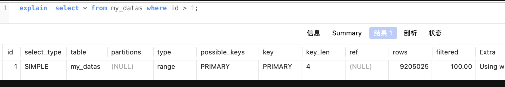
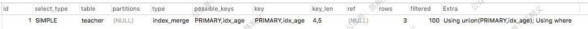
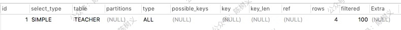
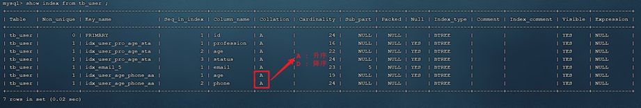
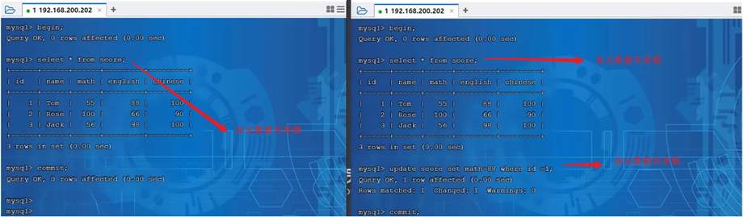
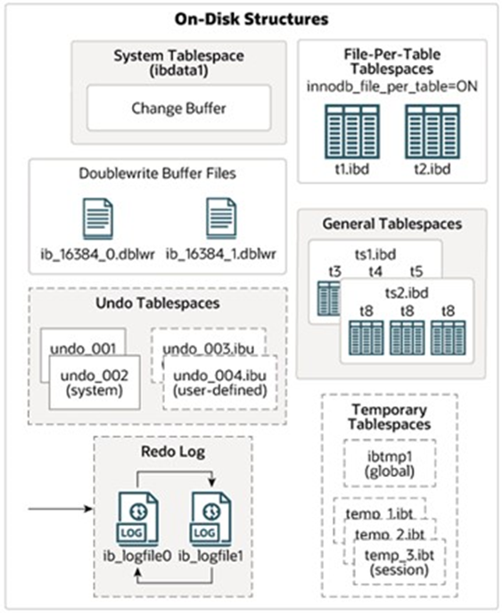

# 基础篇

* DB：DataBase，数据库，等价于磁盘的文件系统

* DBMS：DataBase Management System，数据库管理系统，如MySQL，Oracle等

* SQL：统一标准的结构化查询语句，由DBMS编译后执行去进行数据库操作

* table：数据库的基本组成单元，数据以表格形式管理

  ~~~txt
  学号(int)	姓名(varchar)	年龄(int)
  ------------------------------------
  110			张三		 	20
  
  120			李四			21
  ~~~

  一行代表一条数据，一列代表一个字段，每个字段的定义有包含了字段名，数据类型，相关性约束。

## SQL语句

- DDL（数据设计语言）：create drop alter，对表结构的增删改。
- DML（数据管理语言）：insert delete update，对表当中的数据进行增删改。
- DQL（数据查询语言）: 查询语句，凡是select语句都是DQL。
- TCL（事务控制语言）：commit提交事务，rollback回滚事务。(TCL中的T是Transaction)
- DCL（数据控制语言）: grant授权、revoke撤销权限等。

### DDL（数据设计语言）

#### 数据库操作

* dos命令窗口登录MySQL系统：`mysql -u[用户名] -p[密码]`

* 查询所有数据库：`SHOW DATABASES;`
* 使用数据库：`USE 数据库名;`

* 查询当前数据库：`SELECT DATABASE();`

* 创建数据库：`CREATE DATABASE [IF NOT EXISTS] 数据库名 [DEFAULT CHARSET 字符集] [COLLATE 排序规则];`

  > 注：UTF8字符集长度为3字节，有些符号占4字节，所以推荐用utf8mb4字符集

* 删除数据库：`DROP DATABASE [IF EXISTS] 数据库名;`

* 执行SQL脚本：`source SQL脚本`

  > SQL脚本：文件名以  .sql 结尾的，内容为sql语句的文件

#### 表操作

* 查询当前数据库所有表：`SHOW TABLES;`

* 查询表结构：`DESC 表名;`

* 创建表：

  ~~~mysql
  CREATE TABLE 表名(
  	字段1 字段1类型 [COMMENT 字段1注释],
  	字段2 字段2类型 [COMMENT 字段2注释],
  	字段3 字段3类型 [COMMENT 字段3注释],
  	...
  	字段n 字段n类型 [COMMENT 字段n注释]
  )[ COMMENT 表注释 ];
  
  # 最后一个字段后面没有逗号
  ~~~

* 查询指定表的建表语句：`SHOW CREATE TABLE 表名;`

* 添加字段：`ALTER TABLE 表名 ADD 字段名 类型(长度) [COMMENT 注释] [约束];`

  例：`ALTER TABLE emp ADD nickname varchar(20) COMMENT '昵称';`

* 修改数据类型：`ALTER TABLE 表名 MODIFY 字段名 新数据类型(长度);`

* 修改字段名和字段类型：`ALTER TABLE 表名 CHANGE 旧字段名 新字段名 类型(长度) [COMMENT 注释] [约束];`

  例：将emp表的nickname字段修改为username，类型为varchar(30)

  `ALTER TABLE emp CHANGE nickname username varchar(30) COMMENT '昵称';`

* 删除字段：`ALTER TABLE 表名 DROP 字段名;`

* 修改表名：`ALTER TABLE 表名 RENAME TO 新表名;`
* 复制表：`create table 表名 as select语句;`

* 删除表：`DROP TABLE [IF EXISTS] 表名;`

### DML（数据操作语言）

#### 添加数据

* 指定字段，其余字段填充NULL：`INSERT INTO 表名 (字段名1, 字段名2, ...) VALUES (值1, 值2, ...);`
* 不指定字段，值的顺序和数量必须和表结构一致：`INSERT INTO 表名 VALUES (值1, 值2, ...);`

* 批量添加数据：
  `INSERT INTO 表名 (字段名1, 字段名2, ...) VALUES (值1, 值2, ...), (值1, 值2, ...), (值1, 值2, ...);`
  `INSERT INTO 表名 VALUES (值1, 值2, ...), (值1, 值2, ...), (值1, 值2, ...);`
* 将查询结果插入到一张表中：`INSERT INTO 表1 select * from 表2;`

> 注：
>
> - 字符串和日期类型数据应该包含在引号中
> - 插入的数据大小应该在字段的规定范围内

#### 更新和删除数据

* 修改数据：`UPDATE 表名 SET 字段名1 = 值1, 字段名2 = 值2, ... [ WHERE 条件 ];`

  例：`UPDATE emp SET name = 'Jack' WHERE id = 1;`

* 删除数据：`DELETE FROM 表名 [ WHERE 条件 ];`
* 截断表（清空表数据）：`TRUNCATE TABLE 表名;`

### DQL（数据查询语言）

语法：

~~~sql
SELECT
	字段列表
FROM
	表名字段
WHERE
	条件列表
GROUP BY
	分组字段列表
HAVING
	分组后的条件列表
ORDER BY
	排序字段列表
LIMIT
	分页参数
~~~

#### 基础查询

* 查询多个字段：
  `SELECT 字段1, 字段2, 字段3, ... FROM 表名;`
  `SELECT * FROM 表名;`

* 设置别名：
  `SELECT 字段1 [ AS 别名1 ], 字段2 [ AS 别名2 ], 字段3 [ AS 别名3 ], ... FROM 表名;`
  `SELECT 字段1 [ 别名1 ], 字段2 [ 别名2 ], 字段3 [ 别名3 ], ... FROM 表名;`

  > 注：别名如果是字符串，必须要用引号包裹，如`select ename,sal * 12 as '年薪' from emp;`

* 去除重复记录：`SELECT DISTINCT 字段列表 FROM 表名;`

#### 条件查询

语法：`SELECT 字段列表 FROM 表名 WHERE 条件列表;`

条件：

| 比较运算符          | 功能                                        |
| ------------------- | ------------------------------------------- |
| >                   | 大于                                        |
| >=                  | 大于等于                                    |
| <                   | 小于                                        |
| <=                  | 小于等于                                    |
| =                   | 等于                                        |
| <> 或 !=            | 不等于                                      |
| BETWEEN ... AND ... | 在某个范围内（含最小、最大值）              |
| IN(...)             | 在in之后的列表中的值，多选一                |
| LIKE 占位符         | 模糊匹配（\_匹配单个字符，%匹配任意个字符） |
| IS NULL             | 是NULL                                      |

| 逻辑运算符         | 功能                         |
| ------------------ | ---------------------------- |
| AND 或 &&          | 并且（多个条件同时成立）     |
| OR 或 &#124;&#124; | 或者（多个条件任意一个成立） |
| NOT 或 !           | 非，不是                     |

例子：
```mysql
-- 年龄等于30
select * from employee where age = 30;
-- 年龄小于30
select * from employee where age < 30;
-- 小于等于
select * from employee where age <= 30;
-- 没有身份证
select * from employee where idcard is null or idcard = '';
-- 有身份证
select * from employee where idcard;
select * from employee where idcard is not null;
-- 不等于
select * from employee where age != 30;
-- 年龄在20到30之间
select * from employee where age between 20 and 30;
select * from employee where age >= 20 and age <= 30;
-- 下面语句不报错，但查不到任何信息
select * from employee where age between 30 and 20;
-- 性别为女且年龄小于30
select * from employee where age < 30 and gender = '女';
-- 年龄等于25或30或35
select * from employee where age = 25 or age = 30 or age = 35;
select * from employee where age in (25, 30, 35);
-- 姓名为两个字
select * from employee where name like '__';
-- 姓名中有下划线的
select * from employee where name like '%\_%';
-- 身份证最后为X
select * from employee where idcard like '%X';
```

#### 聚合查询（多行处理函数）

输入多行，输出结果是1行

常见聚合函数：

| 函数  | 功能     |
| ----- | -------- |
| count | 统计数量 |
| max   | 最大值   |
| min   | 最小值   |
| avg   | 平均值   |
| sum   | 求和     |

语法：`SELECT 聚合函数(字段列表) FROM 表名;`

例：`SELECT count(id) from employee where workaddress = "广东省";`

#### 单行处理函数

输入一行，输出一行

例如计算每个员工的年薪：`select ename,(sal+comm)*12 as yearsal from emp;` 	

重点：数据库规定，NULL值参与的运算结果一定是NULL

ifnull() 空处理函数， `ifnull(可能为NULL的数据,被当做什么处理)` ：`select ename,ifnull(comm,0) as comm from emp;`

#### 分组查询

语法：`SELECT 字段列表 FROM 表名 [ WHERE 条件 ] GROUP BY 分组字段名 [ HAVING 分组后的过滤条件];`

> 注：SQL中有group by时，原则上select后只能有分组函数和参与分组的字段。如果select后查询了其他字段，MySQL返回的会是当前分组内第一行的数据，而Oracle则是会报错。

where 和 having 的区别：

- 执行时机不同：where是分组之前进行过滤，不满足where条件不参与分组；having是分组后对结果进行过滤。
- 判断条件不同：where不能对聚合函数进行判断，而having可以。

例子：

```mysql
-- 根据性别分组，统计男性和女性数量（只显示分组数量，不显示哪个是男哪个是女）
select count(*) from employee group by gender;
-- 根据性别分组，统计男性和女性数量
select gender, count(*) from employee group by gender;
-- 根据性别分组，统计男性和女性的平均年龄
select gender, avg(age) from employee group by gender;
-- 年龄小于45，并根据工作地址分组
select workaddress, count(*) from employee where age < 45 group by workaddress;
-- 年龄小于45，并根据工作地址分组，获取员工数量大于等于3的工作地址
select workaddress, count(*) address_count from employee where age < 45 group by workaddress having address_count >= 3;
```

#### 排序查询

语法：`SELECT 字段列表 FROM 表名 ORDER BY 字段1 排序方式1, 字段2 排序方式2;`

排序方式：

- ASC: 升序（默认）
- DESC: 降序

例子：

```mysql
-- 根据年龄升序排序
SELECT * FROM employee ORDER BY age ASC;
SELECT * FROM employee ORDER BY age;
-- 两字段排序，根据年龄升序排序，入职时间降序排序
SELECT * FROM employee ORDER BY age ASC, entrydate DESC;
```

> 注：如果是多字段排序，当第一个字段值相同时，才会根据第二个字段进行排序

#### 分页查询

语法：`SELECT 字段列表 FROM 表名 LIMIT 起始索引, 查询记录数;`

例子：

```mysql
-- 查询第一页数据，展示10条
SELECT * FROM employee LIMIT 0, 10;
-- 查询第二页
SELECT * FROM employee LIMIT 10, 10;
```

> 注：
>
> - 起始索引从0开始，起始索引 = （查询页码 - 1） * 每页显示记录数
> - 分页查询是数据库的方言，不同数据库有不同实现，MySQL是LIMIT
> - 如果查询的是第一页数据，起始索引可以省略，直接简写 LIMIT 10

#### 普通DQL执行顺序

FROM -> WHERE -> GROUP BY -> HAVING -> SELECT -> ORDER BY -> LIMIT

#### 合并结果集

* union all，合并结果集，不进行去重操作：

  ~~~sql
  select ename,job from emp where job = 'MANAGER' 
  union 
  select ename,job from emp where job = 'SALESMAN';
  ~~~

* union，合并结果集并去除重复行：

  ~~~sql
  select ename,job from emp where job = 'MANAGER' 
  union 
  select ename,job from emp where job = 'SALESMAN';
  ~~~

> 注：
>
> * 合并结果集时列的数量一定要对的上
> * 联合查询比使用or效率高，不会使索引失效

#### 查询结果去重

distinct关键字去除重复记录：

~~~sql
select distinct job from emp;
-- 统计岗位的数量
select count(distinct job) from emp;
~~~

> 注：distinct只能出现在所有字段的最前面

#### 多表查询

##### 多表关系

实际业务中，多个表的数据是互相关联的，查询数据时也需要联合多张表来查询数据

* 一对多

  案例：部门与员工

  关系：一个部门对应多个员工，一个员工对应一个部门

  实现：在多的一方建立外键，指向一的一方的主键

* 多对多

  案例：学生与课程

  关系：一个学生可以选多门课程，一门课程也可以供多个学生选修

  实现：建立第三张中间表，中间表至少包含两个外键，分别关联两方主键

* 一对一

  案例：用户与用户详情

  关系：一对一关系，多用于单表拆分，将一张表的基础字段放在一张表中，其他详情字段放在另一张表中，以提升操作效率

  实现：在任意一方加入外键，关联另外一方的主键，并且设置外键为唯一的（UNIQUE）

##### 查询

多个表连接查询时可能会出现笛卡尔积现象：当两张表进行连接查询的时候，没有任何条件进行限制，最终的查询结果条数是两张表记录条数的乘积

怎么避免笛卡尔积现象：加条件进行过滤

`select * from employee, dept where employee.dept = dept.id;`

###### 内连接查询

内连接查询的是两张表交集的部分

* 隐式内连接：`SELECT 字段列表 FROM 表1, 表2 WHERE 条件 ...;`

* 显式内连接：`SELECT 字段列表 FROM 表1 [ INNER ] JOIN 表2 ON 连接条件 ...;`

显式性能比隐式高

例子：

```mysql
-- 查询员工姓名，及关联的部门的名称
-- 隐式
select e.name, d.name from employee as e, dept as d where e.dept = d.id;
-- 显式
select e.name, d.name from employee as e inner join dept as d on e.dept = d.id;
```

###### 外连接查询

* 左外连接：以左表为主表驱动查询，查询左表数据时，按照指定条件查询右表

  `SELECT 字段列表 FROM 表1 LEFT [ OUTER ] JOIN 表2 ON 条件 ...;`

  相当于查询表1的所有数据，包含表1和表2交集部分数据

* 右外连接：以右表为主表驱动查询，查询右表数据时，按照指定条件查询左表
  `SELECT 字段列表 FROM 表1 RIGHT [ OUTER ] JOIN 表2 ON 条件 ...;`

例子：

```mysql
-- 左
select e.*, d.name from employee as e left outer join dept as d on e.dept = d.id;
select d.name, e.* from dept d left outer join emp e on e.dept = d.id;  -- 这条语句与下面的语句效果一样
-- 右
select d.name, e.* from employee as e right outer join dept as d on e.dept = d.id;

-- 左连接可以查询到没有dept的employee，右连接可以查询到没有employee的dept
```

###### 自连接查询

当前表与自身的连接查询，自连接必须使用表别名

语法：`SELECT 字段列表 FROM 表A 别名A JOIN 表A 别名B ON 条件 ...;`

自连接查询，可以是内连接查询，也可以是外连接查询

例子：

```mysql
-- 查询员工及其所属领导的名字
select a.name, b.name from employee a, employee b where a.manager = b.id;
-- 没有领导的也查询出来
select a.name, b.name from employee a left join employee b on a.manager = b.id;
```

##### 子查询

SQL语句中嵌套SELECT语句，称谓嵌套查询，又称子查询。

`SELECT * FROM t1 WHERE column1 = ( SELECT column1 FROM t2);`

**子查询外部的语句可以是 INSERT / UPDATE / DELETE / SELECT 的任何一个**

根据子查询结果可以分为：

- 标量子查询（子查询结果为单个值）
- 列子查询（子查询结果为一列）
- 行子查询（子查询结果为一行）
- 表子查询（子查询结果为多行多列）

根据子查询位置可分为：

- WHERE 之后
- FROM 之后
- SELECT 之后

###### 标量子查询

子查询返回的结果是单个值（数字、字符串、日期等）。

常用操作符：- < > > >= < <=

例子：

```mysql
-- 查询销售部所有员工
select id from dept where name = '销售部';
-- 根据销售部部门ID，查询员工信息
select * from employee where dept = 4;
-- 合并（子查询）
select * from employee where dept = (select id from dept where name = '销售部');

-- 查询xxx入职之后的员工信息
select * from employee where entrydate > (select entrydate from employee where name = 'xxx');
```

###### 列子查询

返回的结果是一列（可以是多行）。

常用操作符：

| 操作符 | 描述                                   |
| ------ | -------------------------------------- |
| IN     | 在指定的集合范围内，多选一             |
| NOT IN | 不在指定的集合范围内                   |
| ANY    | 子查询返回列表中，有任意一个满足即可   |
| SOME   | 与ANY等同，使用SOME的地方都可以使用ANY |
| ALL    | 子查询返回列表的所有值都必须满足       |

例子：

```mysql
-- 查询销售部和市场部的所有员工信息
select * from employee where dept in (select id from dept where name = '销售部' or name = '市场部');
-- 查询比财务部所有人工资都高的员工信息
select * from employee where salary > all(select salary from employee where dept = (select id from dept where name = '财务部'));
-- 查询比研发部任意一人工资高的员工信息
select * from employee where salary > any (select salary from employee where dept = (select id from dept where name = '研发部'));
```

###### 行子查询

返回的结果是一行（可以是多列）。
常用操作符：=, <, >, IN, NOT IN

例子：

```mysql
-- 查询与xxx的薪资及直属领导相同的员工信息
select * from employee where (salary, manager) = (12500, 1);
select * from employee where (salary, manager) = (select salary, manager from employee where name = 'xxx');
```

###### 表子查询

返回的结果是多行多列

常用操作符：IN

例子：

```mysql
-- 查询与xxx1，xxx2的职位和薪资相同的员工
select * from employee where (job, salary) in (select job, salary from employee where name = 'xxx1' or name = 'xxx2');
-- 查询入职日期是2006-01-01之后的员工，及其部门信息
select e.*, d.* from (select * from employee where entrydate > '2006-01-01') as e left join dept as d on e.dept = d.id;
```

### DCL（数据控制语言）

#### 管理用户

* 查询用户：

  ~~~sql
  USE mysql;
  SELECT * FROM user;
  ~~~

* 创建用户：`CREATE USER '用户名'@'主机名' IDENTIFIED BY '密码';`

* 修改用户密码：`ALTER USER '用户名'@'主机名' IDENTIFIED WITH mysql_native_password BY '新密码';`

* 删除用户：`DROP USER '用户名'@'主机名';`

例子：

```mysql
-- 创建用户test，只能在当前主机localhost访问
create user 'test'@'localhost' identified by '123456';
-- 创建用户test，能在任意主机访问
create user 'test'@'%' identified by '123456';
create user 'test' identified by '123456';
-- 修改密码
alter user 'test'@'localhost' identified with mysql_native_password by '1234';
-- 删除用户
drop user 'test'@'localhost';
```

> 注：主机名可以使用 % 通配

#### 权限控制

常用权限：

| 权限                | 说明               |
| ------------------- | ------------------ |
| ALL, ALL PRIVILEGES | 所有权限           |
| SELECT              | 查询数据           |
| INSERT              | 插入数据           |
| UPDATE              | 修改数据           |
| DELETE              | 删除数据           |
| ALTER               | 修改表             |
| DROP                | 删除数据库/表/视图 |
| CREATE              | 创建数据库/表      |

更多权限请看[权限一览表](#权限一览表 "权限一览表")

* 查询权限：`SHOW GRANTS FOR '用户名'@'主机名';`

* 授予权限：`GRANT 权限列表 ON 数据库名.表名 TO '用户名'@'主机名';`

* 撤销权限：`REVOKE 权限列表 ON 数据库名.表名 FROM '用户名'@'主机名';`

注：

> - 多个权限用逗号分隔
> - 授权时，数据库名和表名可以用 * 进行通配，代表所有

## 函数

### 字符串函数

常用函数：

| 函数  | 功能  |
| ------------ | ------------ |
| CONCAT(s1, s2, ..., sn)  | 字符串拼接，将s1, s2, ..., sn拼接成一个字符串  |
| LOWER(str)  | 将字符串全部转为小写  |
| UPPER(str)  | 将字符串全部转为大写  |
| LPAD(str, n, pad)  | 左填充，用字符串pad对str的左边进行填充，达到n个字符串长度  |
| RPAD(str, n, pad)  | 右填充，用字符串pad对str的右边进行填充，达到n个字符串长度  |
| TRIM(str)  | 去掉字符串头部和尾部的空格  |
| SUBSTRING(str, start, len)  | 返回从字符串str从start位置起的len个长度的字符串  |
| REPLACE(column, source, replace)  | 替换字符串  |

使用示例：

```mysql
-- 拼接
SELECT CONCAT('Hello', 'World');
-- 小写
SELECT LOWER('Hello');
-- 大写
SELECT UPPER('Hello');
-- 左填充
SELECT LPAD('01', 5, '-');
-- 右填充
SELECT RPAD('01', 5, '-');
-- 去除空格
SELECT TRIM(' Hello World ');
-- 切片（起始索引为1）
SELECT SUBSTRING('Hello World', 1, 5);
```

### 数值函数

常见函数：

| 函数  | 功能  |
| ------------ | ------------ |
| CEIL(x)  | 向上取整  |
| FLOOR(x)  | 向下取整  |
| MOD(x, y)  | 返回x/y的模  |
| RAND() | 返回0~1内的随机数 |
| ROUND(x, y) | 求参数x的四舍五入值，保留y位小数 |

### 日期函数

常用函数：

| 函数  | 功能  |
| ------------ | ------------ |
| CURDATE()  | 返回当前日期  |
| CURTIME()  | 返回当前时间  |
| NOW()  | 返回当前日期和时间  |
| YEAR(date)  | 获取指定date的年份  |
| MONTH(date)  | 获取指定date的月份  |
| DAY(date)  | 获取指定date的日期  |
| DATE_ADD(date, INTERVAL expr type)  | 返回一个日期/时间值加上一个时间间隔expr后的时间值  |
| DATEDIFF(date1, date2)  | 返回起始时间date1和结束时间date2之间的天数  |

例子：

```mysql
-- DATE_ADD
SELECT DATE_ADD(NOW(), INTERVAL 70 YEAR);
```

### 流程函数

常用函数：

| 函数  | 功能  |
| ------------ | ------------ |
| IF(value, t, f)  | 如果value为true，则返回t，否则返回f  |
| IFNULL(value1, value2)  | 如果value1不为空，返回value1，否则返回value2  |
| CASE WHEN [ val1 ] THEN [ res1 ] ... ELSE [ default ] END  | 如果val1为true，返回res1，... 否则返回default默认值  |
| CASE [ expr ] WHEN [ val1 ] THEN [ res1 ] ... ELSE [ default ] END  | 如果expr的值等于val1，返回res1，... 否则返回default默认值  |

例子：

```mysql
select
	name,
	(case when age > 30 then '中年' else '青年' end)
from employee;

select
	name,
	(case workaddress when '北京市' then '一线城市' when '上海市' then '一线城市' else '二线城市' end) as '工作地址'
from employee;
```

## 约束

分类：

| 约束  | 描述  | 关键字  |
| ------------ | ------------ | ------------ |
| 非空约束  | 限制该字段的数据不能为null  | NOT NULL  |
| 唯一约束  | 保证该字段的所有数据都是唯一、不重复的  | UNIQUE  |
| 主键约束  | 主键是一行数据的唯一标识，要求非空且唯一  | PRIMARY KEY  |
| 默认约束  | 保存数据时，如果未指定该字段的值，则采用默认值  | DEFAULT  |
| 检查约束（8.0.1版本后）  | 保证字段值满足某一个条件  | CHECK  |
| 外键约束  | 用来让两张图的数据之间建立连接，保证数据的一致性和完整性  | FOREIGN KEY  |

约束是作用于表中字段上的，可以再创建表/修改表的时候添加约束。

### 常用约束

| 约束条件  | 关键字  |
| ------------ | ------------ |
| 主键  | PRIMARY KEY  |
| 自动增长  | AUTO_INCREMENT  |
| 不为空  | NOT NULL  |
| 唯一  | UNIQUE  |
| 逻辑条件  | CHECK  |
| 默认值  | DEFAULT  |

例子：

```mysql
create table user(
	id int primary key auto_increment,
	name varchar(10) not null unique,
	age int check(age > 0 and age < 120),
	status char(1) default '1',
	gender char(1)
);
```

### 外键约束

* 添加外键：

  ~~~sql
  CREATE TABLE 表名(
  	字段名 字段类型,
  	...
  	[CONSTRAINT] [外键名称] FOREIGN KEY(外键字段名) REFERENCES 主表(主表列名)
  );
  ALTER TABLE 表名 ADD CONSTRAINT 外键名称 FOREIGN KEY (外键字段名) REFERENCES 主表(主表列名);
  
  -- 例子
  alter table emp add constraint fk_emp_dept_id foreign key(dept_id) references dept(id);
  ~~~

* 删除外键：`ALTER TABLE 表名 DROP FOREIGN KEY 外键名;`

#### 删除/更新行为

| 行为  | 说明  |
| ------------ | ------------ |
| NO ACTION  | 当在父表中删除/更新对应记录时，首先检查该记录是否有对应外键，如果有则不允许删除/更新（与RESTRICT一致）  |
| RESTRICT  | 当在父表中删除/更新对应记录时，首先检查该记录是否有对应外键，如果有则不允许删除/更新（与NO ACTION一致）  |
| CASCADE  | 当在父表中删除/更新对应记录时，首先检查该记录是否有对应外键，如果有则也删除/更新外键在子表中的记录  |
| SET NULL  | 当在父表中删除/更新对应记录时，首先检查该记录是否有对应外键，如果有则设置子表中该外键值为null（要求该外键允许为null）  |
| SET DEFAULT  | 父表有变更时，子表将外键设为一个默认值（Innodb不支持）  |

更改删除/更新行为：`ALTER TABLE 表名 ADD CONSTRAINT 外键名称 FOREIGN KEY (外键字段) REFERENCES 主表名(主表字段名) ON UPDATE 行为 ON DELETE 行为;`

## 事务

事务是一组操作的集合，事务会把所有操作作为一个整体一起向系统提交或撤销操作请求，即这些操作要么同时成功，要么同时失败。

基本操作：

```mysql
-- 1. 查询张三账户余额
select * from account where name = '张三';
-- 2. 将张三账户余额-1000
update account set money = money - 1000 where name = '张三';
-- 此语句出错后张三钱减少但是李四钱没有增加
模拟sql语句错误
-- 3. 将李四账户余额+1000
update account set money = money + 1000 where name = '李四';

-- 查看事务提交方式
SELECT @@AUTOCOMMIT;
-- 设置事务提交方式，1为自动提交，0为手动提交，该设置只对当前会话有效
SET @@AUTOCOMMIT = 0;
-- 提交事务
COMMIT;
-- 回滚事务
ROLLBACK;

-- 设置手动提交后上面代码改为：
select * from account where name = '张三';
update account set money = money - 1000 where name = '张三';
update account set money = money + 1000 where name = '李四';
commit;
```

操作方式二：

* 开启事务：`START TRANSACTION 或 BEGIN TRANSACTION;`
* 提交事务：`COMMIT;`
* 回滚事务：`ROLLBACK;`

操作实例：

```mysql
start transaction;
select * from account where name = '张三';
update account set money = money - 1000 where name = '张三';
update account set money = money + 1000 where name = '李四';
commit;
```

### 四大特性ACID

- 原子性(Atomicity)：事务是不可分割的最小操作但愿，要么全部成功，要么全部失败
- 一致性(Consistency)：事务完成时，必须使所有数据都保持一致状态
- 隔离性(Isolation)：数据库系统提供的隔离机制，保证事务在不受外部并发操作影响的独立环境下运行
- 持久性(Durability)：事务一旦提交或回滚，它对数据库中的数据的改变就是永久的

### 并发事务

并发问题：

| 问题  | 描述  |
| ------------ | ------------ |
| 脏读  | 一个事务读到另一个事务还没提交的数据  |
| 不可重复读  | 一个事务先后读取同一条记录，但两次读取的数据不同，关注**数据的修改** |
| 幻读  | 一个事务按照条件查询数据时，没有对应的数据行，但是再插入数据时，又发现这行数据已经存在，关注**数据的增删** |

> 这三个问题的详细演示：https://www.bilibili.com/video/BV1Kr4y1i7ru?p=55cd 

并发事务隔离级别，以及每个级别存在的并发事务问题：

| 隔离级别  | 脏读  | 不可重复读  | 幻读  |
| ------------ | ------------ | ------------ | ------------ |
| Read uncommitted  | √  | √  | √  |
| Read committed  | ×  | √  | √  |
| Repeatable Read(默认)  | ×  | ×  | √  |
| Serializable  | ×  | ×  | ×  |

> - √表示在当前隔离级别下该问题会出现
> - Serializable 性能最低；Read uncommitted 性能最高，数据安全性最差


查看事务隔离级别：`SELECT @@TRANSACTION_ISOLATION;`

设置事务隔离级别：`SET [ SESSION | GLOBAL ] TRANSACTION ISOLATION LEVEL {READ UNCOMMITTED | READ COMMITTED | REPEATABLE READ | SERIALIZABLE };`

> SESSION 是会话级别，表示只针对当前会话有效，GLOBAL 表示对所有会话有效

# 进阶篇

## 存储引擎

### MySQL体系结构：


* 连接层 

  最上层是一些客户端和链接服务，包含本地sock 通信和大多数基于客户端/服务端工具实现的类似于  TCP/IP的通信。主要完成一些类似于**连接处理、授权认证、及相关的安全方案**。在该层上引入了线程 池的概念，为通过认证安全接入的客户端提供线程。同样在该层上可以实现基于SSL的安全链接。服务器也会为安全接入的每个客户端验证它所具有的操作权限。 

* 服务层 

  第二层架构主要完成大多数的核心服务功能，如**SQL接口，并完成缓存的查询，SQL的分析和优化，部分内置函数的执行**。**所有跨存储引擎的功能也在这一层实现，如 过程、函数等**。在该层，服务器会解 析查询并创建相应的内部解析树，并对其完成相应的优化如确定表的查询的顺序，是否利用索引等，  最后生成相应的执行操作。如果是select语句，服务器还会查询内部的缓存，如果缓存空间足够大， 这样在解决大量读操作的环境中能够很好的提升系统的性能

* 引擎层

  存储引擎层， **存储引擎真正的负责了MySQL中数据的存储和提取**，服务器通过API和存储引擎进行通 信。不同的存储引擎具有不同的功能，这样我们可以根据自己的需要，来选取合适的存储引擎。数据库 中的索引是在存储引擎层实现的。

* 存储层 

  数据存储层， 主要是**将数据(如: redolog、undolog、数据、索引、二进制日志、错误日志、查询 日志、慢查询日志等)存储在文件系统之上，并完成与存储引擎的交互**。

### 存储引擎介绍

存储引擎就是存储数据、建立索引、更新/查询数据等技术的实现方式。存储引擎是基于表而不是基于库的，所以存储引擎也可以被称为表引擎。
默认存储引擎是InnoDB。

相关操作：

```mysql
-- 查询建表语句
show create table account;
-- 建表时指定存储引擎
CREATE TABLE 表名(
	...
) ENGINE=INNODB;
-- 查看当前数据库支持的存储引擎
show engines;
```

#### InnoDB

InnoDB 是一种兼顾高可靠性和高性能的通用存储引擎，在 MySQL 5.5 之后，InnoDB 是默认的 MySQL 引擎。

1. 特点：

   - DML 操作遵循 ACID 模型，支持**事务**
   - **行级锁**，提高并发访问性能
   - 支持**外键**约束，保证数据的完整性和正确性

2. 存储层文件：xxx.ibd: xxx代表表名，InnoDB 引擎的每张表都会对应这样一个表空间文件，存储该表的表结构（frm、sdi）、数据和索引。

   参数：innodb_file_per_table，决定多张表共享一个idb文件还是每张表对应一个idb文件

   指令 ibd2sdi ，通过该指令就可以从二进制格式存储的ibd文件中提取sdi信息，而sdi数据字典信息中就包含该表的表结构

3. InnoDB 逻辑存储结构：InnoDB所有数据都被逻辑地存放在一个表空间（tablespace）中。表空间又由段（segment）、区（extent）、页（page）组成，页在一些文档中有时也称为块（block）
   
   * 表空间：存储逻辑结构最高层
   * 段:  常见的段有数据段、索引段、回滚段等。InnoDB中对于段的管理都是引擎自身完成
   * 区:  每个区的大小为1M，默认情况下， InnoDB存储引擎页默认大小为16K， 即一个区中一共有64个连续的页
   * 页: **InnoDB 存储引擎磁盘管理的最小单元**。为了保证页的连续性，InnoDB 存储引擎每次从磁盘申请 4-5 个区
   * 行 : InnoDB 存储引擎是面向行来存放数据的

#### MyISAM

MyISAM 是 MySQL 早期的默认存储引擎。

1. 特点：
   * **无事务**，**无外键**
   * 支持**表锁**，不支持行锁
   * 访问速度快

2. 存储层文件：
   * xxx.sdi: 存储表结构信息
   * xxx.MYD: 存储数据
   * xxx.MYI: 存储索引

#### Memory

Memory 引擎的表数据是存储在内存中的，受硬件问题、断电问题的影响，只能将这些表作为临时表或缓存使用。

1. 特点：

   - 存放在**内存中，速度快**

   - hash索引（默认）


2. 存储层文件：
   - xxx.sdi: 存储表结构信息


### 存储引擎区别

| 特点  | InnoDB  | MyISAM  | Memory  |
| ------------ | ------------ | ------------ | ------------ |
| 存储限制  | 64TB  | 有  | 有  |
| 事务安全  | 支持  | -  | -  |
| 锁机制  | 行锁  | 表锁  | 表锁  |
| B+tree索引  | 支持  | 支持  | 支持  |
| Hash索引  | -  | -  | 支持  |
| 全文索引  | 支持（5.6版本之后）  | 支持  | -  |
| 空间使用  | 高  | 低  | N/A  |
| 内存使用  | 高  | 低  | 中等  |
| 批量插入速度  | 低  | 高  | 高  |
| 支持外键  | 支持  | -  | -  |

### 存储引擎的选择

在选择存储引擎时，应该**根据应用系统的特点选择合适的存储引擎**。复杂应用系统，还可以选择多种存储引擎进行组合。

- InnoDB: 对事物的完整性有较高的要求，在并发条件下要求数据的一致性，数据操作除了插入和查询之外，还包含很多的更新、删除操作
- MyISAM: 以读操作和插入操作为主，只有很少的更新和删除操作，并且对事务的完整性、并发性要求不高
- Memory: 所有数据保存在内存中，访问速度快，通常用于临时表及缓存。Memory 的缺陷是对表的大小有限制，太大的表无法缓存在内存中，而且无法保障数据的安全性

电商中的足迹和评论适合使用 MyISAM 引擎，缓存适合使用 Memory 引擎。

## 索引

索引是帮助 MySQL **高效获取数据**的**数据结构（有序）**。在数据之外，数据库系统还维护着满足特定查找算法的数据结构，这些数据结构以某种方式引用（指向）数据，这样就可以在这些数据结构上实现高级查询算法，这种数据结构就是索引。

优点：

- 提高数据检索效率，降低数据库的IO成本
- 通过索引对数据进行排序，降低数据排序的成本，降低CPU的消耗

缺点：

- 索引也是要占用空间的
- 索引大大提高了查询效率，但降低了更新的速度，比如 INSERT、UPDATE、DELETE

### 索引结构

MySQL的索引是在存储引擎层实现的，主要包含以下几种：

| 索引结构  | 描述  |
| ------------ | ------------ |
| B+Tree  | 最常见的索引类型，大部分引擎都支持B+树索引  |
| Hash  | 底层数据结构是用哈希表实现，只有精确匹配索引列的查询才有效，不支持范围查询  |
| R-Tree(空间索引)  | 空间索引是 MyISAM 引擎的一个特殊索引类型，主要用于地理空间数据类型，通常使用较少  |
| Full-Text(全文索引)  | 是一种通过建立倒排索引，快速匹配文档的方式，类似于 Lucene, Solr, ES  |

| 索引  | InnoDB  | MyISAM  | Memory  |
| ------------ | ------------ | ------------ | ------------ |
| B+Tree索引  | 支持  | 支持  | 支持  |
| Hash索引  | 不支持  | 不支持  | 支持  |
| R-Tree索引  | 不支持  | 支持  | 不支持  |
| Full-text  | 5.6版本后支持  | 支持  | 不支持  |

#### 二叉树

假如说MySQL的索引结构采用二叉树的数据结构，比较理想的结构如下：


如果主键是顺序插入的，则会形成一个单向链表，结构如下：

 

所以，使用二叉树作为索引结构，会存在以下缺点：

* 顺序插入时，会形成一个链表，查询性能大大降低。 

* 大数据量情况下，层级较深，检索速度慢。

假设选择红黑树，红黑树是一颗自平衡二叉树，那这样即使是顺序插入数据，最终形成的数据结构也是一颗平衡的二叉树，结构如下:

 

依然存在一个缺点：大数据量情况下，层级较深，检索速度慢。

#### B-Tree

B树是一种多叉路衡查找树，相对于二叉树，B树每个节点可以有多个分支，即多叉。

以一棵最大度数（max-degree，指一个节点的子节点个数）为5（5阶）的 b-tree 为例（每个节点最多存储4个key，5个指针）


特点： 

* 5阶的B树，每一个节点最多存储4个key，对应5个指针
* 一旦节点存储的key数量到达5，就会裂变，中间元素向上分裂
* 在B树中，非叶子节点和叶子节点都会存放数据

#### B+Tree

B+Tree是B-Tree的变种，我们以一颗最大度数（max-degree）为4（4阶）的b+tree为例


B+Tree 与 B-Tree相比，主要有以下三点区别：

* 所有的数据都会出现在叶子节点
* 叶子节点形成一个单向链表
* 非叶子节点仅仅起到索引数据作用，具体的数据都是在叶子节点存放的

MySQL 索引数据结构对经典的 B+Tree 进行了优化。在原 B+Tree 的基础上，增加一个指向相邻叶子节点的链表指针，就形成了带有顺序指针的 B+Tree，提高区间访问的性能。


#### Hash

哈希索引就是采用一定的hash算法，将键值换算成新的hash值，映射到对应的槽位上，然后存储在hash表中。

如果两个（或多个）键值，映射到一个相同的槽位上，他们就产生了hash冲突（也称为hash碰撞），可以通过链表来解决。


特点：

- Hash索引只能用于对等比较（=、in），不支持范围查询（betwwn、>、<、...）
- 无法利用索引完成排序操作
- 查询效率高，通常只需要一次检索就可以了，效率通常要高于 B+Tree 索引

存储引擎支持：

- Memory
- InnoDB: 具有自适应hash功能，hash索引是存储引擎根据 B+Tree 索引在指定条件下自动构建的

#### 面试题

为什么 InnoDB 存储引擎选择使用 B+Tree 索引结构？

- 相对于二叉树，层级更少，搜索效率高
- B-Tree，无论是叶子节点还是非叶子节点，都会保存数据，导致一页中存储的键值减少，指针也跟着减少，要同样保存大量数据，只能增加树的高度，导致性能降低
- 相对于 Hash 索引，B+Tree 支持范围匹配及排序操作

### 索引分类

| 分类  | 含义  | 特点  | 关键字  |
| ------------ | ------------ | ------------ | ------------ |
| 主键索引  | 针对于表中主键创建的索引  | 默认自动创建，只能有一个  | PRIMARY  |
| 唯一索引  | 避免同一个表中某数据列中的值重复  | 可以有多个  | UNIQUE  |
| 常规索引  | 快速定位特定数据  | 可以有多个  |   |
| 全文索引  | 全文索引查找的是文本中的关键词，而不是比较索引中的值  | 可以有多个  | FULLTEXT  |

在 InnoDB 存储引擎中，根据索引的存储形式，又可以分为以下两种：

| 分类  | 含义  | 特点  |
| ------------ | ------------ | ------------ |
| 聚集索引(Clustered Index)  | 将数据存储与索引放一块，索引结构的**叶子节点保存了完整行数据** | 必须有，而且只有一个  |
| 二级索引(Secondary Index)  | 将数据与索引分开存储，索引结构的**叶子节点关联的是对应的主键** | 可以存在多个  |

聚集索引和二级索引的具体结构如下：


聚集索引选取规则：

- 如果存在主键，主键索引就是聚集索引
- 如果不存在主键，将使用第一个唯一(UNIQUE)索引作为聚集索引
- 如果表没有主键或没有合适的唯一索引，则 InnoDB 会自动生成一个 rowid 作为隐藏的聚集索引

**回表查询**： 先到二级索引中查找数据，找到主键值，然后再到聚集索引中根据主键值，获取数据的方式，就称之为回表查询，如图

#### 思考题

1\. 以下 SQL 语句，哪个执行效率高？为什么？

```mysql
select * from user where id = 10;
select * from user where name = 'Arm';
-- 备注：id为主键，name字段创建的有索引
```

答：第一条语句，因为第二条需要回表查询，相当于两个步骤。

2\. InnoDB 主键索引的 B+Tree 高度为多少？

答：假设一行数据大小为1k，一页中可以存储16行这样的数据。InnoDB 的指针占用6个字节的空间，主键假设为bigint，占用字节数为8。

可得公式：`n * 8 + (n + 1) * 6 = 16 * 1024`，其中 8 表示 bigint 占用的字节数，n 表示当前节点存储的key的数量，(n + 1) 表示指针数量（比key多一个）。算出n约为1170。

如果树的高度为2，那么他能存储的数据量大概为：`1171 * 16 = 18736`；

如果树的高度为3，那么他能存储的数据量大概为：`1171 * 1171 * 16 = 21939856`。

另外，如果有成千上万的数据，那么就要考虑分表，涉及运维篇知识。

### 索引语法

* 创建索引：`CREATE [ UNIQUE | FULLTEXT ] INDEX index_name ON table_name (index_col_name, ...);`

  如果不加 CREATE 后面不加索引类型参数，则创建的是常规索引

* 查看索引：`SHOW INDEX FROM table_name;`

* 删除索引：`DROP INDEX index_name ON table_name;`

案例：

```mysql
-- name字段为姓名字段，该字段的值可能会重复，为该字段创建索引
create index idx_user_name on tb_user(name);
-- phone手机号字段的值非空，且唯一，为该字段创建唯一索引
create unique index idx_user_phone on tb_user (phone);
-- 为profession, age, status创建联合索引
create index idx_user_pro_age_stat on tb_user(profession, age, status);
-- 为email建立合适的索引来提升查询效率
create index idx_user_email on tb_user(email);

-- 删除索引
drop index idx_user_email on tb_user;
```

### 使用规则

#### 最左前缀法则

如果索引关联了多列（联合索引），要遵守最左前缀法则，最左前缀法则指的是查询时从索引的最左列开始，并且不跳过索引中的列。
如果跳跃某一列，索引将部分失效（后面的字段索引失效）

以 tb_user 表为例：


其中有一个联合索引，这个联合索引涉及到三个字段，顺序分别为：profession，age，status

下面用一些SQL的执行计划来演示最左前缀法则：

` explain select * from tb_user where profession = '软件工程' and age = 31 and status  = '0';`


` explain select * from tb_user where profession = '软件工程' and age = 31;`


`explain select * from tb_user where profession = '软件工程';`


可以发现只要联合索引最左边的字段 profession存在，索引就会生效，只不过索引的长度不同。 而且由以上三组测试，我们也可以推测出profession字段索引长度为47、age 字段索引长度为2、status字段索引长度为5。

` explain select * from tb_user where age = 31 and status = '0';`


发现索引并未生效，原因是因为不满足最左前缀法则，联合索引最左边的列profession不存在。

`explain select * from tb_user where profession = '软件工程' and status = '0';`


存在最左边的profession字段，满足最左前缀法则的基本条件。但是查询时，跳过了age这个列，所以后面的列索引是不会使用的，也就是索引部分生效。

> 注意 ：
>
> 最左前缀法则中指的最左边的列，是指在查询时，联合索引的最左边的字段必须存在，与我们编写SQL时，条件编写的先后顺序无关
>
> 如 ` explain select * from tb_user where age = 31 and  status = '0' and profession = '软件工程'；`
>
> 

#### 范围查询

联合索引中，出现范围查询（<, >），范围查询右侧的列索引失效：

` explain select * from tb_user where profession = '软件工程' and age > 30 and status  = '0';`


可以看到走联合索引了，但是索引的长度为49，就说明范围查询右边的status字 段是没有走索引的

可以用>=或者<=来规避索引失效问题：

` explain select * from tb_user where profession = '软件工程' and age >= 30 and  status = '0';`


索引的长度为54，就说明所有的字段都是走索引的

#### 索引失效情况	

1. 在索引列上进行运算操作，索引将失效。如：`explain select * from tb_user where substring(phone, 10, 2) = '15';`

2. 字符串类型字段使用时，不加引号，索引将失效，因为会发生隐式类型转换。如：`explain select * from tb_user where phone = 17799990015;`，此处phone的值没有加引号。

3. 模糊查询中，如果仅仅是尾部模糊匹配，索引不会失效；如果是头部模糊匹配，索引失效。如：`explain select * from tb_user where profession like '%工程';`，前后都有 % 也会失效。

4. or连接的条件，左右两侧字段都有索引时，索引才会生效。

5. 如果 MySQL 评估使用索引比全表更慢，则不使用索引。

   执行如下两条语句 ：

   ~~~sql
    explain select * from tb_user where profession is null;
    explain select * from tb_user where profession is not null;
   ~~~

   

   接下来，我们做一个操作将profession字段值全部更新为null

   

   然后，再次执行上述的两条SQL，查看SQL语句的执行计划。

    

   可以看到，一样的SQL先后执行两次，结果查询计划是不一样的，这是和数据库的数据分布有关系，查询时MySQL会评估，走索引快，还是全表扫描快，如果全表扫描更快，则放弃索引走全表扫描。 因为索引是用来索引少量数据的，如果通过索引查询返回大批量的数据，则还不如走全表扫描来的快，此时索引就会失效。

#### SQL 提示

是优化数据库的一个重要手段，简单来说，就是在SQL语句中加入一些人为的提示来达到优化操作的目的。

例如：

*  use index ： 建议MySQL使用哪一个索引完成此次查询（仅仅是建议，mysql内部还会再次进 行评估）
  `explain select * from tb_user use index(idx_user_pro) where profession="软件工程";`
* ignore index ： 忽略指定的索引
  `explain select * from tb_user ignore index(idx_user_pro) where profession="软件工程";`
* force index ： 强制使用索引
  `explain select * from tb_user force index(idx_user_pro) where profession="软件工程";`

#### 覆盖索引&回表查询

尽量使用覆盖索引（查询使用了索引，并且需要返回的列，在该索引中已经全部能找到），减少 select *。

explain 中 extra 字段含义：

* `using index condition`：查找使用了索引，但是需要回表查询数据
* `using where; using index;`：查找使用了索引，但是需要的数据都在索引列中能找到，所以不需要回表查询

假设存在tb_user表：

~~~sql
CREATE TABLE tb_user(
	id int PRIMARY KEY,
	name varchar,
	gender char(2)
);

create index idx_user_name on tb_user(name);
~~~

`select id, name from xxx where name='xxx';`，只需要通过二级索引(name)查找到对应的id，返回name和name索引对应的id即可。

`select id, name, gender from xxx where name='xxx';`，需要通过二级索引查找其他字段，则需要回表查询。

所以尽量不要用`select *`，容易出现回表查询，降低效率，除非有联合索引包含了所有字段

> 面试题：一张表，有四个字段（id, username, password, status），由于数据量大，需要对以下SQL语句进行优化，该如何进行才是最优方案：
> `select id, username, password from tb_user where username='itcast';`
>
> 解：给username和password字段建立联合索引，则不需要回表查询，直接覆盖索引

#### 前缀索引

当字段类型为字符串（varchar, text等）时，有时候需要索引很长的字符串，这会让索引变得很大，查询时，浪费大量的磁盘IO，影响查询效率，此时可以只降字符串的一部分前缀，建立索引，这样可以大大节约索引空间，从而提高索引效率。

语法：`create index idx_xxxx on table_name(columnn(n));`

如 ` create index idx_email_5 on tb_user(email(5));`


前缀长度n：可以根据索引的选择性来决定，而选择性是指不重复的索引值（基数）和数据表的记录总数的比值，索引选择性越高则查询效率越高，唯一索引的选择性是1，这是最好的索引选择性，性能也是最好的。

求选择性公式：

```mysql
select count(distinct email) / count(*) from tb_user;
select count(distinct substring(email, 1, 5)) / count(*) from tb_user;
```

前缀索引的查询流程：


#### 单列索引&联合索引

单列索引：即一个索引只包含单个列

联合索引：即一个索引包含了多个列

在业务场景中，如果存在多个查询条件，考虑针对于查询字段建立索引时，建议建立联合索引，而非单列索引。

多条件联合查询时，MySQL优化器会评估哪个字段的索引效率更高，会选择该索引完成本次查询

### 设计原则

1. 针对于数据量较大，且查询比较频繁的表建立索引
2. 针对于常作为查询条件（where）、排序（order by）、分组（group by）操作的字段建立索引
3. 尽量选择区分度高的列作为索引，尽量建立唯一索引，区分度越高，使用索引的效率越高
4. 如果是字符串类型的字段，字段长度较长，可以针对于字段的特点，建立前缀索引
5. 尽量使用联合索引，减少单列索引，查询时，联合索引很多时候可以覆盖索引，节省存储空间，避免回表，提高查询效率
6. 要控制索引的数量，索引并不是多多益善，索引越多，维护索引结构的代价就越大，会影响增删改的效率
7. 如果索引列不能存储NULL值，请在创建表时使用NOT NULL约束它。当优化器知道每列是否包含NULL值时，它可以更好地确定哪个索引最有效地用于查询

## 性能分析

### 查看执行频次

查看当前数据库的 INSERT, UPDATE, DELETE, SELECT 访问频次：

`SHOW [GLOBAL | SESSION] STATUS LIKE 'Com_______'; # 共七个下划线`

例：`show global status like 'Com_______'`


### 慢查询日志

慢查询日志记录了所有执行时间超过指定参数（long_query_time，单位：秒，默认10秒）的所有SQL语句的日志。

查看慢查询日志开关状态：`show variables like 'slow_query_log';`

MySQL的慢查询日志默认没有开启，需要在MySQL的配置文件（/etc/my.cnf）中配置如下信息：

~~~txt
# 开启慢查询日志开关
slow_query_log=1
# 设置慢查询日志的时间为2秒，SQL语句执行时间超过2秒，就会视为慢查询，记录慢查询日志
long_query_time=2
~~~

更改后记得重启MySQL服务，日志文件位置：/var/lib/mysql/localhost-slow.log

例如：

* 执行SQL：`select count(*) from tb_sku`

* 检查慢查询日志：慢查询日志中，只会记录执行时间超过预设时间的SQL，执行较快的SQL 是不会记录的

  

这样通过慢查询日志，就可以定位出执行效率比较低的SQL，从而有针对性的进行优化。

### profile

show profiles 能够在做SQL优化时帮助我们了解时间都耗费到哪里去了。

* 通过have_profiling 参数，能够看到当前MySQL是否支持profile操作：`select @@have_profiling ;`

  在session/global级别开启profiling：`SET profiling = 1;`

* 开关打开后执行的SQL语句，都会被MySQL记录，并记录执行时间消耗到哪儿去了。

  查看每一条SQL的耗时情况：`show profiles;`

  

  查看指定SQL各个阶段的耗时情况：`show profile for query query_id;`

  

  查看指定query_id的SQL语句的CPU使用情况：`show profile cpu for query query_id;`

### explain

EXPLAIN 或者 DESC 命令获取 MySQL 如何执行 SELECT 语句的信息，包括在 SELECT 语句执行过程中表如何连接和连接的顺序。

语法，直接在select语句之前加上关键字 explain / desc：`EXPLAIN SELECT 字段列表 FROM 表名 WHERE 条件;`



EXPLAIN 各字段含义：

- id：select 查询的序列号，表示查询中执行 select 子句或者操作表的顺序（id相同，执行顺序从上到下；id不同，值越大越先执行）

- select_type：表示 SELECT 的类型，常见取值有 

  - SIMPLE（简单表，即不适用表连接或者子查询）
  - PRIMARY（主查询，即外层的查询）
  - UNION（UNION中的第二个或者后面的查询语句）
  - UNION RESULT（合并的最终结果集）
  - SUBQUERY（SELECT/WHERE之后包含了子查询）
  - DERIVED（FROM之后包含的子查询）

- table：表示explain这一行正在访问的表

  - 当from中包含子查询时，table列是<derivedN>格式，表示当前查询依赖id=N的查询，需要先执行id=N的查询
  - 当有 union 时，UNION RESULT 的 table 列的值为<union1,2>，1和2表示参与 union 的 select 行id。

- type：表示连接类型

  - 性能由好到差的连接类型为 NULL、system、const、eq_ref、ref、fulltext、ref_or_null、index_merge、unique_subquery、index_subquery、range、index、ALL

    - **NULL**：MySQL 能够在优化阶段分解查询语句，在执行阶段用不着再访问表或索引。

    - **system**：表只有一行记录（等于系统表），这是const类型的特列

    - **const**：const 表示该表最多有一个匹配记录，通常情况下是 SQL 中出现了主键索引或唯一索引

      `explain select * from teacher where name = 'T002'`

      假设teacher.name 字段为唯一索引字段，所以通过该字段只能唯一找到一条记录，因此其 type 类型为 const

    - **eq_ref**：表示主键索引或唯一索引的所有部分被连接使用 ，最多只会返回一条符合条件的记录

      与 const 类型非常相似，唯一的区别是 eq_ef 通常出现在联表的情况下，而 const 通常出现在单表情况下

      如：

      ~~~sql
      EXPLAIN SELECT
      	* 
      FROM
      	teacher,
      	teacher_student 
      WHERE
      	teacher.NAME = teacher_student.teacher_name
      ~~~

      结果为

      从上面的执行结果可以看出，其首先全表扫描了 teacher_student 表，之后使用 teacher.name 唯一索引去将联合 teacher 表的每一条记录。

      要注意的是，eq_ref 这种情况重点在于：**读取本表中和关联表表中的每行组合成的一行。** 如果并没有关联表中每行这个概念，那么就不会出现 eq_ref 这种类型。例如我在上面的 SQL 中加上 age 为 24 这个条件，即 SQL 为：

      ~~~sql
      EXPLAIN SELECT
      	* 
      FROM
      	teacher,
      	teacher_student 
      WHERE
      	teacher.NAME = teacher_student.teacher_name and teacher.age = 24
      ~~~

      执行计划变为

      会看到 type 类型都变为 ref 了，eq_ref 消失了

    - **ref**：表示使用了非唯一索引扫描，会返回匹配某个单独值的所有行

      与 const 非常类似，只不过 ref 会匹配到多个记录，而 const 则只会匹配到单个记录

      `explain select * from teacher where age = 24`

      age 为普通索引，表中有 2 条记录

    - ref_or_null：类似ref，但是可以搜索值为NULL的行

      `explain select * from teacher where age = 24 or age is null`

       当我们增加 `age is null` 查询条件后，其 type 字段就变成了 `ref_or_null`

    - index_merge：表示使用了索引合并的优化方法。

      索引合并指的是：**对多个索引分别进行条件扫描，然后将它们各自的结果进行合并。**

      `EXPLAIN SELECT * from teacher where id = 1 or age = 24`

       可以看到使用了 index_merge 的查询类型。在 teacher 表中 id 和 age 都是索引，其将两个字段的索引结果进行合并了。

    - **range**：表示检索给定范围的行，使用一个索引来选择行，key 列显示使用了哪个索引

      一般就是在你的 where 语句中出现 between、<>、in 等的范围查询

      `EXPLAIN SELECT * FROM TEACHER where age between 10 and 20`

    - **index**：表示只遍历索引树，且只从索引树中获取数据

      `EXPLAIN SELECT id, age FROM TEACHER ` 

      上面 SQL 中的 id、age 都是索引字段，可以直接从索引树中读取。因此其 type 字段为 index，表示此次查询数据可以直接从索引树获取到。但是如果查询的字段不在索引树中，那么就是全表扫描了。例如：

      `EXPLAIN SELECT id, enter_time FROM TEACHER `

    - **ALL**：ALL 表示该查询将遍历全表以找到匹配行，这是最糟糕的一种查询方式

  - SQL性能优化的目标：至少要达到range级别，要求是ref级别，最好是consts级别。

- possible_key：显示可能应用在这张表上的索引，一个或多个

- Key：实际使用的索引，如果为 NULL，则没有使用索引

- Key_len：表示索引中使用的字节数，该值为索引字段最大可能长度，并非实际使用长度，在不损失精确性的前提下，长度越短越好

- ref：这一列显示了在 key 列记录的索引中，表查找值所用到的列或常量，常见的有：const（常量），func，NULL，字段名（例：film.id）

- rows：MySQL认为必须要执行的行数，在InnoDB引擎的表中，是一个估计值，可能并不总是准确的

- filtered：表示返回结果的行数占需读取行数的百分比，filtered的值越大越好

- Extra：这一列展示的是额外信息

  - distinct：一旦mysql找到了与行相联合匹配的行，就不再搜索了

  - Using where：使用了where条件

  - Using index：这表示查找某个表的时候，所需要的信息直接从索引就可以拿到，而不需要再回表查询

    如果同时出现using where，表明索引被用来执行索引键值的查找
    如果没有同时出现using where，表明索引用来读取数据而非执行查找动作

  - Using temporary：mysql需要创建一张临时表来处理查询。出现这种情况一般是要进行优化的，首先是想到用索引来优化

  - Using filesort：MySQL 中无法利用索引完成的排序操作称为「文件排序」

    在MySQL中的ORDER BY有两种排序实现方式：

    1. 利用有序索引获取有序数据
    2. 文件排序

    在explain中分析查询的时候，利用有序索引获取有序数据显示 Using index ，文件排序显示 Using filesort。至于什么时候使用索引排序，什么时候使用文件排序，这个问题太过于复杂，这里不做深入介绍

##

## SQL 优化

### 插入数据

普通插入：

1. 采用批量插入（一次插入的数据不建议超过1000条）

   ` Insert  into  tb_test  values(1,'Tom'),(2,'Cat'),(3,'Jerry');`

2. 手动提交事务

   ~~~sql
   start  transaction;
   insert  into  tb_test  values(1,'Tom'),(2,'Cat'),(3,'Jerry');
   insert  into  tb_test  values(4,'Tom'),(5,'Cat'),(6,'Jerry');
   insert  into  tb_test  values(7,'Tom'),(8,'Cat'),(9,'Jerry');
   commit;
   ~~~

3. 主键顺序插入，性能要高于乱序插入

   ~~~txt
   主键乱序插入 : 8  1  9  21  88  2  4  15  89  5  7  3  
   主键顺序插入 : 1  2  3  4  5  7  8  9  15  21  88  89
   ~~~

大批量插入：如果一次性需要插入大批量数据，使用insert语句插入性能较低，此时可以使用MySQL数据库提供的load指令插入。

```mysql
# 客户端连接服务端时，加上参数 --local-infile（这一行在bash/cmd界面输入）
mysql --local-infile -u root -p
# 设置全局参数local_infile为1，开启从本地加载文件导入数据的开关
set global local_infile = 1;
select @@local_infile;
# 执行load指令将准备好的数据，加载到表结构中
load data local infile '/root/sql1.log' into table 'tb_user' fields terminated by ',' lines terminated by '\n';
```

### 主键优化

1. 数据组织方式

   在InnoDB存储引擎中，表数据都是根据主键顺序组织存放的，这种存储方式的表称为索引组织表（Index organized table, IOT），而数据行是记录在逻辑结构 page 页中的，而每一个页的大小是固定的，即一个页中所存储的行也是有限的，如果插入的数据行row在该页存储不下，将会存储到下一个页中，页与页之间会通过指针连接。 

2. 页分裂

   页可以为空，也可以填充一半，也可以填充100%，每个页包含了2-N行数据（如果一行数据过大，会行溢出），根据主键排列。

   **主键顺序插入**时，对应行数据也将会按顺序写入，即

   

   **主键乱序插入**时，假设已经有如下数据

   

   这时想要再插入一条id为50的数据时，由于表数据是要按照主键顺序存放，那么这时就不能直接在page2后新开一页page3来存放这个id=50，而是会先将page1后面一半的数据转移到新的page3，然后在page3中把id=50写入

   

   再调整这三个页的顺序，保证数据按主键顺序存放

   

   上面这种现象就是**页分裂**，是比较耗费性能的操作

3. 页合并

   假设已有数据如

   

   当删除一行记录时，实际上记录并没有被物理删除，只是记录被标记（flaged）为删除并且它的空间变得允许被其他记录声明使用。

   

   当页中删除的记录到达 MERGE_THRESHOLD（默认为页的50%），InnoDB会开始寻找最靠近的页（前后）看看是否可以将这两个**页合并**以优化空间使用

   

   > MERGE_THRESHOLD：合并页的阈值，可以自己设置，在创建表或创建索引时指定

4. **主键设计原则**：

   - 满足业务需求的情况下，尽量降低主键的长度

   - 插入数据时，尽量选择顺序插入，选择使用 AUTO_INCREMENT 自增主键

   - 尽量不要使用 UUID 做主键或者是其他的自然主键，如身份证号

   - 业务操作时，避免对主键的修改，以免发生数据存放位置的变动


### order by优化

MySQL的两种排序方式

* Using filesort：通过表的索引或全表扫描，读取满足条件的数据行，然后在排序缓冲区 sort buffer 中完成排序操作，所有不是通过索引直接返回排序结果的排序都叫 FileSort 排序

* Using index：通过有序索引顺序扫描直接返回有序数据，这种情况即为 using index，不需要额外排序，操作效率高

在tb_user表上创建索引 `create  index  idx_user_age_phone_aa  on  tb_user(age,phone);`

进行升序排序查询 ` explain select  id,age,phone from tb_user order by age , phone;`


可以看到排序方式为Using index

进行降序排序查询 ` explain select  id,age,phone from tb_user order by age desc , phone desc;`


出现 Using index的同时Backward index scan，这个代表反向扫描索引，因为我们创建的索引中默认叶子节点是从小到大排序的，而此时我们查询排序时，是从大到小，所以就是反向扫描，就会出现 Backward index scan。 在MySQL8版本中，支持降序索引，我们也可以创建降序索引。

根据phone，age进行升序排序，phone在前，age在后 `explain select  id,age,phone from tb_user order by phone , age;`


排序时,也需要满足最左前缀法则,否则也会出现 filesort。因为在创建索引的时候， age是第一个 字段，phone是第二个字段，所以排序时，也就该按照这个顺序来，否则就会出现 Using  filesort。

 根据age, phone进行降序一个升序，一个降序 `explain select  id,age,phone from tb_user order by age asc , phone  desc ;`


因为创建索引时，如果未指定顺序，默认都是按照升序排序的，而查询时，一个升序，一个降序，此时 就会出现Using filesort



这时可以在创建联合索引时自行指定排序方式 ` create  index  idx_user_age_phone_ad  on  tb_user(age asc ,phone desc);`


再执行SQL `explain select  id,age,phone from tb_user order by age asc , phone  desc ;`


升序/降序联合索引结构图示：


**总结**：

- 根据排序字段建立合适的索引，多字段排序时，也遵循最左前缀法则
- 尽量使用覆盖索引
- 多字段排序，一个升序一个降序，此时需要注意联合索引在创建时的规则（ASC/DESC）
- 如果不可避免出现filesort，大数据量排序时，可以适当增大排序缓冲区大小 sort_buffer_size（默认256k）

### group by优化

在tb_user表上创建索引 ` create  index  idx_user_pro_age_sta  on  tb_user(profession , age , status);`

执行SQL `explain  select  profession , count(*)  from  tb_user   group  by  profession ;`


再执行如下的分组查询SQL，查看执行计划：


发现，如果仅仅根据age分组，就会出现 Using temporary ；而如果是根据  profession,age两个字段同时分组，则不会出现 Using temporary。原因是因为对于分组操作， 在联合索引中，也是符合最左前缀法则的。

> 注：如索引为`idx_user_pro_age_stat`，则句式可以是`select ... where profession order by age`，这样也符合最左前缀法则，即先用where条件过滤数据，再根据group by条件分组，也是能用这个联合索引实现的

**总结**：

- 在分组操作时，可以通过索引来提高效率
- 分组操作时，索引的使用也是满足最左前缀法则的

### limit优化

常见的问题如`limit 2000000, 10`，此时需要 MySQL 排序前2000000条记录，但仅仅返回2000000 - 2000010的记录，其他记录丢弃，查询排序的代价非常大。

优化方案：一般分页查询时，通过创建覆盖索引能够比较好地提高性能，可以通过覆盖索引加子查询形式进行优化

例如：

```mysql
-- 此语句耗时很长
select * from tb_sku limit 9000000, 10;
-- 通过覆盖索引加快速度，直接通过主键索引进行排序及查询
select id from tb_sku order by id limit 9000000, 10;
-- 下面的语句是错误的，因为 MySQL 不支持 in 里面使用 limit
-- select * from tb_sku where id in (select id from tb_sku order by id limit 9000000, 10);
-- 通过连表查询即可实现第一句的效果，并且能达到第二句的速度
select * from tb_sku as s, (select id from tb_sku order by id limit 9000000, 10) as a where s.id = a.id;
```

### count优化

count() 是一个聚合函数，对于返回的结果集，一行行地判断，如果 count 函数的参数不是  NULL，累计值就加 1，否则不加，最后返回累计值。

MyISAM 引擎把一个表的总行数存在了磁盘上，因此执行 count(\*) 的时候会直接返回这个数，效率很高（前提是不适用where）；InnoDB 在执行 count(\*) 时，需要把数据一行一行地从引擎里面读出来，然后累计计数。

优化方案：自己计数，如创建key-value表存储在内存或硬盘，或者是用redis。

各种用法：

* count(主键)：InnoDB  引擎会遍历整张表，把每一行的 主键id 值都取出来，返回给服务层。  服务层拿到主键后，直接按行进行累加(主键不可能为null) 
* count(字段)：
  * 没有not  null 约束 : InnoDB 引擎会遍历整张表把每一行的字段值都取出来，返回给服务层，服务层判断是否为null，不为null，计数累加。
  * 有not  null 约束：InnoDB 引擎会遍历整张表把每一行的字段值都取出来，返回给服务层，直接按行进行累加。 
* count(数字) ：InnoDB  引擎遍历整张表，但不取值。服务层对于返回的每一行，放一个数字“1” 进去，直接按行进行累加。 
* count(*) ：InnoDB引擎并不会把全部字段取出来，而是专门做了优化，不取值，服务层直接按行进行累加。

按效率排序：count(字段) < count(主键) < count(1) < count(\*)，所以尽量使用 count(\*)

### update优化（避免行锁升级为表锁）

InnoDB 的行锁是针对索引加的锁，不是针对记录加的锁，并且该索引不能失效，否则会从行锁升级为表锁。

如以下两条语句：

`update student set no = '123' where id = 1;`，这句由于id有主键索引，所以只会锁这一行；

`update student set no = '123' where name = 'test';`，这句由于name没有索引，所以会把整张表都锁住进行数据更新，解决方法是给name字段添加索引。

## 视图/存储过程/触发器

**TODO**

## 锁

锁是计算机协调多个进程或线程并发访问资源的机制。在数据库中，除传统的计算资源（CPU、 RAM、I/O）的争用以外，数据也是一种多用户共享的资源。如何保证数据并发访问的一致性、有效性是所有数据库必须解决的问题，锁冲突也是影响数据库并发访问性能的重要因素。

MySQL中的锁按照粒度分为以下三类： 

* 全局锁：锁定数据库中的所有表。 
* 表级锁：每次操作锁住整张表。 
* 行级锁：每次操作锁住对应的行数据

### 全局锁

全局锁就是对整个数据库实例加锁，加锁后整个实例就处于只读状态，后续的DML的写语句，DDL语句，已经更新操作的事务提交语句都将被阻塞。 其典型的使用场景是做全库的逻辑备份，对所有的表进行锁定，从而获取一致性视图，保证数据的完整性。

假设有tb_stock 库存表，tb_order 订单表。备份数据库时，不加全局锁的话，备份tb_stock库存表时，这时tb_order 订单表发生了修改，则最终备份出来的数据，是存在问题的。因为备份出来的数据，tb_stock表与tb_order表的数据不一 致(有最新操作的订单信息,但是库存数没减)。

1. 语法

   * 加全局锁：` flush tables with read lock ;`

   * 数据备份：` mysqldump  -uroot –p1234  itcast > itcast.sql`

     > 数据备份的相关指令, 在后面MySQL管理章节, 还会详细讲解

   * 释放锁：` unlock tables ;`

2. 特点

   数据库中加全局锁，是一个比较重的操作，存在以下问题： 

   * 如果在主库上备份，那么在备份期间都不能执行更新，业务基本上就得停摆。 
   * 如果在从库上备份，那么在备份期间从库不能执行主库同步过来的二进制日志（binlog），会导致主从延迟。 

   在InnoDB引擎中，我们可以在备份时加上参数 `--single-transaction` 参数来完成不加锁的一致性数据备份

   `mysqldump  --single-transaction  -uroot –p123456  itcast > itcast.sql`

   `--single-transaction`是依赖于InnoDB的**MVCC**机制实现的，具体逻辑为：

   * **开启一个事务**：当 `mysqldump` 使用 `--single-transaction` 选项时，它会在导出开始前开启一个事务。
   * **设置隔离级别**：这个事务会将隔离级别设置为 `REPEATABLE READ`，这是 InnoDB 的默认隔离级别。这个隔离级别确保了在事务开始时创建的数据快照在整个事务期间都是一致的。
   * **创建数据快照**：在事务开始时，InnoDB 会创建一个数据快照，这个快照包含了所有已经提交的事务的数据。这意味着即使在导出过程中有新的事务提交，这些新数据也不会出现在导出的快照中。
   * **导出数据**：`mysqldump` 会从这个快照中读取数据，而不是直接从当前的数据页中读取。这样，即使在导出过程中有新的写入操作，也不会影响导出的数据。
   * **结束事务**：数据导出完成后，`mysqldump` 会提交这个事务。由于这个事务没有做任何修改操作，所以它实际上不会对数据库产生任何影响。

   使用 `--single-transaction` 选项是处理大型数据库或需要高并发访问的数据库时的一个好方法，因为它可以避免`mysqldump` 时使用 `LOCK TABLES` 来锁定所有要导出的表，减少导出操作对数据库性能的影响，并且可以保证导出的数据的一致性。

### 表级锁

表级锁，每次操作锁住整张表。锁定粒度大，发生锁冲突的概率最高，并发度最低。应用在MyISAM、 InnoDB、BDB等存储引擎中。

主要分为以下三类： 

* 表锁 
* 元数据锁（meta data lock，MDL）
* 意向锁

#### 表锁

对于表锁，分为两类： 

* 表共享读锁（read lock） 
* 表独占写锁（write lock） 

语法： 

* 加锁：lock tables 表名... read/write
* 释放锁：unlock tables / 客户端断开连接 

特点

* 读锁

  

  左侧为客户端一，对指定表加了读锁，不会影响右侧客户端二的读，但是会阻塞自己和右侧客户端的写。

  

* 写锁

  

  左侧为客户端一，对指定表加了写锁，会阻塞右侧客户端的读和写。

  

#### 	元数据锁

meta data lock , 元数据锁，简写MDL。元数据可以简单理解为就是一张表的表结构 。

MDL加锁过程是系统自动控制，无需显式使用，在访问一张表的时候会自动加上。MDL锁主要作用是维 护表元数据的数据一致性，在表上有活动事务的时候，不可以对元数据进行写入操作。为了避免DML与 DDL冲突，保证读写的正确性。 

在MySQL5.5中引入了MDL，当对一张表进行增删改查的时候，加MDL读锁(共享)；当对表结构进行变更操作的时候，加MDL写锁(排他)。 常见的SQL操作时，所添加的元数据锁：

| **对应SQL**                                       | **锁类型**                                | **说明**                                             |
| ------------------------------------------------- | ----------------------------------------- | ---------------------------------------------------- |
| lock  tables xxx read / write                     | SHARED_READ_ONLY  /  SHARED_NO_READ_WRITE |                                                      |
| select  、select ... lock in share mode           | SHARED_READ                               | 与SHARED_READ、  SHARED_WRITE兼容，与  EXCLUSIVE互斥 |
| insert  、update、 delete、select  ... for update | SHARED_WRITE                              | 与SHARED_READ、  SHARED_WRITE兼容，与  EXCLUSIVE互斥 |
| alter  table ...                                  | EXCLUSIVE                                 | 与其他的MDL都互斥                                    |

当执行SELECT、INSERT、UPDATE、DELETE等语句时，添加的是元数据共享锁（SHARED_READ /  SHARED_WRITE），之间是兼容的。



当执行SELECT语句时，添加的是元数据共享锁（SHARED_READ），会阻塞元数据排他锁（EXCLUSIVE），之间是互斥的。


我们可以通过下面的SQL，来查看数据库中的元数据锁的情况：

` select object_type,object_schema,object_name,lock_type,lock_duration from performance_schema.metadata_locks ;`


#### 意向锁

为了避免DML在执行时，加的行锁与表锁的冲突，在InnoDB中引入了意向锁，使得加表锁时不用检查每行数据是否加锁，使用意向锁来减少表锁的检查。

假如没有意向锁，客户端一对表加了行锁后，客户端二如何给表加表锁呢？

首先客户端一，开启一个事务，然后执行DML操作，会对涉及到的行加行锁：


当客户端二，想对这张表加表锁时，会检查当前表是否有对应的行锁，如果没有，则添加表锁，此时就会从第一行数据，检查到最后一行数据，效率较低


有了意向锁之后：

客户端一，在执行DML操作时，会对涉及的行加行锁，同时也会对该表加上意向锁


而其他客户端，在对这张表加表锁的时候，会根据该表上所加的意向锁来判定是否可以成功加表锁，而不用逐行判断行锁情况了


##### 分类

* 意向共享锁(IS): 由语句select ... lock in share mode添加 。 与表锁共享锁 (read)兼容，与表锁排他锁(write)互斥。 

  

* 意向排他锁(IX): 由insert、update、delete、select...for update添加 。与表锁共享锁(read)及排他锁(write)都互斥，意向锁之间不会互斥。

  

> 一旦事务提交了，意向共享锁、意向排他锁，都会自动释放

可以通过以下SQL，查看意向锁及行锁的加锁情况：

`select object_schema,object_name,index_name,lock_type,lock_mode,lock_data from  performance_schema.data_locks;`

### 行级锁

行级锁，每次操作锁住对应的行数据。锁定粒度最小，发生锁冲突的概率最低，并发度最高，应用在 InnoDB存储引擎中。

InnoDB的数据是基于索引组织的，行锁是通过对索引上的索引项加锁来实现的，而不是对记录加的锁。对于行级锁，主要分为以下三类：

* 行锁（Record Lock）：锁定单个行记录的锁，**防止其他事务对此行进行update和delete**。在 RC、RR隔离级别下都支持。 

  

* 间隙锁（Gap Lock）：锁定索引记录间隙（不含该记录），确保索引记录间隙不变，**防止其他事务在这个间隙进行insert**，产生幻读。在RR隔离级别下都支持。 

  

* 临键锁（Next-Key Lock）：**行锁和间隙锁组合，同时锁住数据和数据前面的间隙Gap**。 在RR隔离级别下支持。

  

#### 行锁

InnoDB实现了以下两种类型的行锁： 

* 共享锁（S）：允许多个获取共享锁的事务去读同一行，阻止其他事务获得相同数据集的排它锁。 
* 排他锁（X）：允许获取排他锁的事务更新数据，阻止其他事务获得相同数据集的共享锁和排他锁。

两种行锁的兼容情况如下：


常见的SQL语句，在执行时，所加的行锁如下：

| **SQL**                         | **行锁类型** | **说明**                                   |
| ------------------------------- | ------------ | ------------------------------------------ |
| INSERT  ...                     | 排他锁       | 自动加锁                                   |
| UPDATE  ...                     | 排他锁       | 自动加锁                                   |
| DELETE  ...                     | 排他锁       | 自动加锁                                   |
| SELECT（正常）                  | 不加任何锁   |                                            |
| SELECT  ... LOCK IN SHARE  MODE | 共享锁       | 需要手动在SELECT之后加LOCK  IN SHARE  MODE |
| SELECT  ... FOR UPDATE          | 排他锁       | 需要手动在SELECT之后加FOR  UPDATE          |

默认情况下，InnoDB在 REPEATABLE READ事务隔离级别运行，InnoDB使用 next-key 锁进行搜索和索引扫描，以防止幻读。 

* 针对唯一索引进行检索时，对已存在的记录进行等值匹配时，将会自动优化为行锁。 
* InnoDB的行锁是针对于索引加的锁，不通过索引条件检索数据，那么InnoDB将对表中的所有记录加锁，此时就会升级为表锁。

可以通过以下SQL，查看意向锁及行锁的加锁情况：

` select object_schema,object_name,index_name,lock_type,lock_mode,lock_data from  performance_schema.data_locks;`

#### 间隙锁&临键锁

默认情况下，InnoDB在 REPEATABLE READ事务隔离级别运行，InnoDB使用 next-key 锁进行搜索和索引扫描，以防止幻读。 

* 索引上的等值查询(唯一索引)，给不存在的记录加锁时, 优化为间隙锁

  

* 索引上的等值查询(非唯一普通索引)，向右遍历时最后一个值不满足查询需求时，next-key  lock 退化为间隙锁。 

  

  我们知道InnoDB的B+树索引，叶子节点是有序的双向链表。 假如，我们要根据这个二级索引查询值为18的数据，并加上共享锁，我们是只锁定18这一行就可以了吗？ 并不是，因为是非唯一索引，这个结构中可能有多个18的存在，所以，在加锁时会继续往后找，找到一个不满足条件的值（当前案例中也就是29）。此时会对18加临键锁，并对29之前的间隙加锁。

  

* 索引上的范围查询(唯一索引)--会访问到不满足条件的第一个值为止。

  

  查询的条件为id>=19，并添加共享锁。 此时我们可以根据数据库表中现有的数据，将数据分为三个部分： 

  [19]

  (19,25]

  (25,+∞]

  所以数据库数据在加锁时，就是将19加了行锁，25的临键锁（包含25及25之前的间隙），正无穷的临键锁(正无穷及之前的间隙)。

> 注意：间隙锁唯一目的是防止其他事务插入间隙。间隙锁可以共存，一个事务采用的间隙锁不会 阻止另一个事务在同一间隙上采用间隙锁。

## InnoDB引擎详解

### 逻辑存储结构


* 表空间 

  表空间是InnoDB存储引擎逻辑结构的最高层， 如果用户启用了参数 innodb_file_per_table(在 8.0版本中默认开启) ，则每张表都会有一个表空间（xxx.ibd），一个mysql实例可以对应多个表空间，用于存储记录、索引等数据。 

* 段 

  分为数据段（Leaf node segment）、索引段（Non-leaf node segment）、回滚段 （Rollback segment），InnoDB是索引组织表，数据段就是B+树的叶子节点， 索引段即为B+树的非叶子节点。段用来管理多个Extent（区）。 

* 区

  表空间的单元结构，每个区的大小为1M。 默认情况下， InnoDB存储引擎页大小为16K， 即一 个区中一共有64个连续的页。

* 页

  是InnoDB 存储引擎磁盘管理的最小单元，每个页的大小默认为 16KB。为了保证页的连续性， InnoDB 存储引擎每次从磁盘申请 4-5 个区。

* 行

  InnoDB 存储引擎数据是按行进行存放的。 在行中，默认有两个隐藏字段：  

  * Trx_id：每次对某条记录进行改动时，都会把对应的事务id赋值给trx_id隐藏列。 
  * Roll_pointer：每次对某条引记录进行改动时，都会把旧的版本写入到undo日志中，然后这个隐藏列就相当于一个指针，可以通过它来找到该记录修改前的信息

### 架构

MySQL5.5 版本开始，默认使用InnoDB存储引擎，它擅长事务处理，具有崩溃恢复特性，在日常开发 中使用非常广泛。下面是InnoDB架构图，左侧为内存结构，右侧为磁盘结构。


#### 内存结构


在左侧的内存结构中，主要分为这么四大块儿： Buffer Pool、Change Buffer、Adaptive Hash Index、Log Buffer。

1. Buffer Pool

   InnoDB存储引擎基于磁盘文件存储，访问物理硬盘和在内存中进行访问，速度相差很大，为了尽可能弥补这两者之间的I/O效率的差值，就需要**把经常使用的数据加载到缓冲池**中，避免每次访问都进行磁盘I/O。

   在InnoDB的缓冲池中不仅缓存了**索引页和数据页，还包含了undo页、插入缓存、自适应哈希索引以及InnoDB的锁信息等等**。

   缓冲池 Buffer Pool，是主内存中的一个区域，里面可以缓存磁盘上经常操作的真实数据，在执行增删改查操作时，先操作缓冲池中的数据（若缓冲池没有数据，则从磁盘加载并缓存），然后再以一定频率刷新到磁盘，从而减少磁盘IO，加快处理速度。

   缓冲池以Page页为单位，底层采用**链表数据结构管理Page**。根据状态，将Page分为三种类型：

   • free page：空闲page，未被使用。

   • clean page：被使用page，数据没有被修改过。

   • dirty page：脏页，被使用page，数据被修改过，其中数据与磁盘的数据产生了不一致。

   在专用服务器上，通常将多达80％的物理内存分配给缓冲池 。参数设置： `show variables like 'innodb_buffer_pool_size';`

   

2. Change Buffer

   Change Buffer，更改缓冲区（针对于非唯一二级索引页），在执行DML语句时，如果这些数据Page没有在Buffer Pool中，不会直接操作磁盘，而会将数据变更存在更改缓冲区 Change Buffer 中，在未来数据被读取时，再将数据合并恢复到Buffer Pool中，再将合并后的数据刷新到磁盘中。

   Change Buffer的意义是什么呢?

   先来看一幅图，这个是二级索引的结构图：

   

   与聚集索引不同，二级索引通常是非唯一的，并且以相对随机的顺序插入二级索引。同样，删除和更新可能会影响索引树中不相邻的二级索引页，如果每一次都操作磁盘，会造成大量的磁盘IO。有了ChangeBuffer之后，我们可以在缓冲池中进行合并处理，减少磁盘IO。

4. Adaptive Hash Index

   自适应hash索引，用于优化对Buffer Pool数据的查询。MySQL的innoDB引擎中虽然没有直接支持 hash索引，但是给我们提供了一个功能就是这个自适应hash索引。因为前面我们讲到过，hash索引在进行等值匹配时，一般性能是要高于B+树的，因为hash索引一般只需要一次IO即可，而B+树，可能需要几次匹配，所以hash索引的效率要高，但是hash索引又不适合做范围查询、模糊匹配等。

   InnoDB存储引擎会监控对表上各索引页的查询，如果观察到在特定的条件下hash索引可以提升速度，则建立hash索引，称之为自适应hash索引。

   **自适应哈希索引，无需人工干预，是系统根据情况自动完成。**

   参数： adaptive_hash_index

5. Log Buffer

   日志缓冲区，用来**保存要将写入到磁盘中的log日志数据**（redo log 、undo log），默认大小为 16MB，日志缓冲区的日志会定期刷新到磁盘中。如果需要更新、插入或删除许多行的事务，增加日志缓冲区的大小可以节省磁盘 I/O。

   参数:

   * innodb_log_buffer_size：缓冲区大小

   * innodb_flush_log_at_trx_commit：日志刷新到磁盘时机，取值主要包含以下三个：

     * 1: 日志在每次事务提交时写入并刷新到磁盘，默认值。
     * 0: 每秒将日志写入并刷新到磁盘一次。
     * 2: 日志在每次事务提交后写入，并每秒刷新到磁盘一次。

     

#### 磁盘结构



1. System Tablespace

   系统表空间是更改缓冲区的存储区域。如果表是在系统表空间而不是每个表文件或通用表空间中创建的，它也可能包含表和索引数据。(在MySQL5.x版本中还包含InnoDB数据字典、undolog等)

   参数：innodb_data_file_path

   

   系统表空间，默认的文件名叫 ibdata1。

2. File-Per-Table Tablespaces

   如果开启了innodb_file_per_table开关 ，则每个表的文件表空间包含单个InnoDB表的数据和索引 ，并存储在文件系统上的单个数据文件中。

   开关参数：innodb_file_per_table ，该参数默认开启。

   

   那也就是说，我们每创建一个表，都会产生一个表空间文件，如图：

   

3. General Tablespaces

   通用表空间，需要通过 CREATE TABLESPACE 语法创建通用表空间，在创建表时，可以指定该表空间。

   * 创建表空间 `CREATE TABLESPACE ts_name  ADD  DATAFILE  'file_name' ENGINE = engine_name;`

     

   * 创建表时指定表空间  ` CREATE  TABLE  xxx ...  TABLESPACE  ts_name;`

     

4. Undo Tablespaces

   撤销表空间，MySQL实例在初始化时会自动创建两个默认的undo表空间（初始大小16M），用于存储 undo log日志。

5. Temporary Tablespaces

   InnoDB 使用会话临时表空间和全局临时表空间。存储用户创建的临时表等数据。

6. Doublewrite Buffer Files

   双写缓冲区，innoDB引擎将数据页从Buffer Pool刷新到磁盘前，先将数据页写入双写缓冲区文件中，便于系统异常时恢复数据。

   

7. Redo Log

   重做日志，是用来实现事务的持久性。该日志文件由两部分组成：重做日志缓冲（redo log buffer）以及重做日志文件（redo log）,前者是在内存中，后者在磁盘中。当事务提交之后会把所有修改信息都会存到该日志中, 用于在刷新脏页到磁盘时,发生错误时, **进行数据恢复使用**。

   以循环方式写入重做日志文件，涉及两个文件：

   

#### 后台线程

前面我们介绍了InnoDB的内存结构，以及磁盘结构，那么内存中我们所更新的数据，又是如何到磁盘中的呢？ 此时，就涉及到一组后台线程，接下来，就来介绍一些InnoDB中涉及到的后台线程。


在InnoDB的后台线程中，分为4类，分别是：Master Thread 、IO Thread、Purge Thread、Page Cleaner Thread。

1. Master Thread

   核心后台线程，负责调度其他线程，还负责将缓冲池中的数据异步刷新到磁盘中, 保持数据的一致性，还包括脏页的刷新、合并插入缓存、undo页的回收 

2. IO Thread

   在InnoDB存储引擎中大量使用了AIO来处理IO请求, 这样可以极大地提高数据库的性能，而IO Thread主要负责这些IO请求的回调。

   | **线程类型**          | **默认个数** | **职责**                     |
   | --------------------- | ------------ | ---------------------------- |
   | Read  thread          | 4            | 负责读操作                   |
   | Write  thread         | 4            | 负责写操作                   |
   | Log  thread           | 1            | 负责将日志缓冲区刷新到磁盘   |
   | Insert  buffer thread | 1            | 负责将写缓冲区内容刷新到磁盘 |

   我们可以通过以下的这条指令，查看到InnoDB的状态信息，其中就包含IO Thread信息。

   ` show engine innodb status \G;`

   

3. Purge Thread

   主要用于回收事务已经提交了的undo log，在事务提交之后，undo log可能不用了，就用它来回收。

4. Page Cleaner Thread

   协助 Master Thread 刷新脏页到磁盘的线程，它可以减轻 Master Thread 的工作压力，减少阻塞。

### 事务原理

事务是一组操作的集合，它是一个不可分割的工作单位，事务会把所有的操作作为一个整体一起向系统提交或撤销操作请求，即这些操作要么同时成功，要么同时失败。

特性：

* 原子性（Atomicity）：事务是不可分割的最小操作单元，要么全部成功，要么全部失败。
* 一致性（Consistency）：事务完成时，必须使所有的数据都保持一致状态（也可以说要保证数据的正确更新）。
* 隔离性（Isolation）：数据库系统提供的隔离机制，保证事务在不受外部并发操作影响的独立环境下运行。
* 持久性（Durability）：事务一旦提交或回滚，它对数据库中的数据的改变就是永久的。

那实际上，我们研究事务的原理，就是研究MySQL的InnoDB引擎是如何保证事务的这四大特性的。

而对于这四大特性，实际上分为两个部分。 其中的**原子性、一致性、持久化，实际上是由InnoDB中的两份日志来保证的，一份是redo log日志，一份是undo log日志**。 而**隔离性是通过数据库的锁，加上MVCC来保证的**。


#### **redo log**

重做日志，**记录的是事务提交时数据页的物理修改，是用来实现事务的持久性**。

该日志文件由两部分组成：重做日志缓冲（redo log buffer）以及重做日志文件（redo log file）,前者是在内存中，后者在磁盘中。当事务提交之后会把所有修改信息都存到该日志文件中, 用于在刷新脏页到磁盘,发生错误时, 进行数据恢复使用。

如果没有redolog，可能会存在什么问题的？ 我们一起来分析一下。我们知道，在InnoDB引擎中的内存结构中，主要的内存区域就是缓冲池，在缓冲池中缓存了很多的数据页。 当我们在一个事务中，**执行多个增删改的操作时，InnoDB引擎会先操作缓冲池中的数据**，如果缓冲区没有对应的数据，会通过后台线程将磁盘中的数据加载出来，存放在缓冲区中，然后将缓冲池中的数据修改，**修改后的数据页我们称为脏页**。 而**脏页则会在一定的时机，通过后台线程刷新到磁盘中，从而保证缓冲区与磁盘的数据一致**。 而缓冲区的脏页数据并不是实时刷新的，而是一段时间之后将缓冲区的数据刷新到磁盘中，**假如刷新到磁盘的过程出错了，而提示给用户事务提交成功，而数据却没有持久化下来，这就出现问题了，没有保证事务的持久性**。


通过redolog如何解决这个问题


有了redolog之后，当对**缓冲区的数据增删改之后，会首先将操作的数据页的变化，记录在redo log buffer中**。**在事务提交时，会将redo log buffer中的数据刷新到redo log磁盘文件中**。过一段时间之后，如果**刷新缓冲区的脏页到磁盘时，发生错误，此时就可以借助于redo log进行数据恢复，以此保证事务持久性**。 而如果脏页成功刷新到磁盘或者涉及到的数据已经落盘，此时redolog就可以删除了，所以**存在的两个redolog文件是循环写的**。

那为什么每一次提交事务，要刷新redo log 到磁盘中呢，而不是直接将buffer pool中的脏页刷新到磁盘呢 ?

因为在业务操作中，我们操作数据一般都是随机读写磁盘的，而不是顺序读写磁盘。 而redo log在往磁盘文件中写入数据，由于是日志文件，所以都是顺序写的。顺序写的效率，要远大于随机写。 这种先写日志的方式，称之为 WAL（Write-Ahead Logging）。

#### undo log

回滚日志，用于记录数据被修改前的信息 , 作用包含两个 : **提供回滚(保证事务的原子性) 和MVCC(多版本并发控制)** 。

undo log和redo log记录物理日志不一样，它是**逻辑日志**。可以认为当delete一条记录时，undo log中会记录一条对应的insert记录，反之亦然，当update一条记录时，它记录一条对应相反的update记录。当执行rollback时，就可以从undo log中的逻辑记录读取到相应的内容并进行回滚。

Undo log销毁：undo log在事务执行时产生，事务提交时，并不会立即删除undo log，因为这些日志可能还用于MVCC。

Undo log存储：undo log采用段的方式进行管理和记录，存放在前面介绍的 rollback segment 回滚段中，内部包含1024个undo log segment。

#### MVCC

1. **当前读**

   **读取的是记录的最新版本，读取时还要保证其他并发事务不能修改当前记录，会对读取的记录进行加锁**。对于我们日常的操作，如：select ... lock in share mode(共享锁)，select ... for update、update、insert、delete(排他锁)都是一种当前读。

   

   可以看到，即使是在默认的RR隔离级别下，事务A中依然可以读取到事务B最新提交的内容，因为在查询语句后面加上了 lock in share mode 共享锁，此时是当前读操作。当然，当我们加排他锁的时候，也是当前读操作。

2. **快照读**

   简单的select（不加锁）就是快照读，快照读，**读取的是记录数据的可见版本，有可能是历史数据，不加锁，是非阻塞读**。

   * Read Committed：每次select都会生成一个新的快照，因此可能会看到其他事务的最新提交。
   * Repeatable Read：快照在读操作的第一次执行时生成，并在事务的整个生命周期中使用，因此不会看到其他事务在该快照创建后的提交。
   * Serializable：快照读会退化为当前读。

   

   可以看到即使事务B提交了数据,事务A中也查询不到。 原因就是因为普通的select是快照读，而在当前默认的RR隔离级别下，开启事务后第一个select语句才是快照读的地方，后面执行相同的select语句都是从快照中获取数据，并不是当前的最新数据，这样也就保证了可重复读。

3. MVCC

   全称 Multi-Version Concurrency Control，**多版本并发控制**。指维护一个数据的多个版本，使得读写操作没有冲突，快照读为MySQL实现MVCC提供了一个非阻塞读功能。MVCC的具体实现，还需要依赖于数据库记录中的三个**隐式字段、undo log日志、readView**。

##### 隐藏字段


当我们创建了上面的这张表，我们在查看表结构的时候，就可以显式的看到这三个字段。 实际上除了这三个字段以外，InnoDB还会自动的给我们添加三个隐藏字段及其含义分别是：

| **隐藏字段** | **含义**                                                     |
| ------------ | ------------------------------------------------------------ |
| DB_TRX_ID    | 最近修改事务ID，记录插入这条记录或最后一次修改该记录的事务ID。 |
| DB_ROLL_PTR  | 回滚指针，指向这条记录的上一个版本，用于配合undo  log，指向上一个版本。 |
| DB_ROW_ID    | 隐藏主键，如果表结构没有指定主键，将会生成该隐藏字段。       |

前两个字段是肯定会添加的， 是否添加最后一个字段DB_ROW_ID，得看当前表有没有主键，如果有主键，则不会添加该隐藏字段。

例如在MySQL的数据库文件夹下查看idb文件详细：

假设存在数据库itcast，则进入`/var/lib/mysql/itcast/`执行`ibd2sdi stu.ibd`

查看到的表结构信息中，有一栏 columns，在其中我们会看到处理我们建表时指定的字段以外，还有额外的两个字段 分别是：DB_TRX_ID 、 DB_ROLL_PTR ，因为该表有主键，所以没有DB_ROW_ID 隐藏字段。


##### undo log

回滚日志，在insert、update、delete的时候产生的便于数据回滚的日志。

当insert的时候，产生的undo log日志只在回滚时需要，在事务提交后，可被立即删除。

而update、delete的时候，产生的undo log日志不仅在回滚时需要，在快照读时也需要，不会立即被删除。

###### 版本链

有一张表原始数据为：


DB_TRX_ID : 代表最近修改事务ID，记录插入这条记录或最后一次修改该记录的事务ID，是自增的。

DB_ROLL_PTR ： 由于这条数据是才插入的，没有被更新过，所以该字段值为null。然后，有四个并发事务同时在访问这张表。


当事务2执行第一条修改语句时，会记录undo log日志，记录数据变更之前的样子; 然后更新记录，并且记录本次操作的事务ID，回滚指针，回滚指针用来指定如果发生回滚，回滚到哪一个版本。


以此类推，到事务4


当事务4执行第一条修改语句时，也会记录undo log日志，记录数据变更之前的样子; 然后更新记录，并且记录本次操作的事务ID，回滚指针，回滚指针用来指定如果发生回滚，回滚到哪一个版本。


最终我们发现，不同事务或相同事务对同一条记录进行修改，会导致该记录的undolog生成一条记录版本链表，链表的头部是最新的旧记录，链表尾部是最早的旧记录。

##### readView

ReadView（读视图）是快照读 SQL执行时MVCC提取数据的依据，记录并维护系统当前活跃的事务（未提交的）id。

ReadView中包含了四个核心字段：

| **字段**       | **含义**                                             |
| -------------- | ---------------------------------------------------- |
| m_ids          | 当前活跃的事务ID集合                                 |
| min_trx_id     | 最小活跃事务ID                                       |
| max_trx_id     | 预分配事务ID，当前最大事务ID+1（因为事务ID是自增的） |
| creator_trx_id | ReadView创建者的事务ID                               |

**当前事务在读取数据时就会根据ReadView记录的信息，去迭代undo log的版本链，判断当前事务可以访问那个版本的数据，本质就是在找生成ReadView那一刻其他已提交事务所修改的数据**，而在readview中就规定了版本链数据的访问规则（其中trx_id 代表当前undolog版本链对应事务ID）：

| **条件**                            | **是否可以访问**                          | **说明**                                          |
| ----------------------------------- | ----------------------------------------- | ------------------------------------------------- |
| trx_id  == creator_trx_id           | 可以访问该版本                            | 说明该版本数据是当前这个事务更改的                |
| trx_id  < min_trx_id                | 可以访问该版本                            | 说明该版本数据是已经提交了的                      |
| trx_id  > max_trx_id                | 不可以访问该版本                          | 说明该版本数据对应的事务是在 ReadView生成后才开启 |
| min_trx_id  <= trx_id <= max_trx_id | 如果trx_id不在m_ids中，是可以访问该版本的 | 说明该版本数据是已经提交了的                      |

不同的隔离级别，生成ReadView的时机不同：

* READ COMMITTED ：在事务中每一次执行快照读时生成ReadView。
* REPEATABLE READ：仅在事务中第一次执行快照读时生成ReadView，后续复用该ReadView。

##### 原理分析

###### RC隔离级别

RC隔离级别下，在事务中每一次执行快照读时生成ReadView。我们就来分析事务5中，两次快照读读取数据，是如何获取数据的?

在事务5中，查询了两次id为30的记录，由于隔离级别为Read Committed，所以每一次进行快照读都会生成一个ReadView，那么两次生成的ReadView如下。


那么这两次快照读在获取数据时，就需要根据所生成的ReadView以及ReadView的版本链访问规则，到undolog版本链中匹配数据，最终决定此次快照读返回的数据。 

先来看第一次快照读具体的读取过程：


在进行匹配时，会从undo log的版本链，从上到下进行挨个匹配：

* 先匹配 这条记录，这条记录对应的trx_id为4，也就是将4带入右侧的匹配规则中。 ①不满足 ②不满足③不满足 ④也不满足 ，都不满足，则继续匹配undo log版本链的下一条。
* 再匹配第二条  ，这条记录对应的trx_id为3，也就是将3带入右侧的匹配规则中。①不满足 ②不满足 ③不满足 ④也不满足 ，都不满足，则继续匹配undo log版本链的下一条。
*  再匹配第三条  ，这条记录对应的trx_id为2，也就是将2带入右侧的匹配规则中。①不满足 ②满足 终止匹配，此次快照读，返回的数据就是版本链中记录的这条数据。

再来看第二次快照读具体的读取过程：


在进行匹配时，会从undo log的版本链，从上到下进行挨个匹配：

* 先匹配 这条记录，这条记录对应的trx_id为4，也就是将4带入右侧的匹配规则中。 ①不满足 ②不满足 ③不满足 ④也不满足 ，都不满足，则继续匹配undo log版本链的下一条。
* 再匹配第二条  ，这条记录对应的trx_id为3，也就是将3带入右侧的匹配规则中。①不满足 ②满足 。终止匹配，此次快照读，返回的数据就是版本链中记录的这条数据。

###### RR隔离级别

RR隔离级别下，仅在事务中第一次执行快照读时生成ReadView，后续复用该ReadView。 而RR 是可重复读，在一个事务中，执行两次相同的select语句，查询到的结果是一样的。 

那MySQL是如何做到可重复读的呢? 我们简单分析一下就知道了


我们看到，在RR隔离级别下，只是在事务中第一次快照读时生成ReadView，后续都是复用该ReadView，那么既然ReadView都一样， ReadView的版本链匹配规则也一样， 那么最终快照读返回的结果也是一样的。 

## MySQL管理


# 数据类型

## 整型

| 类型名称      | 取值范围                                  | 大小    |
| ------------- | ----------------------------------------- | ------- |
| TINYINT       | -128〜127                                 | 1个字节 |
| SMALLINT      | -32768〜32767                             | 2个宇节 |
| MEDIUMINT     | -8388608〜8388607                         | 3个字节 |
| INT (INTEGHR) | -2147483648〜2147483647                   | 4个字节 |
| BIGINT        | -9223372036854775808〜9223372036854775807 | 8个字节 |

无符号在数据类型后加 unsigned 关键字。

## 浮点型

| 类型名称            | 说明               | 存储需求   |
| ------------------- | ------------------ | ---------- |
| FLOAT               | 单精度浮点数       | 4 个字节   |
| DOUBLE              | 双精度浮点数       | 8 个字节   |
| DECIMAL (M, D)，DEC | 压缩的“严格”定点数 | M+2 个字节 |

## 日期和时间

| 类型名称  | 日期格式            | 日期范围                                          | 存储需求 |
| --------- | ------------------- | ------------------------------------------------- | -------- |
| YEAR      | YYYY                | 1901 ~ 2155                                       | 1 个字节 |
| TIME      | HH:MM:SS            | -838:59:59 ~ 838:59:59                            | 3 个字节 |
| DATE      | YYYY-MM-DD          | 1000-01-01 ~ 9999-12-3                            | 3 个字节 |
| DATETIME  | YYYY-MM-DD HH:MM:SS | 1000-01-01 00:00:00 ~ 9999-12-31 23:59:59         | 8 个字节 |
| TIMESTAMP | YYYY-MM-DD HH:MM:SS | 1980-01-01 00:00:01 UTC ~ 2040-01-19 03:14:07 UTC | 4 个字节 |

## 字符串

| 类型名称   | 说明                                         | 存储需求                                                   |
| ---------- | -------------------------------------------- | ---------------------------------------------------------- |
| CHAR(M)    | 固定长度非二进制字符串                       | M 字节，1<=M<=255                                          |
| VARCHAR(M) | 变长非二进制字符串                           | L+1字节，在此，L< = M和 1<=M<=255                          |
| TINYTEXT   | 非常小的非二进制字符串                       | L+1字节，在此，L<2^8                                       |
| TEXT       | 小的非二进制字符串                           | L+2字节，在此，L<2^16                                      |
| MEDIUMTEXT | 中等大小的非二进制字符串                     | L+3字节，在此，L<2^24                                      |
| LONGTEXT   | 大的非二进制字符串                           | L+4字节，在此，L<2^32                                      |
| ENUM       | 枚举类型，只能有一个枚举字符串值             | 1或2个字节，取决于枚举值的数目 (最大值为65535)             |
| SET        | 一个设置，字符串对象可以有零个或 多个SET成员 | 1、2、3、4或8个字节，取决于集合 成员的数量（最多64个成员） |

## 二进制类型

| 类型名称       | 说明                 | 存储需求               |
| -------------- | -------------------- | ---------------------- |
| BIT(M)         | 位字段类型           | 大约 (M+7)/8 字节      |
| BINARY(M)      | 固定长度二进制字符串 | M 字节                 |
| VARBINARY (M)  | 可变长度二进制字符串 | M+1 字节               |
| TINYBLOB (M)   | 非常小的BLOB         | L+1 字节，在此，L<2^8  |
| BLOB (M)       | 小 BLOB              | L+2 字节，在此，L<2^16 |
| MEDIUMBLOB (M) | 中等大小的BLOB       | L+3 字节，在此，L<2^24 |
| LONGBLOB (M)   | 非常大的BLOB         | L+4 字节，在此，L<2^32 |

# 权限一览表

> 具体权限的作用详见[官方文档](https://dev.mysql.com/doc/refman/8.0/en/privileges-provided.html "官方文档")

GRANT 和 REVOKE 允许的静态权限

| Privilege                                                    | Grant Table Column           | Context                               |
| :----------------------------------------------------------- | :--------------------------- | :------------------------------------ |
| [`ALL [PRIVILEGES]`](https://dev.mysql.com/doc/refman/8.0/en/privileges-provided.html#priv_all) | Synonym for “all privileges” | Server administration                 |
| [`ALTER`](https://dev.mysql.com/doc/refman/8.0/en/privileges-provided.html#priv_alter) | `Alter_priv`                 | Tables                                |
| [`ALTER ROUTINE`](https://dev.mysql.com/doc/refman/8.0/en/privileges-provided.html#priv_alter-routine) | `Alter_routine_priv`         | Stored routines                       |
| [`CREATE`](https://dev.mysql.com/doc/refman/8.0/en/privileges-provided.html#priv_create) | `Create_priv`                | Databases, tables, or indexes         |
| [`CREATE ROLE`](https://dev.mysql.com/doc/refman/8.0/en/privileges-provided.html#priv_create-role) | `Create_role_priv`           | Server administration                 |
| [`CREATE ROUTINE`](https://dev.mysql.com/doc/refman/8.0/en/privileges-provided.html#priv_create-routine) | `Create_routine_priv`        | Stored routines                       |
| [`CREATE TABLESPACE`](https://dev.mysql.com/doc/refman/8.0/en/privileges-provided.html#priv_create-tablespace) | `Create_tablespace_priv`     | Server administration                 |
| [`CREATE TEMPORARY TABLES`](https://dev.mysql.com/doc/refman/8.0/en/privileges-provided.html#priv_create-temporary-tables) | `Create_tmp_table_priv`      | Tables                                |
| [`CREATE USER`](https://dev.mysql.com/doc/refman/8.0/en/privileges-provided.html#priv_create-user) | `Create_user_priv`           | Server administration                 |
| [`CREATE VIEW`](https://dev.mysql.com/doc/refman/8.0/en/privileges-provided.html#priv_create-view) | `Create_view_priv`           | Views                                 |
| [`DELETE`](https://dev.mysql.com/doc/refman/8.0/en/privileges-provided.html#priv_delete) | `Delete_priv`                | Tables                                |
| [`DROP`](https://dev.mysql.com/doc/refman/8.0/en/privileges-provided.html#priv_drop) | `Drop_priv`                  | Databases, tables, or views           |
| [`DROP ROLE`](https://dev.mysql.com/doc/refman/8.0/en/privileges-provided.html#priv_drop-role) | `Drop_role_priv`             | Server administration                 |
| [`EVENT`](https://dev.mysql.com/doc/refman/8.0/en/privileges-provided.html#priv_event) | `Event_priv`                 | Databases                             |
| [`EXECUTE`](https://dev.mysql.com/doc/refman/8.0/en/privileges-provided.html#priv_execute) | `Execute_priv`               | Stored routines                       |
| [`FILE`](https://dev.mysql.com/doc/refman/8.0/en/privileges-provided.html#priv_file) | `File_priv`                  | File access on server host            |
| [`GRANT OPTION`](https://dev.mysql.com/doc/refman/8.0/en/privileges-provided.html#priv_grant-option) | `Grant_priv`                 | Databases, tables, or stored routines |
| [`INDEX`](https://dev.mysql.com/doc/refman/8.0/en/privileges-provided.html#priv_index) | `Index_priv`                 | Tables                                |
| [`INSERT`](https://dev.mysql.com/doc/refman/8.0/en/privileges-provided.html#priv_insert) | `Insert_priv`                | Tables or columns                     |
| [`LOCK TABLES`](https://dev.mysql.com/doc/refman/8.0/en/privileges-provided.html#priv_lock-tables) | `Lock_tables_priv`           | Databases                             |
| [`PROCESS`](https://dev.mysql.com/doc/refman/8.0/en/privileges-provided.html#priv_process) | `Process_priv`               | Server administration                 |
| [`PROXY`](https://dev.mysql.com/doc/refman/8.0/en/privileges-provided.html#priv_proxy) | See `proxies_priv` table     | Server administration                 |
| [`REFERENCES`](https://dev.mysql.com/doc/refman/8.0/en/privileges-provided.html#priv_references) | `References_priv`            | Databases or tables                   |
| [`RELOAD`](https://dev.mysql.com/doc/refman/8.0/en/privileges-provided.html#priv_reload) | `Reload_priv`                | Server administration                 |
| [`REPLICATION CLIENT`](https://dev.mysql.com/doc/refman/8.0/en/privileges-provided.html#priv_replication-client) | `Repl_client_priv`           | Server administration                 |
| [`REPLICATION SLAVE`](https://dev.mysql.com/doc/refman/8.0/en/privileges-provided.html#priv_replication-slave) | `Repl_slave_priv`            | Server administration                 |
| [`SELECT`](https://dev.mysql.com/doc/refman/8.0/en/privileges-provided.html#priv_select) | `Select_priv`                | Tables or columns                     |
| [`SHOW DATABASES`](https://dev.mysql.com/doc/refman/8.0/en/privileges-provided.html#priv_show-databases) | `Show_db_priv`               | Server administration                 |
| [`SHOW VIEW`](https://dev.mysql.com/doc/refman/8.0/en/privileges-provided.html#priv_show-view) | `Show_view_priv`             | Views                                 |
| [`SHUTDOWN`](https://dev.mysql.com/doc/refman/8.0/en/privileges-provided.html#priv_shutdown) | `Shutdown_priv`              | Server administration                 |
| [`SUPER`](https://dev.mysql.com/doc/refman/8.0/en/privileges-provided.html#priv_super) | `Super_priv`                 | Server administration                 |
| [`TRIGGER`](https://dev.mysql.com/doc/refman/8.0/en/privileges-provided.html#priv_trigger) | `Trigger_priv`               | Tables                                |
| [`UPDATE`](https://dev.mysql.com/doc/refman/8.0/en/privileges-provided.html#priv_update) | `Update_priv`                | Tables or columns                     |
| [`USAGE`](https://dev.mysql.com/doc/refman/8.0/en/privileges-provided.html#priv_usage) | Synonym for “no privileges”  | Server administration                 |

GRANT 和 REVOKE 允许的动态权限

| Privilege                                                    | Context                                           |
| :----------------------------------------------------------- | :------------------------------------------------ |
| [`APPLICATION_PASSWORD_ADMIN`](https://dev.mysql.com/doc/refman/8.0/en/privileges-provided.html#priv_application-password-admin) | Dual password administration                      |
| [`AUDIT_ABORT_EXEMPT`](https://dev.mysql.com/doc/refman/8.0/en/privileges-provided.html#priv_audit-abort-exempt) | Allow queries blocked by audit log filter         |
| [`AUDIT_ADMIN`](https://dev.mysql.com/doc/refman/8.0/en/privileges-provided.html#priv_audit-admin) | Audit log administration                          |
| [`AUTHENTICATION_POLICY_ADMIN`](https://dev.mysql.com/doc/refman/8.0/en/privileges-provided.html#priv_authentication-policy-admin) | Authentication administration                     |
| [`BACKUP_ADMIN`](https://dev.mysql.com/doc/refman/8.0/en/privileges-provided.html#priv_backup-admin) | Backup administration                             |
| [`BINLOG_ADMIN`](https://dev.mysql.com/doc/refman/8.0/en/privileges-provided.html#priv_binlog-admin) | Backup and Replication administration             |
| [`BINLOG_ENCRYPTION_ADMIN`](https://dev.mysql.com/doc/refman/8.0/en/privileges-provided.html#priv_binlog-encryption-admin) | Backup and Replication administration             |
| [`CLONE_ADMIN`](https://dev.mysql.com/doc/refman/8.0/en/privileges-provided.html#priv_clone-admin) | Clone administration                              |
| [`CONNECTION_ADMIN`](https://dev.mysql.com/doc/refman/8.0/en/privileges-provided.html#priv_connection-admin) | Server administration                             |
| [`ENCRYPTION_KEY_ADMIN`](https://dev.mysql.com/doc/refman/8.0/en/privileges-provided.html#priv_encryption-key-admin) | Server administration                             |
| [`FIREWALL_ADMIN`](https://dev.mysql.com/doc/refman/8.0/en/privileges-provided.html#priv_firewall-admin) | Firewall administration                           |
| [`FIREWALL_EXEMPT`](https://dev.mysql.com/doc/refman/8.0/en/privileges-provided.html#priv_firewall-exempt) | Firewall administration                           |
| [`FIREWALL_USER`](https://dev.mysql.com/doc/refman/8.0/en/privileges-provided.html#priv_firewall-user) | Firewall administration                           |
| [`FLUSH_OPTIMIZER_COSTS`](https://dev.mysql.com/doc/refman/8.0/en/privileges-provided.html#priv_flush-optimizer-costs) | Server administration                             |
| [`FLUSH_STATUS`](https://dev.mysql.com/doc/refman/8.0/en/privileges-provided.html#priv_flush-status) | Server administration                             |
| [`FLUSH_TABLES`](https://dev.mysql.com/doc/refman/8.0/en/privileges-provided.html#priv_flush-tables) | Server administration                             |
| [`FLUSH_USER_RESOURCES`](https://dev.mysql.com/doc/refman/8.0/en/privileges-provided.html#priv_flush-user-resources) | Server administration                             |
| [`GROUP_REPLICATION_ADMIN`](https://dev.mysql.com/doc/refman/8.0/en/privileges-provided.html#priv_group-replication-admin) | Replication administration                        |
| [`GROUP_REPLICATION_STREAM`](https://dev.mysql.com/doc/refman/8.0/en/privileges-provided.html#priv_group-replication-stream) | Replication administration                        |
| [`INNODB_REDO_LOG_ARCHIVE`](https://dev.mysql.com/doc/refman/8.0/en/privileges-provided.html#priv_innodb-redo-log-archive) | Redo log archiving administration                 |
| [`NDB_STORED_USER`](https://dev.mysql.com/doc/refman/8.0/en/privileges-provided.html#priv_ndb-stored-user) | NDB Cluster                                       |
| [`PASSWORDLESS_USER_ADMIN`](https://dev.mysql.com/doc/refman/8.0/en/privileges-provided.html#priv_passwordless-user-admin) | Authentication administration                     |
| [`PERSIST_RO_VARIABLES_ADMIN`](https://dev.mysql.com/doc/refman/8.0/en/privileges-provided.html#priv_persist-ro-variables-admin) | Server administration                             |
| [`REPLICATION_APPLIER`](https://dev.mysql.com/doc/refman/8.0/en/privileges-provided.html#priv_replication-applier) | `PRIVILEGE_CHECKS_USER` for a replication channel |
| [`REPLICATION_SLAVE_ADMIN`](https://dev.mysql.com/doc/refman/8.0/en/privileges-provided.html#priv_replication-slave-admin) | Replication administration                        |
| [`RESOURCE_GROUP_ADMIN`](https://dev.mysql.com/doc/refman/8.0/en/privileges-provided.html#priv_resource-group-admin) | Resource group administration                     |
| [`RESOURCE_GROUP_USER`](https://dev.mysql.com/doc/refman/8.0/en/privileges-provided.html#priv_resource-group-user) | Resource group administration                     |
| [`ROLE_ADMIN`](https://dev.mysql.com/doc/refman/8.0/en/privileges-provided.html#priv_role-admin) | Server administration                             |
| [`SESSION_VARIABLES_ADMIN`](https://dev.mysql.com/doc/refman/8.0/en/privileges-provided.html#priv_session-variables-admin) | Server administration                             |
| [`SET_USER_ID`](https://dev.mysql.com/doc/refman/8.0/en/privileges-provided.html#priv_set-user-id) | Server administration                             |
| [`SHOW_ROUTINE`](https://dev.mysql.com/doc/refman/8.0/en/privileges-provided.html#priv_show-routine) | Server administration                             |
| [`SYSTEM_USER`](https://dev.mysql.com/doc/refman/8.0/en/privileges-provided.html#priv_system-user) | Server administration                             |
| [`SYSTEM_VARIABLES_ADMIN`](https://dev.mysql.com/doc/refman/8.0/en/privileges-provided.html#priv_system-variables-admin) | Server administration                             |
| [`TABLE_ENCRYPTION_ADMIN`](https://dev.mysql.com/doc/refman/8.0/en/privileges-provided.html#priv_table-encryption-admin) | Server administration                             |
| [`VERSION_TOKEN_ADMIN`](https://dev.mysql.com/doc/refman/8.0/en/privileges-provided.html#priv_version-token-admin) | Server administration                             |
| [`XA_RECOVER_ADMIN`](https://dev.mysql.com/doc/refman/8.0/en/privileges-provided.html#priv_xa-recover-admin) | Server administration                             |

# 图形化界面工具

- Workbench(免费): http://dev.mysql.com/downloads/workbench/
- navicat(收费，试用版30天): https://www.navicat.com/en/download/navicat-for-mysql
- Sequel Pro(开源免费，仅支持Mac OS): http://www.sequelpro.com/
- HeidiSQL(免费): http://www.heidisql.com/
- phpMyAdmin(免费): https://www.phpmyadmin.net/
- SQLyog: https://sqlyog.en.softonic.com/

# 小技巧

1. 在SQL语句之后加上`\G`会将结果的表格形式转换成行文本形式

2. 查看Mysql数据库占用空间：

   ~~~sql
   SELECT table_schema "Database Name"
        , SUM(data_length + index_length) / (1024 * 1024) "Database Size in MB"
   FROM information_schema.TABLES
   GROUP BY table_schema;
   ~~~